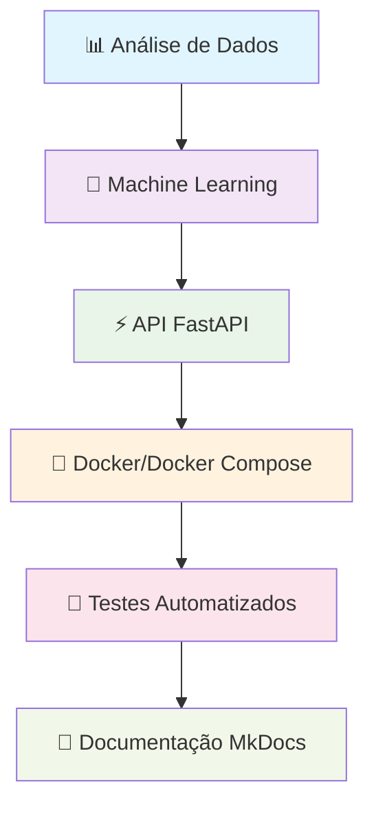
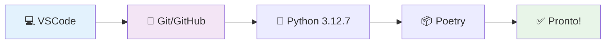
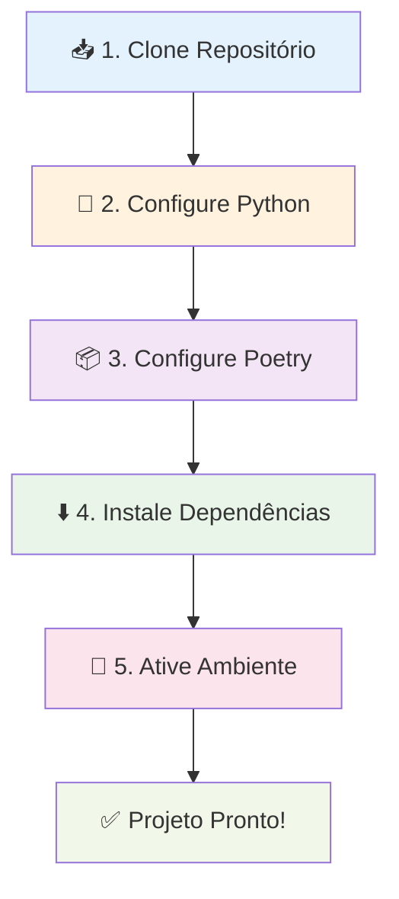
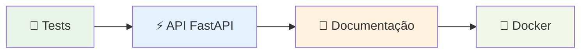
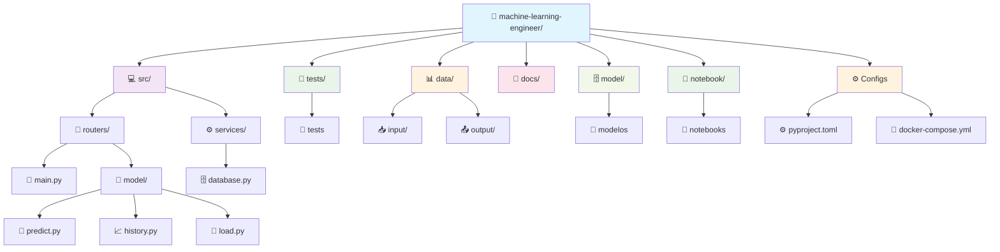
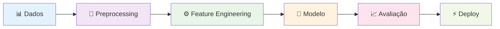
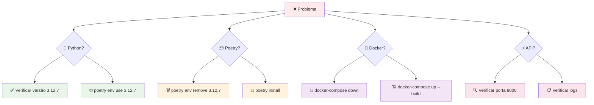
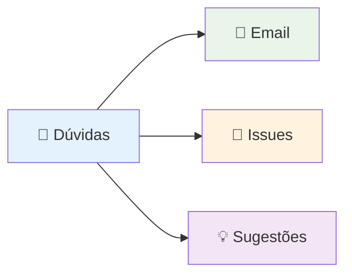

# 🚀 Machine Learning Engineer Challenge

<div align="center">


[](https://www.python.org)
[](https://python-poetry.org)
[](https://ulissesbomjardim.github.io/machine-learning-engineer/)

</div>

## 📚 Documentação

A documentação completa do projeto está disponível em:

**🌐 [https://ulissesbomjardim.github.io/machine-learning-engineer/](https://ulissesbomjardim.github.io/machine-learning-engineer/)**

---

## 🎯 Sobre o Projeto

Este repositório contém a solução para o **Case Técnico de Machine Learning Engineer**, implementando uma arquitetura profissional para predição de cancelamento de voos.

### 🌟 Objetivos Principais



### 🎯 Componentes do Sistema

| 🎯**Componente**        | 📖**Descrição**             | 🛠️**Tecnologias**                 |
| ----------------------------- | ----------------------------------- | ----------------------------------------- |
| 📊**EDA**               | Análise exploratória de dados     | `Pandas`, `Jupyter Notebooks`         |
| 🤖**ML Pipeline**       | Pipeline de Machine Learning        | `Scikit-learn`, `Feature Engineering` |
| ⚡**API**               | Serviço de predição via REST API | `FastAPI`, `Pydantic`, `Uvicorn`    |
| 🐳**Containerização** | Deploy com containers               | `Docker`, `Docker Compose`            |
| 🧪**Testes**            | Testes unitários e de integração | `Pytest`, `Coverage`                  |
| 📖**Documentação**    | Documentação técnica             | `MkDocs`, `Material Theme`            |

## 🚀 Começando

### 📋 Pré-requisitos



#### 🛠️ **Ferramentas Necessárias**

| 🛠️**Ferramenta**  | 📖**Descrição**      | 🔗**Links Úteis**                                                                                  |
| ------------------------- | ---------------------------- | --------------------------------------------------------------------------------------------------------- |
| 💻**VSCode**        | Editor de código principal  | [📥 Download](https://code.visualstudio.com/download)                                                        |
| 🔧**Git**           | Controle de versão          | [📖 Instalação](https://git-scm.com/book/pt-br/v2)                                                         |
| 🌐**GitHub**        | Plataforma de repositórios  | [📝 Criar Conta](https://docs.github.com/pt/get-started/onboarding/getting-started-with-your-github-account) |
| 🐍**Python 3.12.7** | Linguagem de programação   | [🎥 Tutorial Pyenv](https://www.youtube.com/watch?v=TkcqjLu1dgA)                                             |
| 📦**Poetry**        | Gerenciador de dependências | [📚 Documentação](https://python-poetry.org/docs/#installation)                                            |

#### 🎥 **Tutoriais Recomendados**

- **🪟 Windows Git/GitHub**: [YouTube Tutorial](https://www.youtube.com/watch?v=_hZf1teRFNg)
- **🐍 Pyenv Windows**: [Tutorial Pyenv](https://www.youtube.com/watch?v=TkcqjLu1dgA)
- **📦 Poetry Windows**: [Tutorial Poetry](https://www.youtube.com/watch?v=BuepZYn1xT8)
- **📖 Git Básico**: [Ebook LinkedIn](https://www.linkedin.com/feed/update/urn:li:activity:7093915148351864832/)

#### ⚡ **Instalação Rápida do Poetry**

```bash
pip install poetry
```

### ⚙️ Configuração do Projeto



#### 📥 **1. Clone o Repositório**

```bash
git clone https://github.com/ulissesbomjardim/machine-learning-engineer.git
cd machine-learning-engineer
```

#### 🐍 **2. Configure Python 3.12.7**

```bash
# Se estiver usando Pyenv
pyenv install 3.12.7
pyenv local 3.12.7
```

> **💡 Nota**: O projeto já possui arquivo `.python-version` especificando Python 3.12.7

#### 📦 **3. Configure Poetry**

```bash
poetry env use 3.12.7
```

#### ⬇️ **4. Instale as Dependências**

```bash
poetry install
```

**🎯 O que este comando faz:**

- ✅ Cria ambiente virtual automaticamente
- ✅ Instala dependências do `pyproject.toml`
- ✅ Instala ferramentas de desenvolvimento (`pytest`, `black`, `isort`)

#### 🚀 **5. Ative o Ambiente Virtual**

```bash
poetry shell
```

### ⚡ Executando o Projeto



#### 🧪 **6. Execute os Testes**

```bash
# Com Poetry shell ativo
task test

# Ou sem ativar o shell
poetry run task test
```

#### ⚡ **7. Execute a API**

```bash
# Iniciar servidor de desenvolvimento
uvicorn src.routers.main:app --reload

# Ou usando Docker Compose
docker-compose up --build
```

**🌐 Acesse**: `http://localhost:8000` para acessar a API

**📚 Swagger UI**: `http://localhost:8000/docs` para documentação interativa

#### 📖 **8. Execute a Documentação**

```bash
# Com Poetry shell ativo
task docs

# Ou sem ativar o shell
poetry run task docs
```

**🌐 Acesse**: `http://localhost:8000` para visualizar a documentação

#### 🐳 **9. Execute com Docker**

```bash
# Build e execução com Docker Compose
docker-compose up --build

# Apenas execução (se já buildado)
docker-compose up
```

## 🛠️ Comandos Úteis

### 🎨 **Formatação de Código**

```bash
# ✅ Recomendado: via Poetry
poetry run task format

# 🔄 Alternativa: ativando o ambiente
$path = poetry env info --path
& "$path\Scripts\Activate.ps1"
task format
```

### 🚀 **Ativação Manual do Ambiente**

#### 🪟 **Windows PowerShell**

```powershell
$path = poetry env info --path
& "$path\Scripts\Activate.ps1"
```

#### 🪟 **Windows CMD**

```cmd
poetry env info --path
# Copie o caminho e execute: <caminho>\Scripts\activate.bat
```

#### 🐧 **Linux/Mac**

```bash
source $(poetry env info --path)/bin/activate
```

### 📊 **Testes e Coverage**

```bash
# Testes com relatório de cobertura
poetry run pytest --cov=src --cov-report=xml

# Informações do ambiente Poetry
poetry env info
```

### ⚡ **Comandos Rápidos**

| 🎯**Comando**    | 📖**Descrição** | 🚀**Execução**          |
| ---------------------- | ----------------------- | ------------------------------- |
| 🧪`task test`        | Executa testes          | `poetry run task test`        |
| 🎨`task format`      | Formata código         | `poetry run task format`      |
| 📖`task docs`        | Inicia documentação   | `poetry run task docs`        |
| ⚡`task run_extract` | Executa pipeline        | `poetry run task run_extract` |

## 📁 Estrutura do Projeto



### 🗂️ **Detalhamento dos Diretórios**

| 📁**Diretório**    | 📖**Descrição** | 🎯**Propósito**                |
| ------------------------- | ----------------------- | ------------------------------------- |
| `💻 src/routers/`       | Rotas da API FastAPI    | Endpoints e controladores             |
| `⚙️ src/services/`    | Serviços de negócio   | Lógica de banco de dados             |
| `🤖 src/routers/model/` | Modelo de ML            | Predição, histórico e carregamento |
| `🧪 tests/`             | Testes unitários       | Garantia de qualidade e cobertura     |
| `📊 data/input/`        | Dados de entrada        | Datasets para análise                |
| `📊 data/output/`       | Dados processados       | Resultados e features                 |
| `🗄️ model/`           | Modelos treinados       | Artefatos salvos do ML                |
| `📓 notebook/`          | Jupyter Notebooks       | EDA e experimentos                    |
| `📖 docs/`              | Documentação          | Guias e referências MkDocs           |
| `⚙️ config/`          | Configurações         | Arquivos de configuração            |
| `🐳 docker/`            | Docker files            | Containers e dependências            |

## 🤖 Sobre o Challenge

### 🎯 **Objetivo do Projeto**

Desenvolver um sistema de **predição de cancelamento de voos** utilizando dados históricos, implementando:

- 📊 **Análise Exploratória**: Compreensão dos padrões de cancelamento
- 🤖 **Modelo de ML**: Algoritmo de classificação para predição
- ⚡ **API REST**: Serviço para consultas em tempo real
- 🐳 **Deploy**: Containerização para produção

### 📋 **Funcionalidades Principais**

| 🎯**Feature**        | 📖**Descrição**    | 🔗**Endpoint** |
| -------------------------- | -------------------------- | ---------------------- |
| 🔮**Predição**     | Prever cancelamento de voo | `POST /predict`      |
| 📊**Health Check**   | Status do serviço         | `GET /health`        |
| 📋**Documentação** | Swagger UI interativo      | `GET /docs`          |
| 📈**Histórico**     | Histórico de predições  | `GET /history`       |

### 🧠 **Abordagem de ML**



## 🔧 Solução de Problemas



### 🐍 **Problemas com Python**

| ❌**Sintoma**   | 🔧**Solução**                          |
| --------------------- | ---------------------------------------------- |
| Versão incorreta     | `pyenv install 3.12.7 && pyenv local 3.12.7` |
| Poetry não reconhece | `poetry env use 3.12.7`                      |

### 📦 **Problemas com Poetry**

| ❌**Sintoma**        | 🔧**Solução**                          |
| -------------------------- | ---------------------------------------------- |
| Conflitos de dependências | `poetry env remove 3.12.7 && poetry install` |
| Ambiente corrompido        | `poetry env remove --all && poetry install`  |

### 🐳 **Problemas com Docker**

| ❌**Sintoma**   | 🔧**Solução**                                      |
| --------------------- | ---------------------------------------------------------- |
| Container não inicia | `docker-compose down && docker-compose up --build`       |
| Porta ocupada         | Verificar se porta 8000 está livre                        |
| Build falha           | `docker system prune && docker-compose build --no-cache` |

### ⚡ **Problemas com API**

| ❌**Sintoma** | 🔧**Solução**                 |
| ------------------- | ------------------------------------- |
| API não responde   | Verificar se uvicorn está executando |
| Erro 500            | Verificar logs e dependências        |
| Modelo não carrega | Verificar se modelo foi treinado      |

### ✅ **Comandos de Diagnóstico**

```bash
# Verificar Poetry
poetry --version
poetry env list
poetry env info

# Verificar Python
python --version
which python  # Linux/Mac
where python  # Windows

# Verificar Docker
docker --version
docker-compose --version

# Verificar API
curl http://localhost:8000/health
```

## 📞 Contato e Suporte

<div align="center">



</div>

### 🤝 **Como Contribuir**

| 🎯**Tipo**     | 📖**Descrição**      | 🔗**Canal**                                                                               |
| -------------------- | ---------------------------- | ----------------------------------------------------------------------------------------------- |
| 📧**Email**    | Dúvidas e feedbacks diretos | [ulisses.bomjardim@gmail.com](mailto:ulisses.bomjardim@gmail.com)                                  |
| 🐛**Issues**   | Reportar bugs e problemas    | [🔗 GitHub Issues](https://github.com/ulissesbomjardim/machine-learning-engineer/issues)           |
| 💡**Features** | Sugestões de melhorias      | [🔗 GitHub Discussions](https://github.com/ulissesbomjardim/machine-learning-engineer/discussions) |
| ⭐**Suporte**  | Curtir o projeto             | [🔗 GitHub Star](https://github.com/ulissesbomjardim/machine-learning-engineer)                    |

---

<div align="center">

**🎉 Obrigado por conferir o Machine Learning Engineer Challenge! 🎉**

*📅 Última atualização: 2025-10-21*

[](https://github.com/ulissesbomjardim/machine-learning-engineer)
[](https://github.com/ulissesbomjardim/machine-learning-engineer/fork)

</div>
