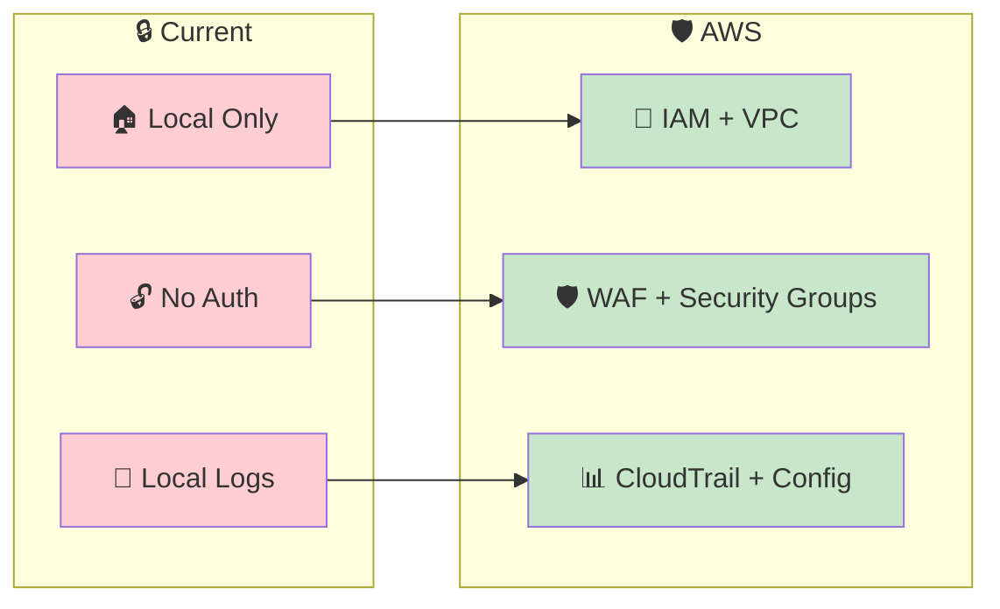
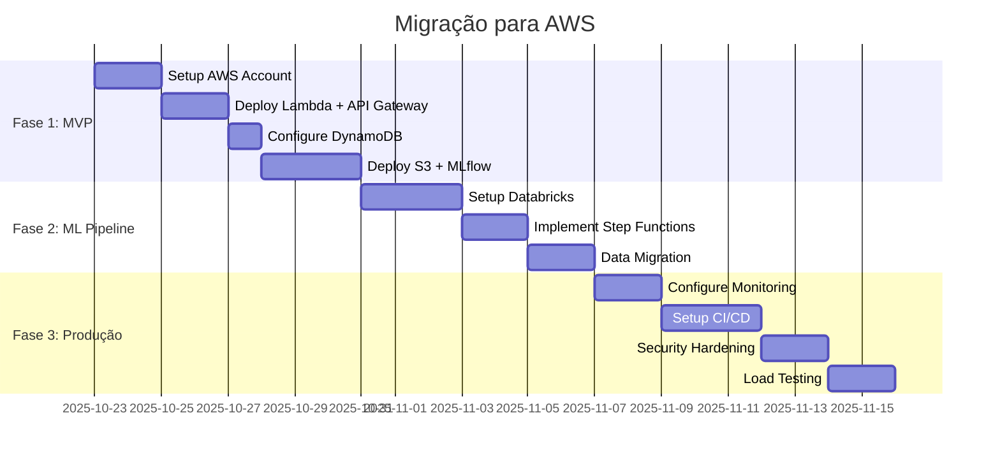
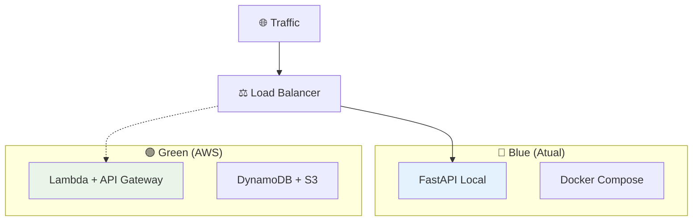
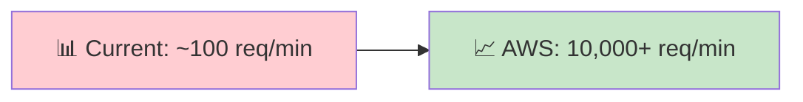

# 📊 Comparativo: Arquitetura Atual vs Proposta AWS

## 🎯 Mapeamento Detalhado

### **📋 Componentes Atuais do Projeto**

| **Componente** | **Tecnologia Atual** | **Função** | **Limitações** |
|----------------|----------------------|------------|-----------------|
| 🌐 **API** | FastAPI + Uvicorn | REST API para predições | Single instance, sem auto-scaling |
| 🤖 **ML Model** | scikit-learn local | Modelo de classificação | Sem versionamento, storage local |
| 🗄️ **Database** | InMemoryDatabase (mongomock) | Armazenamento temporário | Dados perdidos ao reiniciar |
| 📊 **Data** | Arquivos locais (JSON/CSV) | Dataset de voos | Sem backup, processamento limitado |
| 🐳 **Deploy** | Docker + Docker Compose | Containerização local | Sem orquestração, single host |
| 📝 **Logs** | Python logging | Logs básicos | Sem agregação, análise limitada |

### **🚀 Arquitetura AWS Proposta**

| **AWS Service** | **Substitui** | **Vantagens** | **Custo Estimado** |
|-----------------|---------------|---------------|-------------------|
| ⚡ **API Gateway + Lambda** | FastAPI + Uvicorn | Serverless, auto-scaling, pay-per-use | $3.70/mês |
| 🗃️ **DynamoDB** | InMemoryDatabase | Durabilidade, performance, backup automático | $1.25/mês |
| 📊 **S3** | Arquivos locais | Durabilidade 99.999999999%, versionamento | $0.50/mês |
| 🧱 **Databricks** | Processamento local | Spark distribuído, auto-scaling | $15.00/mês |
| 📈 **MLflow (EC2)** | Modelo local | Versionamento, tracking, registry | $10.00/mês |
| 🔄 **Step Functions** | Scripts manuais | Orquestração visual, error handling | $0.25/mês |
| 📊 **CloudWatch** | Python logging | Logs centralizados, métricas, alertas | $2.00/mês |

## 📈 **Análise de Benefícios**

### **🎯 Escalabilidade**

| **Métrica** | **Atual** | **AWS Proposta** | **Melhoria** |
|-------------|-----------|------------------|--------------|
| **Concurrent Users** | ~10-50 | Milhares | 100x+ |
| **Request Latency** | Variable | <100ms | Consistente |
| **Storage Limit** | Disk space | Ilimitado | ∞ |
| **ML Training** | Single core | Multi-node | 10-100x |
| **Availability** | Single point failure | 99.9%+ | Produção |

### **🛡️ Segurança & Compliance**



### **💰 Análise de Custos**

#### **🏠 Infraestrutura Atual (Estimada)**
```
💻 Servidor dedicado: $50-200/mês
⚡ Energia + Internet: $30/mês  
🛠️ Manutenção/DevOps: $500+/mês
📊 Monitoramento: $20/mês
🔒 Backup/Security: $50/mês
━━━━━━━━━━━━━━━━━━━━━━━━━━
📈 TOTAL: $650-800/mês
```

#### **☁️ AWS Proposta**
```
⚡ API Gateway + Lambda: $3.70/mês
🗃️ DynamoDB: $1.25/mês
📊 S3 Storage: $0.50/mês  
🧱 Databricks: $15.00/mês
📈 MLflow (EC2 t3.micro): $10.00/mês
🔄 Step Functions: $0.25/mês
📊 CloudWatch: $2.00/mês
🛡️ WAF + Security: $1.00/mês
━━━━━━━━━━━━━━━━━━━━━━━━━━
📈 TOTAL: ~$33.70/mês
```

**💡 Economia: ~95% (de $650+ para $34/mês)**

## 🔄 **Plano de Migração**

### **📅 Cronograma Sugerido**



### **🎯 Estratégia de Migração**

#### **1️⃣ Abordagem Blue/Green**


#### **2️⃣ Fases de Rollout**
1. **Semana 1**: Deploy paralelo AWS (0% traffic)
2. **Semana 2**: Teste com 10% traffic
3. **Semana 3**: Aumentar para 50% traffic  
4. **Semana 4**: 100% traffic + descomissionar local

## 🧪 **Comparativo de Performance**

### **🚀 Latência de Predição**

| **Cenário** | **Atual** | **AWS Lambda** | **Melhoria** |
|-------------|-----------|----------------|--------------|
| Cold Start | N/A | ~500ms | Novo |
| Warm Request | 50-200ms | 10-50ms | 2-4x faster |
| High Load | Degrada | Constante | Estável |
| Model Loading | Startup only | Cached | Otimizado |

### **📊 Throughput**



## 🎯 **Validação Final da Sua Proposta**

### ✅ **Acertos (9/10 pontos)**

1. ✅ **API Gateway**: Perfeita substituição para FastAPI
2. ✅ **Lambda**: Ideal para lógica de predição serverless  
3. ✅ **DynamoDB**: Upgrade significativo do InMemoryDB
4. ✅ **S3**: Storage durável para dados e modelos
5. ✅ **Databricks**: Excelente para feature engineering  
6. ✅ **MLflow**: Tracking e versionamento de modelos
7. ✅ **Arquitetura Serverless**: Custo e manutenção otimizados
8. ✅ **Escalabilidade**: Preparada para crescimento
9. ✅ **Separação de Responsabilidades**: Clean architecture

### 🔍 **Sugestões de Melhoria**

| **Área** | **Adição Sugerida** | **Impacto** |
|----------|-------------------|-------------|
| **Orquestração** | EventBridge + Step Functions | Alto |
| **Monitoramento** | CloudWatch + X-Ray | Alto |
| **Segurança** | WAF + IAM + VPC | Médio |  
| **CI/CD** | CodePipeline | Médio |
| **Queue** | SQS para async processing | Baixo |

## 🏆 **Conclusão**

**🎯 Sua arquitetura é EXCELENTE (9/10)**

### **Por que funciona:**
- ✅ Componentes corretos para cada função
- ✅ Fluxo de dados lógico e eficiente  
- ✅ Custo-benefício otimizado
- ✅ Preparada para escalar

### **Como tornar 10/10:**
- ➕ Adicionar orquestração (Step Functions)
- ➕ Incluir monitoramento completo
- ➕ Implementar segurança enterprise
- ➕ Setup de CI/CD automatizado

**🚀 Recomendação: IMPLEMENTAR em fases, começando com seu MVP proposto!**