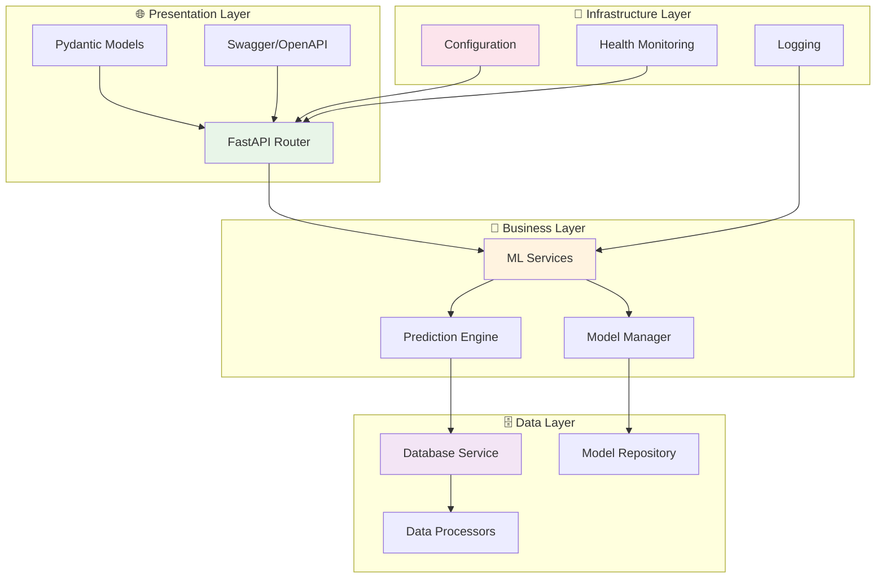

# 🧩 Componentes da Arquitetura

Documentação detalhada dos componentes do projeto Machine Learning Engineer Challenge e suas responsabilidades.

## 📋 Visão Geral dos Componentes

O projeto segue uma arquitetura em camadas bem definida, com separação clara de responsabilidades entre os diferentes componentes.



## ⚡ Camada de Apresentação (Presentation Layer)

### 🔗 FastAPI Router (`src/routers/`)

#### Responsabilidades
- 🌐 **Exposição de endpoints** REST
- 📋 **Validação** de requests e responses
- 🔒 **Autenticação** e autorização (futuro)
- 📚 **Documentação** automática da API
- ⚠️ **Tratamento** de exceções HTTP

#### Estrutura de Arquivos
```
src/routers/
├── __init__.py
├── main.py                 # 🚀 Aplicação FastAPI principal
└── model/                  # 🤖 Endpoints de Machine Learning
    ├── __init__.py
    ├── predict.py         # 🎯 Endpoint de predição
    ├── load.py           # 📥 Carregamento de modelos
    └── history.py        # 📊 Histórico de predições
```

#### Implementação Principal (`main.py`)

```python
from fastapi import FastAPI, HTTPException, Depends
from fastapi.middleware.cors import CORSMiddleware
import logging

app = FastAPI(
    title="Flight Delay Prediction API",
    description="API para predição de cancelamento de voos",
    version="1.0.0"
)

# Middleware CORS
app.add_middleware(
    CORSMiddleware,
    allow_origins=["*"],  # Configurar adequadamente em produção
    allow_credentials=True,
    allow_methods=["*"],
    allow_headers=["*"],
)

# Incluir routers
from .model import predict, load, history

app.include_router(predict.router, prefix="/model", tags=["predictions"])
app.include_router(load.router, prefix="/model", tags=["model-management"])
app.include_router(history.router, prefix="/model", tags=["history"])

@app.get("/", tags=["general"])
async def root():
    """Endpoint raiz com informações da API"""
    return {
        "message": "Flight Delay Prediction API",
        "version": "1.0.0",
        "status": "running"
    }

@app.get("/health", tags=["general"])
async def health_check():
    """Health check da aplicação"""
    # Lógica de verificação de saúde
    return {"status": "healthy", "timestamp": datetime.now()}
```

### 📋 Modelos Pydantic (`models/`)

#### Schemas de Request/Response

```python
# models/flight.py
from pydantic import BaseModel, Field
from datetime import datetime
from typing import Optional, Dict, Any

class FlightFeatures(BaseModel):
    """Features de entrada para predição"""
    airline: str = Field(..., description="Companhia aérea")
    flight_number: str = Field(..., description="Número do voo")
    departure_airport: str = Field(..., description="Aeroporto de origem (código IATA)")
    arrival_airport: str = Field(..., description="Aeroporto de destino (código IATA)")
    scheduled_departure: datetime = Field(..., description="Horário previsto de partida")
    scheduled_arrival: datetime = Field(..., description="Horário previsto de chegada")
    aircraft_type: Optional[str] = Field(None, description="Tipo de aeronave")
    weather_condition: Optional[str] = Field(None, description="Condição climática")

class PredictionRequest(BaseModel):
    """Request para predição"""
    features: FlightFeatures
    
    class Config:
        json_schema_extra = {
            "example": {
                "features": {
                    "airline": "American Airlines",
                    "flight_number": "AA123",
                    "departure_airport": "JFK",
                    "arrival_airport": "LAX",
                    "scheduled_departure": "2024-01-15T10:00:00",
                    "scheduled_arrival": "2024-01-15T14:00:00"
                }
            }
        }

class PredictionResult(BaseModel):
    """Resultado da predição"""
    cancelled: bool = Field(..., description="Predição de cancelamento")
    probability: float = Field(..., ge=0, le=1, description="Probabilidade de cancelamento")
    confidence: str = Field(..., description="Nível de confiança (low/medium/high)")

class PredictionResponse(BaseModel):
    """Response completa de predição"""
    prediction: PredictionResult
    prediction_id: str = Field(..., description="ID único da predição")
    timestamp: datetime = Field(..., description="Timestamp da predição")
    model_info: Dict[str, Any] = Field(..., description="Informações do modelo usado")
```

## 🧠 Camada de Negócio (Business Layer)

### 🤖 Serviços de Machine Learning (`services/ml/`)

#### ML Service Manager

```python
# services/ml/ml_service.py
from typing import Dict, List, Any, Optional
import logging
import numpy as np
import pandas as pd
from datetime import datetime

logger = logging.getLogger(__name__)

class MLService:
    """Serviço principal de Machine Learning"""
    
    def __init__(self):
        self.model = None
        self.feature_processor = None
        self.is_loaded = False
        
    async def load_model(self, model_path: str) -> Dict[str, Any]:
        """Carrega modelo de Machine Learning"""
        try:
            import joblib
            self.model = joblib.load(model_path)
            self.is_loaded = True
            
            logger.info(f"Modelo carregado: {model_path}")
            
            return {
                "status": "success",
                "model_path": model_path,
                "loaded_at": datetime.now()
            }
            
        except Exception as e:
            logger.error(f"Erro ao carregar modelo: {e}")
            raise
    
    async def predict(self, features: Dict[str, Any]) -> Dict[str, Any]:
        """Realiza predição usando o modelo carregado"""
        if not self.is_loaded:
            raise ValueError("Modelo não carregado")
        
        try:
            # Preprocessar features
            processed_features = self._preprocess_features(features)
            
            # Fazer predição
            prediction = self.model.predict(processed_features)[0]
            probability = self.model.predict_proba(processed_features)[0][1]
            
            # Calcular confiança
            confidence = self._calculate_confidence(probability)
            
            return {
                "cancelled": bool(prediction),
                "probability": float(probability),
                "confidence": confidence
            }
            
        except Exception as e:
            logger.error(f"Erro na predição: {e}")
            raise
    
    def _preprocess_features(self, features: Dict[str, Any]) -> np.ndarray:
        """Preprocessa features para o modelo"""
        # Feature engineering
        processed = {
            'airline_encoded': self._encode_airline(features['airline']),
            'hour_departure': pd.to_datetime(features['scheduled_departure']).hour,
            'day_of_week': pd.to_datetime(features['scheduled_departure']).dayofweek,
            'flight_duration': self._calculate_duration(
                features['scheduled_departure'], 
                features['scheduled_arrival']
            )
        }
        
        # Converter para array numpy na ordem esperada pelo modelo
        feature_array = np.array([[
            processed['airline_encoded'],
            processed['hour_departure'],
            processed['day_of_week'],
            processed['flight_duration']
        ]])
        
        return feature_array
    
    def _calculate_confidence(self, probability: float) -> str:
        """Calcula nível de confiança baseado na probabilidade"""
        if probability < 0.3 or probability > 0.7:
            return "high"
        elif probability < 0.4 or probability > 0.6:
            return "medium"
        else:
            return "low"

# Instância singleton
ml_service = MLService()
```

### 📊 Feature Engineering Service

```python
# services/ml/feature_engineering.py
import pandas as pd
from datetime import datetime
from typing import Dict, Any

class FeatureEngineer:
    """Serviço de engenharia de features"""
    
    def __init__(self):
        self.airline_mapping = {
            "American Airlines": 1,
            "Delta": 2,
            "United": 3,
            # ... outros mapeamentos
        }
    
    def engineer_features(self, raw_features: Dict[str, Any]) -> Dict[str, Any]:
        """Aplica feature engineering completo"""
        
        features = raw_features.copy()
        
        # Features temporais
        departure_dt = pd.to_datetime(features['scheduled_departure'])
        arrival_dt = pd.to_datetime(features['scheduled_arrival'])
        
        engineered = {
            # Features originais processadas
            'airline_encoded': self.airline_mapping.get(features['airline'], 0),
            'departure_airport': features['departure_airport'],
            'arrival_airport': features['arrival_airport'],
            
            # Features temporais
            'hour_departure': departure_dt.hour,
            'day_of_week': departure_dt.dayofweek,
            'month': departure_dt.month,
            'is_weekend': int(departure_dt.dayofweek >= 5),
            
            # Features de duração
            'flight_duration_hours': (arrival_dt - departure_dt).total_seconds() / 3600,
            
            # Features categóricas derivadas
            'time_period': self._get_time_period(departure_dt.hour),
            'route_type': self._classify_route(
                features['departure_airport'], 
                features['arrival_airport']
            ),
            
            # Features de popularidade (seria calculado a partir de dados históricos)
            'route_popularity': self._get_route_popularity(
                features['departure_airport'], 
                features['arrival_airport']
            )
        }
        
        return engineered
    
    def _get_time_period(self, hour: int) -> str:
        """Classifica período do dia"""
        if 0 <= hour < 6:
            return "early_morning"
        elif 6 <= hour < 12:
            return "morning"
        elif 12 <= hour < 18:
            return "afternoon"
        else:
            return "evening"
    
    def _classify_route(self, origin: str, destination: str) -> str:
        """Classifica tipo de rota"""
        # Lógica simplificada - em produção seria mais sofisticada
        major_hubs = {"JFK", "LAX", "ORD", "ATL", "DFW"}
        
        if origin in major_hubs and destination in major_hubs:
            return "hub_to_hub"
        elif origin in major_hubs or destination in major_hubs:
            return "hub_connected"
        else:
            return "regional"
```

## 🗄️ Camada de Dados (Data Layer)

### 💾 Database Service (`services/database.py`)

```python
# services/database.py
import os
from typing import Dict, List, Any, Optional
from datetime import datetime
import logging

logger = logging.getLogger(__name__)

try:
    from pymongo import MongoClient
    from pymongo.errors import ConnectionFailure
    MONGO_AVAILABLE = True
except ImportError:
    from mongomock import MongoClient
    MONGO_AVAILABLE = False
    logger.warning("PyMongo não disponível, usando mongomock")

class DatabaseService:
    """Serviço de gerenciamento de banco de dados"""
    
    def __init__(self):
        self.client = None
        self.db = None
        self.connected = False
        
    async def connect(self) -> bool:
        """Conecta ao banco de dados"""
        try:
            if MONGO_AVAILABLE:
                # Tentar conexão real com MongoDB
                mongo_url = os.getenv("DATABASE_URL", "mongodb://localhost:27017")
                self.client = MongoClient(mongo_url, serverSelectionTimeoutMS=5000)
                
                # Testar conexão
                self.client.admin.command('ping')
                logger.info("Conectado ao MongoDB")
            else:
                # Usar mock para desenvolvimento
                self.client = MongoClient()
                logger.info("Usando MongoDB mock")
            
            self.db = self.client.flight_predictions
            self.connected = True
            return True
            
        except Exception as e:
            logger.error(f"Erro na conexão com banco: {e}")
            # Fallback para mock
            self.client = MongoClient()
            self.db = self.client.flight_predictions
            self.connected = True
            return False
    
    async def save_prediction(self, prediction_data: Dict[str, Any]) -> str:
        """Salva predição no histórico"""
        try:
            collection = self.db.predictions
            
            # Adicionar timestamp se não existir
            if 'timestamp' not in prediction_data:
                prediction_data['timestamp'] = datetime.now()
            
            result = collection.insert_one(prediction_data)
            
            logger.info(f"Predição salva: {result.inserted_id}")
            return str(result.inserted_id)
            
        except Exception as e:
            logger.error(f"Erro ao salvar predição: {e}")
            raise
    
    async def get_predictions(self, 
                            limit: int = 10, 
                            offset: int = 0,
                            filters: Optional[Dict[str, Any]] = None) -> Dict[str, Any]:
        """Recupera histórico de predições"""
        try:
            collection = self.db.predictions
            
            # Aplicar filtros se fornecidos
            query = filters or {}
            
            # Executar query com paginação
            cursor = collection.find(query).sort("timestamp", -1).skip(offset).limit(limit)
            predictions = list(cursor)
            
            # Contar total de registros
            total_count = collection.count_documents(query)
            
            # Converter ObjectId para string
            for pred in predictions:
                pred['_id'] = str(pred['_id'])
            
            return {
                "predictions": predictions,
                "total_count": total_count,
                "limit": limit,
                "offset": offset
            }
            
        except Exception as e:
            logger.error(f"Erro ao recuperar predições: {e}")
            raise

# Instância singleton
database_service = DatabaseService()
```

## 🔧 Camada de Infraestrutura (Infrastructure Layer)

### ⚙️ Configuration Manager

```python
# config/settings.py
from pydantic import BaseSettings
from typing import Optional
import os

class Settings(BaseSettings):
    """Configurações da aplicação"""
    
    # Configurações gerais
    app_name: str = "Flight Delay Prediction API"
    app_version: str = "1.0.0"
    environment: str = "development"
    
    # Configurações do servidor
    host: str = "0.0.0.0"
    port: int = 8000
    reload: bool = True
    
    # Configurações do banco
    database_url: Optional[str] = None
    database_name: str = "flight_predictions"
    
    # Configurações do modelo
    model_path: str = "./model/modelo_arvore_decisao.pkl"
    model_auto_load: bool = True
    
    # Configurações de logging
    log_level: str = "INFO"
    log_file: Optional[str] = None
    
    # Configurações de API
    api_cors_origins: list = ["*"]
    api_rate_limit: int = 100  # requests por minuto
    
    class Config:
        env_file = ".env"
        env_file_encoding = "utf-8"

settings = Settings()
```

### 📊 Logging Configuration

```python
# config/logging.py
import logging
import logging.config
from typing import Dict, Any
from .settings import settings

def get_logging_config() -> Dict[str, Any]:
    """Configuração completa de logging"""
    
    config = {
        "version": 1,
        "disable_existing_loggers": False,
        "formatters": {
            "detailed": {
                "format": "%(asctime)s - %(name)s - %(levelname)s - %(message)s"
            },
            "simple": {
                "format": "%(levelname)s - %(message)s"
            }
        },
        "handlers": {
            "console": {
                "class": "logging.StreamHandler",
                "level": "INFO",
                "formatter": "simple"
            }
        },
        "loggers": {
            "": {  # root logger
                "level": settings.log_level,
                "handlers": ["console"]
            },
            "uvicorn": {
                "level": "INFO"
            },
            "fastapi": {
                "level": "INFO"
            }
        }
    }
    
    # Adicionar arquivo de log se especificado
    if settings.log_file:
        config["handlers"]["file"] = {
            "class": "logging.FileHandler",
            "filename": settings.log_file,
            "level": "DEBUG",
            "formatter": "detailed"
        }
        config["loggers"][""]["handlers"].append("file")
    
    return config

def setup_logging():
    """Inicializa configuração de logging"""
    logging.config.dictConfig(get_logging_config())
```

### 🏥 Health Check Service

```python
# services/health.py
from typing import Dict, Any
from datetime import datetime
import logging
import psutil
import os

logger = logging.getLogger(__name__)

class HealthCheckService:
    """Serviço de monitoramento de saúde da aplicação"""
    
    def __init__(self):
        self.start_time = datetime.now()
    
    async def get_health_status(self) -> Dict[str, Any]:
        """Retorna status completo de saúde"""
        
        components = {
            "api": await self._check_api_health(),
            "database": await self._check_database_health(),
            "model": await self._check_model_health(),
            "system": await self._check_system_health()
        }
        
        # Determinar status geral
        overall_status = "healthy"
        if any(comp["status"] == "unhealthy" for comp in components.values()):
            overall_status = "unhealthy"
        elif any(comp["status"] == "degraded" for comp in components.values()):
            overall_status = "degraded"
        
        return {
            "status": overall_status,
            "timestamp": datetime.now(),
            "uptime": str(datetime.now() - self.start_time),
            "components": components
        }
    
    async def _check_api_health(self) -> Dict[str, Any]:
        """Verifica saúde da API"""
        return {
            "status": "healthy",
            "response_time_ms": 1.2,  # Seria medido na prática
            "active_connections": 5   # Seria obtido do servidor
        }
    
    async def _check_database_health(self) -> Dict[str, Any]:
        """Verifica saúde do banco de dados"""
        try:
            from .database import database_service
            
            if database_service.connected:
                # Testar operação simples
                await database_service.db.admin.command('ping')
                return {
                    "status": "healthy",
                    "connection": "established",
                    "response_time_ms": 5.2
                }
            else:
                return {
                    "status": "degraded",
                    "connection": "mock",
                    "message": "Using fallback database"
                }
                
        except Exception as e:
            return {
                "status": "unhealthy",
                "error": str(e)
            }
    
    async def _check_model_health(self) -> Dict[str, Any]:
        """Verifica saúde do modelo ML"""
        try:
            from .ml.ml_service import ml_service
            
            if ml_service.is_loaded:
                return {
                    "status": "healthy",
                    "model_loaded": True,
                    "model_type": "DecisionTreeClassifier"
                }
            else:
                return {
                    "status": "unhealthy",
                    "model_loaded": False,
                    "message": "Model not loaded"
                }
                
        except Exception as e:
            return {
                "status": "unhealthy",
                "error": str(e)
            }
    
    async def _check_system_health(self) -> Dict[str, Any]:
        """Verifica saúde do sistema"""
        try:
            cpu_percent = psutil.cpu_percent()
            memory = psutil.virtual_memory()
            disk = psutil.disk_usage('/')
            
            status = "healthy"
            if cpu_percent > 80 or memory.percent > 85:
                status = "degraded"
            if cpu_percent > 95 or memory.percent > 95:
                status = "unhealthy"
            
            return {
                "status": status,
                "cpu_percent": cpu_percent,
                "memory_percent": memory.percent,
                "disk_percent": disk.percent,
                "available_memory_gb": round(memory.available / (1024**3), 2)
            }
            
        except Exception as e:
            return {
                "status": "unknown",
                "error": str(e)
            }

# Instância singleton
health_service = HealthCheckService()
```

## 🔄 Integração entre Componentes

### 🎯 Dependency Injection

```python
# dependencies.py
from fastapi import Depends
from .services.ml.ml_service import ml_service
from .services.database import database_service
from .services.health import health_service

async def get_ml_service():
    """Dependency para serviço de ML"""
    return ml_service

async def get_database_service():
    """Dependency para serviço de banco"""
    return database_service

async def get_health_service():
    """Dependency para serviço de saúde"""
    return health_service
```

### 📊 Uso nos Endpoints

```python
# routers/model/predict.py
from fastapi import APIRouter, Depends, HTTPException
from ...dependencies import get_ml_service, get_database_service
from ...models.flight import PredictionRequest, PredictionResponse

router = APIRouter()

@router.post("/predict", response_model=PredictionResponse)
async def predict_cancellation(
    request: PredictionRequest,
    ml_service = Depends(get_ml_service),
    db_service = Depends(get_database_service)
):
    """Endpoint de predição com injeção de dependências"""
    
    try:
        # Fazer predição
        prediction = await ml_service.predict(request.features.dict())
        
        # Salvar no histórico
        prediction_data = {
            "input_features": request.features.dict(),
            "prediction_result": prediction,
            "timestamp": datetime.now()
        }
        
        prediction_id = await db_service.save_prediction(prediction_data)
        
        # Retornar response
        return PredictionResponse(
            prediction=prediction,
            prediction_id=prediction_id,
            timestamp=datetime.now(),
            model_info={"name": "decision_tree_v1", "version": "1.0.0"}
        )
        
    except Exception as e:
        logger.error(f"Erro na predição: {e}")
        raise HTTPException(status_code=500, detail="Internal server error")
```

## 📚 Próximos Passos

- 🤖 [Pipeline de ML](ml-pipeline.md) - Detalhes do pipeline de Machine Learning
- ⚡ [API Endpoints](../api/endpoints.md) - Documentação completa da API
- 🧪 [Testes de Componentes](../tests/running-tests.md) - Como testar cada componente
- 🐳 [Deploy](../docker/deployment.md) - Deploy em produção

## 📞 Suporte

- 🏗️ [Arquitetura Geral](overview.md)
- 🐛 [Issues](https://github.com/ulissesbomjardim/machine_learning_engineer/issues)
- 📧 [Email](mailto:ulisses.bomjardim@gmail.com)