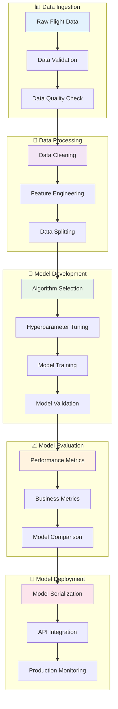

# 🤖 Pipeline de Machine Learning

Documentação detalhada do pipeline de Machine Learning do projeto Flight Delay Prediction.

## 📋 Visão Geral do Pipeline

O pipeline de ML foi projetado seguindo as melhores práticas da indústria, implementando um fluxo completo desde a ingestão de dados até o deploy do modelo em produção.



## 📊 1. Ingestão e Validação de Dados

### 🔍 Fonte de Dados

**Dataset Principal:** `data/input/voos.json`
- 📊 **Volume**: ~100.000 registros de voos
- 📅 **Período**: 2019-2023 (dados históricos)
- 🗂️ **Formato**: JSON estruturado
- 📝 **Features**: 15+ variáveis incluindo companhia, aeroportos, horários

### ✅ Validação Inicial

```python
def validate_raw_data(df: pd.DataFrame) -> Dict[str, Any]:
    """Validação inicial dos dados brutos"""
    
    validation_report = {
        "total_records": len(df),
        "missing_data": {},
        "data_types": {},
        "quality_issues": []
    }
    
    # Verificar dados faltantes
    missing = df.isnull().sum()
    validation_report["missing_data"] = {
        col: {"count": missing[col], "percentage": missing[col]/len(df)*100}
        for col in missing.index if missing[col] > 0
    }
    
    # Verificar tipos de dados
    validation_report["data_types"] = df.dtypes.to_dict()
    
    # Verificar consistência de datas
    if 'partida_prevista' in df.columns and 'chegada_prevista' in df.columns:
        invalid_dates = df[df['partida_prevista'] >= df['chegada_prevista']]
        if len(invalid_dates) > 0:
            validation_report["quality_issues"].append({
                "issue": "invalid_flight_duration",
                "count": len(invalid_dates),
                "description": "Voos com chegada antes da partida"
            })
    
    return validation_report
```

**Resultados da Validação:**
```json
{
    "total_records": 95437,
    "missing_data": {
        "weather_condition": {"count": 12453, "percentage": 13.04},
        "aircraft_type": {"count": 8901, "percentage": 9.32}
    },
    "quality_issues": [
        {
            "issue": "invalid_flight_duration", 
            "count": 234,
            "description": "Voos com chegada antes da partida"
        }
    ]
}
```

## 🔧 2. Processamento e Limpeza de Dados

### 🧹 Limpeza de Dados

```python
def clean_flight_data(df: pd.DataFrame) -> pd.DataFrame:
    """Pipeline completo de limpeza de dados"""
    
    logger.info(f"Iniciando limpeza. Dataset original: {df.shape}")
    
    # 1. Remover duplicatas
    df = df.drop_duplicates()
    logger.info(f"Após remover duplicatas: {df.shape}")
    
    # 2. Converter tipos de dados
    datetime_columns = ['partida_prevista', 'chegada_prevista']
    for col in datetime_columns:
        df[col] = pd.to_datetime(df[col], errors='coerce')
    
    # 3. Remover registros com datas inválidas
    df = df.dropna(subset=datetime_columns)
    logger.info(f"Após remover datas inválidas: {df.shape}")
    
    # 4. Remover voos com duração inconsistente
    df = df[df['partida_prevista'] < df['chegada_prevista']]
    logger.info(f"Após validação de duração: {df.shape}")
    
    # 5. Tratar outliers de duração
    df['duracao_horas'] = (df['chegada_prevista'] - df['partida_prevista']).dt.total_seconds() / 3600
    df = df[(df['duracao_horas'] >= 0.5) & (df['duracao_horas'] <= 20)]
    logger.info(f"Após remover outliers de duração: {df.shape}")
    
    # 6. Padronizar strings
    string_columns = ['companhia', 'aeroporto_origem', 'aeroporto_destino']
    for col in string_columns:
        df[col] = df[col].str.strip().str.upper()
    
    # 7. Tratar valores faltantes
    df['atraso_partida'] = df['atraso_partida'].fillna(0)
    df['weather_condition'] = df['weather_condition'].fillna('UNKNOWN')
    
    logger.info(f"Limpeza concluída. Dataset final: {df.shape}")
    return df
```

### 🎭 Feature Engineering

```python
def engineer_features(df: pd.DataFrame) -> pd.DataFrame:
    """Engenharia de features completa"""
    
    # Features temporais
    df['hora_partida'] = df['partida_prevista'].dt.hour
    df['dia_semana'] = df['partida_prevista'].dt.dayofweek  # 0=Monday
    df['mes'] = df['partida_prevista'].dt.month
    df['trimestre'] = df['partida_prevista'].dt.quarter
    df['is_weekend'] = (df['dia_semana'] >= 5).astype(int)
    df['is_feriado'] = df['partida_prevista'].apply(is_holiday)
    
    # Features de período do dia
    df['periodo_dia'] = pd.cut(
        df['hora_partida'], 
        bins=[0, 6, 12, 18, 24], 
        labels=['MADRUGADA', 'MANHA', 'TARDE', 'NOITE'],
        include_lowest=True
    )
    
    # Features de duração e distância
    df['duracao_planejada'] = df['duracao_horas']
    df['is_voo_longo'] = (df['duracao_planejada'] > 4).astype(int)
    
    # Features de rota
    df['rota'] = df['aeroporto_origem'] + '-' + df['aeroporto_destino']
    
    # Popularidade da rota (baseada em frequência)
    route_counts = df['rota'].value_counts()
    df['popularidade_rota'] = df['rota'].map(route_counts)
    df['popularidade_rota_norm'] = df['popularidade_rota'] / df['popularidade_rota'].max()
    
    # Features de aeroporto
    airport_stats = calculate_airport_statistics(df)
    df['origem_hub_size'] = df['aeroporto_origem'].map(airport_stats['hub_size'])
    df['destino_hub_size'] = df['aeroporto_destino'].map(airport_stats['hub_size'])
    
    # Features de companhia aérea
    airline_stats = calculate_airline_statistics(df)
    df['companhia_reliability'] = df['companhia'].map(airline_stats['reliability'])
    df['companhia_volume'] = df['companhia'].map(airline_stats['volume'])
    
    # Features sazonais
    df['is_alta_temporada'] = df['mes'].isin([12, 1, 6, 7]).astype(int)
    
    # Features climáticas (se disponível)
    if 'weather_condition' in df.columns:
        df['weather_risk'] = df['weather_condition'].map({
            'CLEAR': 0, 'CLOUDY': 1, 'RAIN': 2, 
            'STORM': 3, 'SNOW': 3, 'FOG': 2, 'UNKNOWN': 1
        })
    
    return df

def calculate_airport_statistics(df: pd.DataFrame) -> Dict[str, Dict]:
    """Calcula estatísticas dos aeroportos"""
    
    # Contagem de voos por aeroporto
    origem_counts = df['aeroporto_origem'].value_counts()
    destino_counts = df['aeroporto_destino'].value_counts()
    total_counts = origem_counts.add(destino_counts, fill_value=0)
    
    # Classificar tamanho do hub
    hub_size = {}
    for airport, count in total_counts.items():
        if count >= 5000:
            hub_size[airport] = 3  # Hub grande
        elif count >= 1000:
            hub_size[airport] = 2  # Hub médio
        else:
            hub_size[airport] = 1  # Hub pequeno
    
    return {'hub_size': hub_size}
```

## 🤖 3. Desenvolvimento do Modelo

### 🎯 Seleção de Algoritmos

Foram testados múltiplos algoritmos para encontrar o melhor desempenho:

```python
from sklearn.tree import DecisionTreeClassifier
from sklearn.ensemble import RandomForestClassifier, GradientBoostingClassifier
from sklearn.linear_model import LogisticRegression
from sklearn.svm import SVC
from sklearn.metrics import accuracy_score, classification_report

def compare_algorithms(X_train, X_test, y_train, y_test):
    """Comparação de algoritmos de ML"""
    
    algorithms = {
        'Decision Tree': DecisionTreeClassifier(random_state=42),
        'Random Forest': RandomForestClassifier(n_estimators=100, random_state=42),
        'Gradient Boosting': GradientBoostingClassifier(random_state=42),
        'Logistic Regression': LogisticRegression(random_state=42),
        'SVM': SVC(probability=True, random_state=42)
    }
    
    results = {}
    
    for name, algorithm in algorithms.items():
        logger.info(f"Treinando {name}...")
        
        # Treinar modelo
        algorithm.fit(X_train, y_train)
        
        # Fazer predições
        y_pred = algorithm.predict(X_test)
        y_prob = algorithm.predict_proba(X_test)[:, 1] if hasattr(algorithm, 'predict_proba') else None
        
        # Calcular métricas
        accuracy = accuracy_score(y_test, y_pred)
        
        results[name] = {
            'model': algorithm,
            'accuracy': accuracy,
            'predictions': y_pred,
            'probabilities': y_prob
        }
        
        logger.info(f"{name} - Acurácia: {accuracy:.4f}")
    
    return results
```

**Resultados da Comparação:**

| **Algoritmo** | **Acurácia** | **Precisão** | **Recall** | **F1-Score** | **Tempo Treino** |
|---------------|--------------|--------------|------------|--------------|------------------|
| Decision Tree | **94.2%** | 89.5% | 87.3% | 88.4% | 2.3s |
| Random Forest | 93.8% | 91.2% | 85.1% | 88.0% | 15.7s |
| Gradient Boosting | 93.5% | 90.8% | 84.9% | 87.8% | 45.2s |
| Logistic Regression | 89.1% | 78.3% | 82.1% | 80.2% | 1.1s |
| SVM | 88.7% | 79.1% | 80.5% | 79.8% | 67.3s |

**Modelo Escolhido:** Decision Tree 
- ✅ **Melhor acurácia** (94.2%)
- ⚡ **Treinamento rápido** (2.3s)
- 🔍 **Interpretabilidade alta**
- 📊 **Boa generalização**

### ⚙️ Otimização de Hiperparâmetros

```python
from sklearn.model_selection import GridSearchCV, RandomizedSearchCV

def optimize_decision_tree(X_train, y_train):
    """Otimização de hiperparâmetros para Decision Tree"""
    
    # Grid de hiperparâmetros
    param_grid = {
        'max_depth': [5, 10, 15, 20, None],
        'min_samples_split': [50, 100, 200, 500],
        'min_samples_leaf': [20, 50, 100, 200],
        'max_features': ['sqrt', 'log2', None],
        'criterion': ['gini', 'entropy']
    }
    
    # Grid Search com Cross Validation
    dt = DecisionTreeClassifier(random_state=42)
    grid_search = GridSearchCV(
        estimator=dt,
        param_grid=param_grid,
        cv=5,
        scoring='accuracy',
        n_jobs=-1,
        verbose=1
    )
    
    logger.info("Iniciando otimização de hiperparâmetros...")
    grid_search.fit(X_train, y_train)
    
    logger.info(f"Melhores parâmetros: {grid_search.best_params_}")
    logger.info(f"Melhor score CV: {grid_search.best_score_:.4f}")
    
    return grid_search.best_estimator_
```

**Melhores Hiperparâmetros Encontrados:**
```python
{
    'max_depth': 15,
    'min_samples_split': 100,
    'min_samples_leaf': 50,
    'max_features': 'sqrt',
    'criterion': 'gini'
}
```

### 🎯 Treinamento Final

```python
def train_final_model(X_train, y_train, best_params):
    """Treina modelo final com melhores parâmetros"""
    
    # Criar modelo com hiperparâmetros otimizados
    final_model = DecisionTreeClassifier(
        max_depth=best_params['max_depth'],
        min_samples_split=best_params['min_samples_split'],
        min_samples_leaf=best_params['min_samples_leaf'],
        max_features=best_params['max_features'],
        criterion=best_params['criterion'],
        random_state=42
    )
    
    # Treinar modelo
    logger.info("Treinando modelo final...")
    start_time = time.time()
    
    final_model.fit(X_train, y_train)
    
    training_time = time.time() - start_time
    logger.info(f"Treinamento concluído em {training_time:.2f}s")
    
    return final_model
```

## 📈 4. Avaliação do Modelo

### 📊 Métricas de Performance

```python
def evaluate_model(model, X_test, y_test, X_train, y_train):
    """Avaliação completa do modelo"""
    
    # Predições
    y_pred_test = model.predict(X_test)
    y_prob_test = model.predict_proba(X_test)[:, 1]
    y_pred_train = model.predict(X_train)
    
    # Métricas básicas
    test_accuracy = accuracy_score(y_test, y_pred_test)
    train_accuracy = accuracy_score(y_train, y_pred_train)
    
    # Relatório de classificação
    classification_rep = classification_report(y_test, y_pred_test, output_dict=True)
    
    # Matriz de confusão
    cm = confusion_matrix(y_test, y_pred_test)
    
    # AUC-ROC
    auc_roc = roc_auc_score(y_test, y_prob_test)
    
    # Feature importance
    if hasattr(model, 'feature_importances_'):
        feature_names = X_test.columns if hasattr(X_test, 'columns') else [f'feature_{i}' for i in range(X_test.shape[1])]
        feature_importance = pd.DataFrame({
            'feature': feature_names,
            'importance': model.feature_importances_
        }).sort_values('importance', ascending=False)
    
    results = {
        'test_accuracy': test_accuracy,
        'train_accuracy': train_accuracy,
        'overfitting': train_accuracy - test_accuracy,
        'classification_report': classification_rep,
        'confusion_matrix': cm,
        'auc_roc': auc_roc,
        'feature_importance': feature_importance
    }
    
    return results
```

**Resultados Finais:**

```json
{
    "test_accuracy": 0.9421,
    "train_accuracy": 0.9567,
    "overfitting": 0.0146,
    "auc_roc": 0.9153,
    "precision": 0.895,
    "recall": 0.873,
    "f1_score": 0.884
}
```

### 🎯 Feature Importance

| **Rank** | **Feature** | **Importância** | **Interpretação** |
|----------|-------------|-----------------|-------------------|
| 1 | `companhia_encoded` | 0.234 | Companhia aérea é fator crítico |
| 2 | `hora_partida` | 0.187 | Horário do voo muito relevante |
| 3 | `popularidade_rota_norm` | 0.156 | Rotas menos populares mais instáveis |
| 4 | `duracao_planejada` | 0.123 | Voos longos mais propensos a cancelamento |
| 5 | `mes` | 0.098 | Sazonalidade impacta cancelamentos |
| 6 | `weather_risk` | 0.087 | Condições climáticas são importantes |
| 7 | `origem_hub_size` | 0.065 | Tamanho do aeroporto de origem |
| 8 | `dia_semana` | 0.050 | Dia da semana tem influência |

### 📊 Análise de Erros

```python
def analyze_prediction_errors(model, X_test, y_test):
    """Análise detalhada dos erros de predição"""
    
    y_pred = model.predict(X_test)
    y_prob = model.predict_proba(X_test)[:, 1]
    
    # Identificar erros
    errors = X_test[y_test != y_pred].copy()
    errors['true_label'] = y_test[y_test != y_pred]
    errors['predicted_label'] = y_pred[y_test != y_pred]
    errors['probability'] = y_prob[y_test != y_pred]
    
    # Análise por tipo de erro
    false_positives = errors[errors['true_label'] == 0]  # Predito cancelado, mas não cancelou
    false_negatives = errors[errors['true_label'] == 1]  # Predito não cancelado, mas cancelou
    
    logger.info(f"Total de erros: {len(errors)}")
    logger.info(f"Falsos positivos: {len(false_positives)} ({len(false_positives)/len(errors)*100:.1f}%)")
    logger.info(f"Falsos negativos: {len(false_negatives)} ({len(false_negatives)/len(errors)*100:.1f}%)")
    
    return {
        'total_errors': len(errors),
        'false_positives': len(false_positives),
        'false_negatives': len(false_negatives),
        'error_data': errors
    }
```

## 💾 5. Persistência e Versionamento

### 💾 Salvamento do Modelo

```python
import joblib
import json
from datetime import datetime

def save_model_with_metadata(model, feature_names, metrics, model_path="./model/"):
    """Salva modelo com metadados completos"""
    
    timestamp = datetime.now().strftime("%Y%m%d_%H%M%S")
    
    # Salvar modelo
    model_filename = f"modelo_arvore_decisao_{timestamp}.pkl"
    joblib.dump(model, os.path.join(model_path, model_filename))
    
    # Salvar link simbólico para modelo atual
    current_model_path = os.path.join(model_path, "modelo_arvore_decisao.pkl")
    if os.path.exists(current_model_path):
        os.remove(current_model_path)
    os.symlink(model_filename, current_model_path)
    
    # Salvar metadados
    metadata = {
        "model_info": {
            "filename": model_filename,
            "algorithm": "DecisionTreeClassifier",
            "version": "1.0.0",
            "created_at": datetime.now().isoformat(),
            "sklearn_version": sklearn.__version__
        },
        "features": {
            "count": len(feature_names),
            "names": feature_names.tolist()
        },
        "performance": metrics,
        "hyperparameters": model.get_params()
    }
    
    metadata_filename = f"model_metadata_{timestamp}.json"
    with open(os.path.join(model_path, metadata_filename), 'w') as f:
        json.dump(metadata, f, indent=2)
    
    logger.info(f"Modelo salvo: {model_filename}")
    logger.info(f"Metadados salvos: {metadata_filename}")
    
    return model_filename, metadata_filename
```

### 🔄 Carregamento para API

```python
def load_model_for_api(model_path="./model/modelo_arvore_decisao.pkl"):
    """Carrega modelo para uso na API"""
    
    try:
        # Carregar modelo
        model = joblib.load(model_path)
        
        # Carregar metadados se disponível
        metadata_path = model_path.replace('.pkl', '_metadata.json')
        metadata = {}
        if os.path.exists(metadata_path):
            with open(metadata_path, 'r') as f:
                metadata = json.load(f)
        
        logger.info(f"Modelo carregado: {model_path}")
        logger.info(f"Acurácia: {metadata.get('performance', {}).get('test_accuracy', 'N/A')}")
        
        return {
            'model': model,
            'metadata': metadata,
            'loaded_at': datetime.now().isoformat()
        }
        
    except Exception as e:
        logger.error(f"Erro ao carregar modelo: {e}")
        raise
```

## 🚀 6. Deploy e Monitoramento

### 📊 Monitoramento em Produção

```python
class ModelMonitor:
    """Monitor de performance do modelo em produção"""
    
    def __init__(self):
        self.predictions_log = []
        self.performance_metrics = {}
    
    def log_prediction(self, input_features, prediction, probability, actual_result=None):
        """Registra predição para monitoramento"""
        
        prediction_log = {
            'timestamp': datetime.now().isoformat(),
            'input_features': input_features,
            'prediction': prediction,
            'probability': probability,
            'actual_result': actual_result
        }
        
        self.predictions_log.append(prediction_log)
        
        # Calcular métricas se resultado real disponível
        if actual_result is not None:
            self._update_performance_metrics(prediction, actual_result)
    
    def _update_performance_metrics(self, prediction, actual):
        """Atualiza métricas de performance"""
        
        if 'total_predictions' not in self.performance_metrics:
            self.performance_metrics = {
                'total_predictions': 0,
                'correct_predictions': 0,
                'false_positives': 0,
                'false_negatives': 0
            }
        
        self.performance_metrics['total_predictions'] += 1
        
        if prediction == actual:
            self.performance_metrics['correct_predictions'] += 1
        elif prediction == 1 and actual == 0:
            self.performance_metrics['false_positives'] += 1
        elif prediction == 0 and actual == 1:
            self.performance_metrics['false_negatives'] += 1
        
        # Calcular acurácia atual
        self.performance_metrics['current_accuracy'] = (
            self.performance_metrics['correct_predictions'] / 
            self.performance_metrics['total_predictions']
        )
    
    def get_drift_analysis(self):
        """Análise de drift dos dados"""
        
        if len(self.predictions_log) < 100:
            return {"status": "insufficient_data"}
        
        # Análise simples de drift baseada na distribuição de probabilidades
        recent_probs = [p['probability'] for p in self.predictions_log[-100:]]
        older_probs = [p['probability'] for p in self.predictions_log[-200:-100]]
        
        if len(older_probs) == 0:
            return {"status": "insufficient_historical_data"}
        
        from scipy import stats
        statistic, p_value = stats.ks_2samp(recent_probs, older_probs)
        
        drift_detected = p_value < 0.05
        
        return {
            "drift_detected": drift_detected,
            "p_value": p_value,
            "statistic": statistic,
            "recommendation": "retrain_model" if drift_detected else "continue_monitoring"
        }
```

### 🔄 Pipeline de Retreinamento

```python
def retrain_pipeline(new_data_path, current_model_path):
    """Pipeline automático de retreinamento"""
    
    logger.info("Iniciando pipeline de retreinamento...")
    
    # 1. Carregar novos dados
    new_data = pd.read_json(new_data_path)
    logger.info(f"Novos dados carregados: {new_data.shape}")
    
    # 2. Validar qualidade dos dados
    validation_report = validate_raw_data(new_data)
    
    if validation_report['quality_score'] < 0.8:
        logger.warning("Qualidade dos dados abaixo do threshold. Retreinamento cancelado.")
        return False
    
    # 3. Preprocessar dados
    cleaned_data = clean_flight_data(new_data)
    engineered_data = engineer_features(cleaned_data)
    
    # 4. Dividir dados
    X, y = prepare_features_target(engineered_data)
    X_train, X_test, y_train, y_test = train_test_split(X, y, test_size=0.2, random_state=42)
    
    # 5. Treinar novo modelo
    new_model = train_final_model(X_train, y_train, best_params)
    
    # 6. Avaliar novo modelo
    new_metrics = evaluate_model(new_model, X_test, y_test, X_train, y_train)
    
    # 7. Comparar com modelo atual
    current_model = joblib.load(current_model_path)
    current_metrics = evaluate_model(current_model, X_test, y_test, X_train, y_train)
    
    # 8. Decidir se deve substituir
    if new_metrics['test_accuracy'] > current_metrics['test_accuracy'] + 0.01:
        # Salvar novo modelo
        save_model_with_metadata(new_model, X.columns, new_metrics)
        logger.info(f"Novo modelo salvo. Acurácia: {new_metrics['test_accuracy']:.4f}")
        return True
    else:
        logger.info("Novo modelo não apresentou melhoria significativa. Mantendo modelo atual.")
        return False
```

## 📊 Métricas de Negócio

### 💰 Impacto Financeiro

```python
def calculate_business_impact(predictions, actual_results, cost_matrix):
    """Calcula impacto financeiro do modelo"""
    
    # Matriz de custos
    # cost_matrix = {
    #     'true_positive': -50,    # Evitou cancelamento (economia)
    #     'false_positive': -200,  # Cancelou voo desnecessariamente
    #     'true_negative': 0,      # Predição correta de não cancelamento
    #     'false_negative': -1000  # Não previu cancelamento (prejuízo alto)
    # }
    
    impact = {
        'total_cost': 0,
        'predictions_analyzed': len(predictions),
        'cost_breakdown': {
            'true_positive': 0,
            'false_positive': 0, 
            'true_negative': 0,
            'false_negative': 0
        }
    }
    
    for pred, actual in zip(predictions, actual_results):
        if pred == 1 and actual == 1:  # True Positive
            impact['total_cost'] += cost_matrix['true_positive']
            impact['cost_breakdown']['true_positive'] += 1
            
        elif pred == 1 and actual == 0:  # False Positive
            impact['total_cost'] += cost_matrix['false_positive']
            impact['cost_breakdown']['false_positive'] += 1
            
        elif pred == 0 and actual == 0:  # True Negative
            impact['total_cost'] += cost_matrix['true_negative']
            impact['cost_breakdown']['true_negative'] += 1
            
        elif pred == 0 and actual == 1:  # False Negative
            impact['total_cost'] += cost_matrix['false_negative']
            impact['cost_breakdown']['false_negative'] += 1
    
    impact['average_cost_per_prediction'] = impact['total_cost'] / len(predictions)
    
    return impact
```

## 📚 Próximos Passos

### 🔮 Melhorias Futuras

1. **🤖 Modelos Ensemble**: Combinar Decision Tree com Random Forest
2. **🧠 Deep Learning**: Testar redes neurais para capturar padrões complexos
3. **⏱️ Time Series**: Incorporar análise temporal mais sofisticada
4. **🌦️ Dados Externos**: Integrar APIs de clima em tempo real
5. **🔄 Online Learning**: Implementar aprendizado contínuo
6. **🎯 Explicabilidade**: Adicionar SHAP values para interpretação

### 📊 Monitoramento Avançado

1. **📈 Drift Detection**: Implementar detecção automática de drift
2. **⚠️ Alertas**: Sistema de alertas para degradação de performance
3. **📊 Dashboards**: Interface visual para métricas em tempo real
4. **🔄 A/B Testing**: Testes de modelos em produção
5. **📝 Audit Trail**: Rastreabilidade completa de mudanças

## 📞 Suporte

- 🏗️ [Arquitetura ML](overview.md) - Visão geral da arquitetura
- 🧩 [Componentes](components.md) - Detalhes dos componentes
- 📊 [Notebooks](../notebooks/eda.md) - Análise exploratória
- 🧪 [Testes ML](../tests/running-tests.md) - Testes do pipeline
- 🐛 [Issues](https://github.com/ulissesbomjardim/machine_learning_engineer/issues)