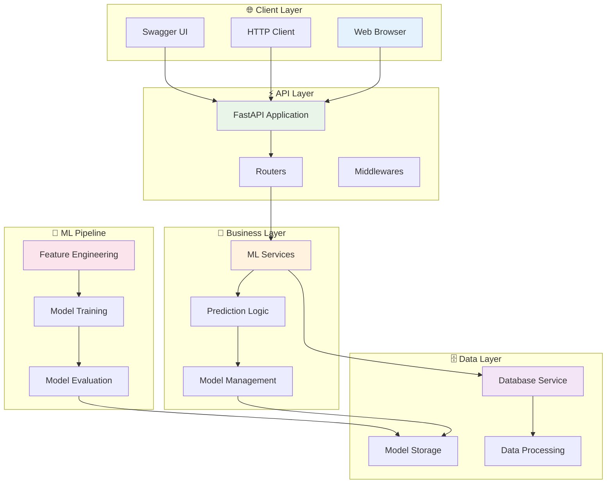
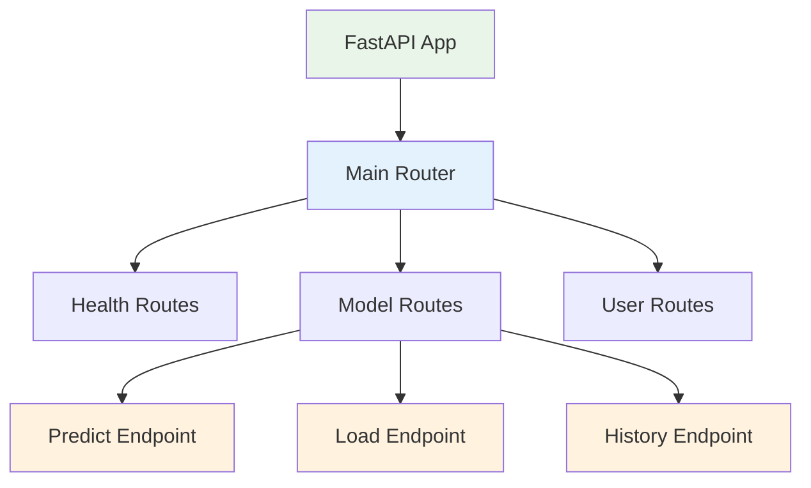
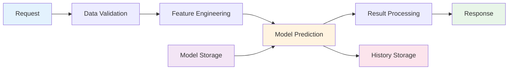
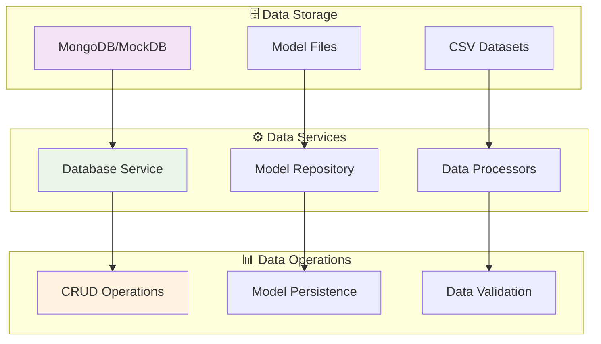
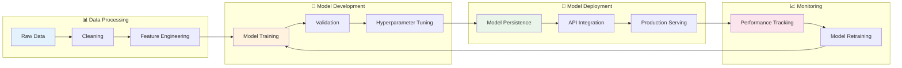
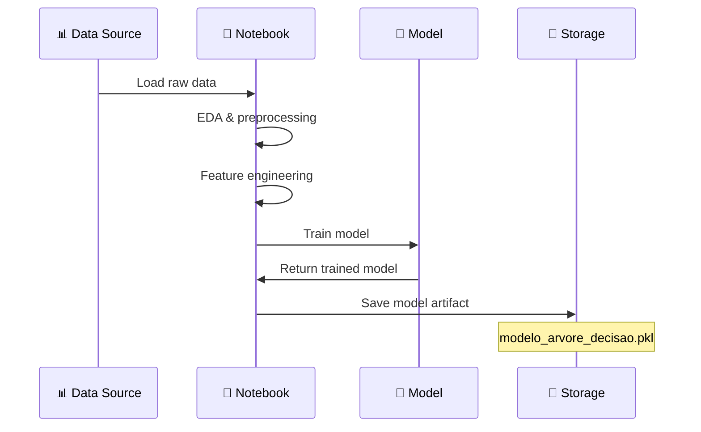
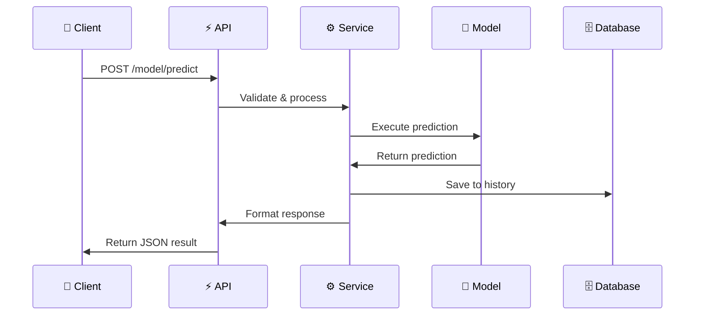
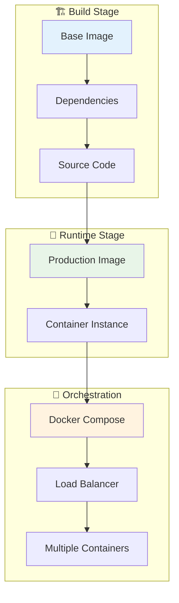

# 🏗️ Visão Geral da Arquitetura

Este documento apresenta a arquitetura geral do projeto Machine Learning Engineer Challenge, detalhando a organização dos componentes e fluxos de dados.

## 🎯 Arquitetura de Alto Nível



## 📂 Organização do Código

### 🏛️ Estrutura Hierárquica

```
machine-learning-engineer/
├── 🚀 src/                          # Código fonte principal
│   ├── routers/                     # 🔗 Camada de API/Rotas
│   │   ├── main.py                  # 📡 Aplicação FastAPI principal
│   │   └── model/                   # 🤖 Endpoints de Machine Learning
│   │       ├── predict.py           # 🎯 Predições
│   │       ├── load.py              # 📥 Carregamento de modelos
│   │       └── history.py           # 📊 Histórico de predições
│   └── services/                    # ⚙️ Camada de Serviços/Negócio
│       └── database.py              # 🗄️ Gerenciamento de dados
├── 🧪 tests/                       # Testes automatizados
├── 📊 data/                        # Datasets e dados processados
├── 🤖 model/                       # Modelos treinados e artefatos
├── 📓 notebook/                    # Jupyter Notebooks (EDA/Experimentos)
├── 📖 docs/                        # Documentação MkDocs
└── 🐳 docker/                      # Configurações de containers
```

### 🎨 Padrões Arquiteturais

| **Padrão** | **Implementação** | **Benefícios** |
|------------|------------------|----------------|
| **Layered Architecture** | API → Business → Data | Separação de responsabilidades |
| **Repository Pattern** | `database.py` | Abstração de dados |
| **Dependency Injection** | FastAPI dependencies | Testabilidade |
| **Factory Pattern** | Model loading | Flexibilidade de modelos |

## ⚡ Camada de API (FastAPI)

### 🔗 Estrutura de Rotas



**Responsabilidades:**
- 🌐 **Exposição de endpoints** REST
- 🔒 **Validação** de requests (Pydantic)
- 📋 **Serialização** de responses
- ⚠️ **Tratamento** de erros
- 📚 **Documentação** automática (Swagger)

**Tecnologias:**
- `FastAPI` - Framework web moderno
- `Pydantic` - Validação de dados
- `Uvicorn` - ASGI server

### 📡 Endpoints Principais

```python
# src/routers/main.py
@app.get("/")                    # ℹ️ Informações da API
@app.get("/health")              # 💚 Health check
@app.get("/docs")                # 📚 Documentação Swagger

# src/routers/model/predict.py
@router.post("/model/predict")   # 🎯 Predições ML

# src/routers/model/load.py
@router.get("/model/load/default")   # 📥 Carregar modelo padrão
@router.post("/model/load/")         # 📤 Upload modelo

# src/routers/model/history.py
@router.get("/model/history/")   # 📊 Histórico predições
```

## 🧠 Camada de Negócio

### 🤖 Machine Learning Services



**Componentes:**
- 🎯 **Prediction Engine** - Core de predição
- 🔧 **Feature Engineering** - Transformação de dados
- 📥 **Model Loader** - Carregamento dinâmico
- 📊 **History Manager** - Gestão de histórico
- ✅ **Validation Layer** - Validação de dados

### 🔄 Fluxo de Predição

```python
# Fluxo típico de predição
1. 📥 Receber dados do cliente
2. ✅ Validar entrada (Pydantic)
3. 🔧 Aplicar feature engineering
4. 🤖 Executar predição no modelo
5. 📊 Salvar no histórico
6. 📤 Retornar resultado
```

## 🗄️ Camada de Dados

### 💾 Gerenciamento de Dados



**Responsabilidades:**
- 💾 **Persistência** de predições
- 🔄 **CRUD operations** para histórico
- 📁 **Gerenciamento** de modelos
- 🔍 **Queries** otimizadas
- 🛡️ **Backup** e recuperação

**Tecnologias:**
- `MongoDB` / `mongomock` - Banco NoSQL
- `pandas` - Manipulação de dados
- `pickle` / `joblib` - Serialização de modelos

## 🤖 Pipeline de Machine Learning

### 🔄 Fluxo do ML Pipeline



### 🧩 Componentes do Pipeline

| **Componente** | **Responsabilidade** | **Localização** |
|----------------|---------------------|-----------------|
| 🔧 **Data Preprocessing** | Limpeza e transformação | `notebook/Transform.ipynb` |
| 📊 **Feature Engineering** | Criação de features | `notebook/Model.ipynb` |
| 🤖 **Model Training** | Treinamento de algoritmos | `notebook/Model.ipynb` |
| 📈 **Model Evaluation** | Métricas e validação | `notebook/Model.ipynb` |
| 💾 **Model Persistence** | Salvamento de modelos | `model/` directory |
| ⚡ **Model Serving** | API de predição | `src/routers/model/` |

## 🔄 Fluxos de Dados

### 📊 Fluxo de Treinamento



### 🎯 Fluxo de Predição



## 🛡️ Princípios Arquiteturais

### 🎯 Design Principles

| **Princípio** | **Implementação** | **Benefício** |
|---------------|------------------|---------------|
| **Separation of Concerns** | Camadas distintas | Manutenibilidade |
| **Single Responsibility** | Classes focadas | Testabilidade |
| **Dependency Inversion** | Interfaces abstratas | Flexibilidade |
| **Don't Repeat Yourself** | Utilitários compartilhados | Consistência |
| **Keep It Simple** | Soluções diretas | Compreensibilidade |

### 🚀 Escalabilidade

**Estratégias de Scaling:**
- 🔄 **Horizontal scaling** via containers
- ⚡ **Load balancing** com múltiplos workers
- 💾 **Database sharding** para grande volume
- 🎯 **Model versioning** para A/B testing
- 📊 **Caching** de predições frequentes

### 🛡️ Confiabilidade

**Garantias de Qualidade:**
- 🧪 **Testes automatizados** (>95% coverage)
- 🔍 **Validação** rigorosa de entrada
- ⚠️ **Error handling** gracioso
- 📊 **Logging** estruturado
- 🔄 **Health checks** periódicos

## 🔧 Configuração e Deploy

### 🐳 Containerização



**Benefícios:**
- 🔄 **Reprodutibilidade** entre ambientes
- ⚡ **Deploy rápido** e consistente
- 🎯 **Isolamento** de dependências
- 📊 **Escalabilidade** horizontal

## 📚 Próximos Passos

Para entender melhor a arquitetura:

1. 🧩 [Componentes Detalhados](components.md)
2. 🤖 [Pipeline de ML](ml-pipeline.md)
3. ⚡ [API Reference](../api/endpoints.md)
4. 🧪 [Testes de Arquitetura](../tests/integration.md)

## 📞 Suporte Técnico

- 🏗️ [Discussões de Arquitetura](https://github.com/ulissesbomjardim/machine_learning_engineer/discussions)
- 🐛 [Issues Técnicas](https://github.com/ulissesbomjardim/machine_learning_engineer/issues)
- 📧 [Contato Direto](mailto:ulisses.bomjardim@gmail.com)