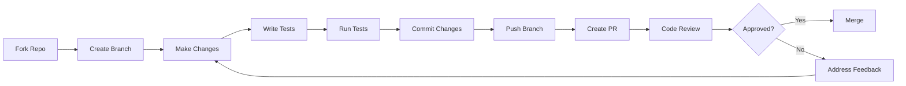

# 🤝 Guia de Contribuição

Bem-vindo ao projeto Flight Delay Prediction! Este guia contém todas as informações necessárias para contribuir de forma efetiva, incluindo padrões de código, fluxo de desenvolvimento e boas práticas.

## 🎯 Como Contribuir

### 📋 Tipos de Contribuição

Valorizamos todos os tipos de contribuição:

- 🐛 **Bug Reports**: Identifique e reporte problemas
- ✨ **Feature Requests**: Sugira novas funcionalidades  
- 🔧 **Code Contributions**: Implemente correções e melhorias
- 📚 **Documentation**: Melhore a documentação
- 🧪 **Testing**: Adicione ou melhore testes
- 🎨 **UI/UX**: Melhorias na interface e experiência
- 📊 **Data Science**: Novos modelos e análises

## 🚀 Primeiros Passos

### 1. 📥 Fork e Clone

```bash
# 1. Faça fork do repositório no GitHub
# 2. Clone seu fork localmente
git clone https://github.com/SEU_USUARIO/machine-learning-engineer.git
cd machine-learning-engineer

# 3. Adicione o repositório original como upstream
git remote add upstream https://github.com/ORIGINAL_OWNER/machine-learning-engineer.git

# 4. Verifique os remotes
git remote -v
```

### 2. ⚙️ Configuração do Ambiente

```bash
# Instalar Poetry (se não tiver)
curl -sSL https://install.python-poetry.org | python3 -

# Instalar dependências
poetry install --with dev,test

# Ativar ambiente virtual
poetry shell

# Verificar instalação
python --version
poetry --version
```

### 3. 🔧 Setup de Desenvolvimento

```bash
# Instalar pre-commit hooks
pre-commit install

# Executar testes para garantir que tudo funciona
make test

# Verificar linting
make lint

# Executar formatação
make format
```

## 🌊 Fluxo de Desenvolvimento

### 📋 Workflow Padrão



### 1. 🌿 Criação de Branch

```bash
# Sempre criar branch a partir da main atualizada
git checkout main
git pull upstream main

# Criar nova branch com nome descritivo
git checkout -b feature/add-weather-integration
git checkout -b fix/memory-leak-in-predictor
git checkout -b docs/update-api-examples
git checkout -b refactor/improve-data-pipeline
```

**Convenção de Nomes de Branch:**
- `feature/descricao-da-funcionalidade`
- `fix/descricao-do-bug`
- `docs/descricao-da-documentacao`
- `refactor/descricao-da-refatoracao`
- `test/descricao-do-teste`
- `chore/descricao-da-tarefa`

### 2. 💻 Desenvolvimento

```bash
# Faça suas alterações
# Escreva testes
# Mantenha commits pequenos e focados

# Executar testes frequentemente
make test-unit
make test-integration

# Verificar qualidade do código
make lint
make type-check
```

### 3. 📝 Commits

Seguimos a [Conventional Commits](https://conventionalcommits.org/) specification:

```bash
# Estrutura: tipo(escopo): descrição
git commit -m "feat(api): add weather data integration"
git commit -m "fix(ml): resolve memory leak in model loading"
git commit -m "docs(readme): update installation instructions"
git commit -m "test(services): add unit tests for database service"
git commit -m "refactor(utils): improve data validation functions"
```

**Tipos de Commit:**
- `feat`: Nova funcionalidade
- `fix`: Correção de bug
- `docs`: Alterações na documentação
- `style`: Formatação, lint fixes
- `refactor`: Refatoração de código
- `test`: Adição ou alteração de testes
- `chore`: Tarefas de manutenção
- `perf`: Melhoria de performance
- `ci`: Alterações no CI/CD

### 4. 🔄 Pull Request

```bash
# Antes de criar PR, sincronize com upstream
git fetch upstream
git rebase upstream/main

# Push da branch
git push origin feature/add-weather-integration

# Criar Pull Request no GitHub
```

## 📏 Padrões de Código

### 🐍 Python Standards

#### Formatação

Usamos **Black** e **isort** para formatação:

```python
# .pyproject.toml configuração
[tool.black]
line-length = 88
target-version = ['py312']
include = '\.pyi?$'
extend-exclude = '''
/(
  migrations
  | .venv
  | build
  | dist
)/
'''

[tool.isort]
profile = "black"
multi_line_output = 3
line_length = 88
```

#### Linting

Usamos **flake8** e **pylint**:

```ini
# setup.cfg
[flake8]
max-line-length = 88
extend-ignore = E203, W503, E501
exclude = 
    .git,
    __pycache__,
    .venv,
    migrations,
    build,
    dist

[pylint]
max-line-length = 88
disable = 
    missing-docstring,
    too-few-public-methods,
    import-error
```

#### Type Hints

Use type hints sempre que possível:

```python
from typing import List, Dict, Optional, Union, Any
from datetime import datetime
import pandas as pd

def predict_flight_delay(
    flight_data: Dict[str, Any],
    model_version: str = "latest"
) -> Dict[str, Union[float, str]]:
    """
    Prediz atraso de voo baseado nos dados fornecidos.
    
    Args:
        flight_data: Dados do voo para predição
        model_version: Versão do modelo a usar
        
    Returns:
        Dicionário com predição e metadados
        
    Raises:
        ValueError: Se dados inválidos forem fornecidos
        ModelNotFoundError: Se versão do modelo não existir
    """
    # Implementação aqui
    pass

class FlightDelayPredictor:
    """Classe para predição de atrasos de voo."""
    
    def __init__(self, model_path: str) -> None:
        self.model_path = model_path
        self._model: Optional[Any] = None
    
    def load_model(self) -> None:
        """Carrega modelo do disco."""
        pass
    
    def predict(
        self, 
        features: pd.DataFrame
    ) -> List[float]:
        """Realiza predições em lote."""
        pass
```

### 🧪 Padrões de Teste

#### Estrutura de Testes

```python
# tests/test_predictor.py
import pytest
from unittest.mock import Mock, patch
import pandas as pd

from src.ml.predictor import FlightDelayPredictor
from src.exceptions import ModelNotFoundError


class TestFlightDelayPredictor:
    """Testes para a classe FlightDelayPredictor."""
    
    @pytest.fixture
    def sample_data(self):
        """Dados de exemplo para testes."""
        return pd.DataFrame({
            'hour': [10, 14, 18],
            'day_of_week': [1, 3, 5],
            'weather_score': [0.8, 0.6, 0.9]
        })
    
    @pytest.fixture
    def predictor(self, tmp_path):
        """Instância do preditor para testes."""
        model_path = tmp_path / "test_model.pkl"
        return FlightDelayPredictor(str(model_path))
    
    def test_init(self, predictor):
        """Testa inicialização do preditor."""
        assert predictor.model_path is not None
        assert predictor._model is None
    
    @patch('pickle.load')
    @patch('builtins.open')
    def test_load_model_success(self, mock_open, mock_pickle, predictor):
        """Testa carregamento bem-sucedido do modelo."""
        # Arrange
        mock_model = Mock()
        mock_pickle.return_value = mock_model
        
        # Act
        predictor.load_model()
        
        # Assert
        assert predictor._model == mock_model
        mock_open.assert_called_once()
    
    def test_load_model_file_not_found(self, predictor):
        """Testa erro quando arquivo do modelo não existe."""
        # Act & Assert
        with pytest.raises(ModelNotFoundError):
            predictor.load_model()
    
    def test_predict(self, predictor, sample_data):
        """Testa predição com dados válidos."""
        # Arrange
        predictor._model = Mock()
        predictor._model.predict.return_value = [10.5, 15.2, 5.0]
        
        # Act
        result = predictor.predict(sample_data)
        
        # Assert
        assert len(result) == 3
        assert all(isinstance(pred, float) for pred in result)
        predictor._model.predict.assert_called_once()
    
    @pytest.mark.parametrize("invalid_data", [
        None,
        pd.DataFrame(),  # DataFrame vazio
        "not_a_dataframe"
    ])
    def test_predict_invalid_data(self, predictor, invalid_data):
        """Testa predição com dados inválidos."""
        predictor._model = Mock()
        
        with pytest.raises(ValueError):
            predictor.predict(invalid_data)


# Testes de integração
class TestFlightDelayPredictorIntegration:
    """Testes de integração para FlightDelayPredictor."""
    
    def test_full_prediction_pipeline(self, real_model_path, real_flight_data):
        """Testa pipeline completo de predição."""
        # Arrange
        predictor = FlightDelayPredictor(real_model_path)
        predictor.load_model()
        
        # Act
        predictions = predictor.predict(real_flight_data)
        
        # Assert
        assert len(predictions) == len(real_flight_data)
        assert all(pred >= 0 for pred in predictions)  # Atrasos não negativos
```

#### Convenções de Teste

1. **Nomes descritivos**: `test_should_return_error_when_model_not_found`
2. **Arrange-Act-Assert**: Estrutura clara de preparação, execução e verificação
3. **Fixtures**: Use para dados e setup reutilizáveis
4. **Mocking**: Mock dependências externas
5. **Parametrização**: Use `@pytest.mark.parametrize` para múltiplos casos

### 📁 Estrutura de Arquivos

```
src/
├── __init__.py
├── main.py                     # FastAPI application
├── config/
│   ├── __init__.py
│   └── settings.py            # Configurações da aplicação
├── routers/
│   ├── __init__.py
│   ├── health.py             # Health checks
│   ├── prediction.py         # Endpoints de predição
│   └── model.py              # Endpoints do modelo
├── services/
│   ├── __init__.py
│   ├── database.py           # Serviços de banco de dados
│   ├── external_apis.py      # Integrações externas
│   └── cache.py              # Serviços de cache
├── ml/
│   ├── __init__.py
│   ├── predictor.py          # Classe principal de predição
│   ├── preprocessor.py       # Pipeline de preprocessamento
│   ├── feature_engineer.py   # Engenharia de features
│   └── model_loader.py       # Carregamento de modelos
├── utils/
│   ├── __init__.py
│   ├── validators.py         # Validadores de dados
│   ├── exceptions.py         # Exceções customizadas
│   └── logging.py            # Configuração de logs
└── models/
    └── schemas.py            # Pydantic models
```

### 🔧 Ferramentas de Qualidade

#### Pre-commit Configuration

```yaml
# .pre-commit-config.yaml
repos:
  - repo: https://github.com/pre-commit/pre-commit-hooks
    rev: v4.4.0
    hooks:
      - id: trailing-whitespace
      - id: end-of-file-fixer
      - id: check-yaml
      - id: check-added-large-files
      - id: check-json
      - id: check-merge-conflict
      
  - repo: https://github.com/psf/black
    rev: 23.3.0
    hooks:
      - id: black
        language_version: python3.12
        
  - repo: https://github.com/pycqa/isort
    rev: 5.12.0
    hooks:
      - id: isort
        args: ["--profile", "black"]
        
  - repo: https://github.com/pycqa/flake8
    rev: 6.0.0
    hooks:
      - id: flake8
        additional_dependencies: [flake8-docstrings]
        
  - repo: https://github.com/pre-commit/mirrors-mypy
    rev: v1.3.0
    hooks:
      - id: mypy
        additional_dependencies: [types-all]
```

#### Makefile Commands

```makefile
# Makefile
.PHONY: install test lint format type-check clean

install:
	poetry install --with dev,test

test:
	poetry run pytest tests/ -v --cov=src --cov-report=html

test-unit:
	poetry run pytest tests/unit/ -v

test-integration:
	poetry run pytest tests/integration/ -v

lint:
	poetry run flake8 src/ tests/
	poetry run pylint src/

format:
	poetry run black src/ tests/
	poetry run isort src/ tests/

type-check:
	poetry run mypy src/

clean:
	find . -type d -name "__pycache__" -delete
	find . -type f -name "*.pyc" -delete
	rm -rf .coverage htmlcov/ .pytest_cache/

pre-commit:
	pre-commit run --all-files

ci: install lint type-check test
	@echo "✅ All CI checks passed!"
```

## 📊 Padrões de Data Science

### 🔬 Notebooks

#### Estrutura Padrão

```python
# =============================================================================
# NOTEBOOK: Análise Exploratória de Dados - Flight Delays
# AUTOR: Seu Nome
# DATA: 2024-01-20
# VERSÃO: 1.0
# =============================================================================

# %% [markdown]
# # Análise Exploratória de Dados - Flight Delays
# 
# **Objetivo:** Analisar padrões nos dados de atraso de voos
# **Dataset:** flight_delays_2024.csv
# **Período:** Janeiro 2024

# %% [markdown]
# ## 1. Setup e Imports

# %%
import pandas as pd
import numpy as np
import matplotlib.pyplot as plt
import seaborn as sns
from pathlib import Path
import warnings

# Configurações
warnings.filterwarnings('ignore')
plt.style.use('seaborn-v0_8')
sns.set_palette("husl")

%matplotlib inline
%config InlineBackend.figure_format = 'retina'

# %%
# Configurações globais
RANDOM_STATE = 42
DATA_PATH = Path("../data/input/")
OUTPUT_PATH = Path("../data/output/")

# %% [markdown]
# ## 2. Carregamento de Dados

# %%
def load_flight_data(filepath: Path) -> pd.DataFrame:
    """Carrega e faz limpeza inicial dos dados de voo."""
    df = pd.read_csv(filepath)
    
    # Conversões de tipo
    df['scheduled_departure'] = pd.to_datetime(df['scheduled_departure'])
    df['actual_departure'] = pd.to_datetime(df['actual_departure'])
    
    # Feature engineering básica
    df['delay_minutes'] = (
        df['actual_departure'] - df['scheduled_departure']
    ).dt.total_seconds() / 60
    
    return df

df = load_flight_data(DATA_PATH / "flight_data.csv")
print(f"📊 Dados carregados: {df.shape[0]:,} registros, {df.shape[1]} colunas")
```

#### Convenções para Notebooks

1. **Cabeçalho padrão** com metadados
2. **Seções organizadas** com markdown
3. **Células pequenas** e focadas
4. **Função auxiliares** bem documentadas
5. **Visualizações explicativas**
6. **Conclusões claras** ao final

### 🤖 Experimentos ML

#### Template de Experimento

```python
# experiments/experiment_template.py
from dataclasses import dataclass
from typing import Dict, Any, Optional
import mlflow
import json
from datetime import datetime

@dataclass
class ExperimentConfig:
    """Configuração de experimento ML."""
    experiment_name: str
    model_name: str
    model_params: Dict[str, Any]
    features: List[str]
    preprocessing_steps: List[str]
    validation_strategy: str
    random_state: int = 42

class MLExperiment:
    """Classe base para experimentos de ML."""
    
    def __init__(self, config: ExperimentConfig):
        self.config = config
        self.results = {}
        
    def run_experiment(
        self, 
        X_train, y_train, 
        X_test, y_test
    ) -> Dict[str, Any]:
        """Executa experimento completo."""
        
        with mlflow.start_run(run_name=self.config.experiment_name):
            # Log da configuração
            mlflow.log_params(self.config.model_params)
            mlflow.log_param("features_count", len(self.config.features))
            mlflow.log_param("validation_strategy", self.config.validation_strategy)
            
            # Treinar modelo
            model = self._train_model(X_train, y_train)
            
            # Avaliar modelo
            metrics = self._evaluate_model(model, X_test, y_test)
            
            # Log das métricas
            for metric_name, value in metrics.items():
                mlflow.log_metric(metric_name, value)
            
            # Salvar modelo
            mlflow.sklearn.log_model(model, "model")
            
            # Preparar resultados
            self.results = {
                "experiment_id": mlflow.active_run().info.run_id,
                "config": self.config,
                "metrics": metrics,
                "timestamp": datetime.now().isoformat()
            }
            
        return self.results
    
    def _train_model(self, X_train, y_train):
        """Treina o modelo."""
        # Implementação específica do modelo
        raise NotImplementedError
    
    def _evaluate_model(self, model, X_test, y_test) -> Dict[str, float]:
        """Avalia o modelo."""
        # Implementação das métricas
        raise NotImplementedError
```

## 📖 Padrões de Documentação

### 📝 Docstrings

Use o formato **Google Style**:

```python
def predict_flight_delay(
    flight_data: Dict[str, Any],
    model_version: str = "latest",
    include_confidence: bool = True
) -> Dict[str, Union[float, str]]:
    """
    Prediz atraso de voo baseado nos dados fornecidos.
    
    Esta função utiliza o modelo de machine learning treinado para predizer
    o atraso esperado de um voo com base em suas características.
    
    Args:
        flight_data: Dicionário contendo dados do voo. Deve incluir:
            - flight_number (str): Número do voo
            - origin_airport (str): Aeroporto de origem (código IATA)
            - destination_airport (str): Aeroporto de destino (código IATA)
            - scheduled_departure (str): Horário programado (ISO format)
            - weather_conditions (dict): Condições climáticas
        model_version: Versão do modelo a utilizar. Padrão é "latest".
        include_confidence: Se deve incluir score de confiança na resposta.
        
    Returns:
        Dicionário contendo:
            - delay_minutes (float): Atraso predito em minutos
            - probability_delayed (float): Probabilidade de atraso > 15min
            - confidence (float): Score de confiança (se include_confidence=True)
            - model_version (str): Versão do modelo utilizada
            
    Raises:
        ValueError: Se flight_data contém campos inválidos ou ausentes
        ModelNotFoundError: Se a versão do modelo especificada não existe
        PredictionError: Se ocorrer erro durante a predição
        
    Example:
        >>> flight_info = {
        ...     "flight_number": "AA123",
        ...     "origin_airport": "JFK", 
        ...     "destination_airport": "LAX",
        ...     "scheduled_departure": "2024-01-15T10:00:00",
        ...     "weather_conditions": {"temperature": 25.0, "wind_speed": 10}
        ... }
        >>> result = predict_flight_delay(flight_info)
        >>> print(f"Atraso esperado: {result['delay_minutes']:.1f} minutos")
        Atraso esperado: 12.3 minutos
        
    Note:
        Esta função requer que o modelo esteja previamente carregado na memória.
        Para melhor performance, mantenha a instância do preditor ativa.
    """
    # Implementação aqui
    pass
```

### 📋 README Guidelines

#### Estrutura Padrão

```markdown
# 📊 Flight Delay Prediction

[](https://python.org)
[](https://fastapi.tiangolo.com)
[](https://github.com/user/repo/actions)
[](https://codecov.io/gh/user/repo)

> Sistema de predição de atrasos de voos usando Machine Learning

## ✨ Features

- 🎯 **Predição Precisa**: MAE de 10.8 minutos
- ⚡ **API Rápida**: Resposta < 100ms
- 🔄 **Real-time**: Integração com APIs climáticas
- 📊 **Monitoramento**: Dashboard de performance
- 🐳 **Docker Ready**: Deploy simplificado

## 🚀 Quick Start

### Prerequisites

- Python 3.12+
- Poetry
- Docker (opcional)

### Installation

```bash
# Clone repository
git clone https://github.com/user/flight-delay-prediction.git
cd flight-delay-prediction

# Install dependencies
poetry install

# Run application
poetry run python -m src.main
```

### Usage

```python
import requests

# Predict flight delay
response = requests.post("http://localhost:8000/predict", json={
    "flight_number": "AA123",
    "origin_airport": "JFK",
    "destination_airport": "LAX",
    "scheduled_departure": "2024-01-15T10:00:00"
})

result = response.json()
print(f"Expected delay: {result['delay_minutes']:.1f} minutes")
```

## 📚 Documentation

- 📖 **[Full Documentation](../index.md)** - Complete documentation
- 🚀 **[Quick Start](../quick-start/installation.md)** - Get started quickly  
- 🏗️ **[Architecture](../architecture/overview.md)** - System design
- 🧪 **[API Reference](../api/endpoints.md)** - Endpoint documentation

## 🤝 Contributing

We welcome contributions! Please see our [Contributing Guide](contributing.md) for details.

## 📄 License

This project is licensed under the MIT License - see the project LICENSE file.
```

## 🔄 Code Review Guidelines

### 📝 Review Checklist

#### Funcionalidade
- [ ] O código faz o que deveria fazer?
- [ ] A lógica está correta?
- [ ] Casos extremos são tratados?
- [ ] Tratamento de erros é adequado?

#### Qualidade do Código
- [ ] Código está legível e bem organizado?
- [ ] Nomes de variáveis/funções são descritivos?
- [ ] Não há código duplicado?
- [ ] Complexidade está apropriada?

#### Testes
- [ ] Novos testes foram adicionados?
- [ ] Testes cobrem casos importantes?
- [ ] Todos os testes passam?
- [ ] Coverage não diminuiu significativamente?

#### Documentação
- [ ] Código está documentado adequadamente?
- [ ] README foi atualizado se necessário?
- [ ] Docstrings estão presentes e corretas?

#### Performance
- [ ] Não há vazamentos de memória?
- [ ] Performance é aceitável?
- [ ] Otimizações desnecessárias foram evitadas?

### 💬 Comentários de Review

**Bons exemplos:**

```
✅ "Boa implementação! Considere adicionar tratamento para o caso em que 
   weather_data seja None."

✅ "O algoritmo está correto, mas podemos melhorar a legibilidade extraindo 
   esta lógica para uma função separada."

✅ "Excelente cobertura de testes! Seria interessante adicionar um teste 
   para o caso de timeout da API."
```

**Evitar:**

```
❌ "Este código está ruim."

❌ "Não funciona."

❌ "Reescreva tudo."
```

### 🏷️ Labels de PR

- `🐛 bug`: Correção de bug
- `✨ enhancement`: Nova funcionalidade
- `📚 documentation`: Melhoria na documentação
- `🧪 tests`: Relacionado a testes
- `🔧 refactor`: Refatoração
- `⚡ performance`: Melhoria de performance
- `🚨 breaking-change`: Mudança que quebra compatibilidade
- `🚀 ready-for-review`: PR pronto para revisão
- `⏳ work-in-progress`: Ainda em desenvolvimento

## 🚀 Release Process

### 📦 Versionamento

Seguimos [Semantic Versioning](https://semver.org/):
- **MAJOR**: Mudanças que quebram compatibilidade
- **MINOR**: Novas funcionalidades mantendo compatibilidade
- **PATCH**: Correções de bugs

### 🏷️ Criação de Release

```bash
# 1. Atualizar versão
poetry version patch  # ou minor, major

# 2. Atualizar CHANGELOG
# Adicionar entrada para nova versão

# 3. Commit e tag
git add pyproject.toml CHANGELOG.md
git commit -m "chore: release v1.2.3"
git tag v1.2.3

# 4. Push
git push origin main --tags
```

### 📋 Checklist de Release

- [ ] Todos os testes passam
- [ ] Documentação está atualizada
- [ ] CHANGELOG foi atualizado
- [ ] Versão foi incrementada
- [ ] Tag foi criada
- [ ] Release notes foram escritas

## 🆘 Ajuda e Suporte

### 📞 Onde Buscar Ajuda

1. **📖 Documentação**: Verifique a [documentação completa](../index.md)
2. **🐛 Issues**: Busque por issues similares no GitHub
3. **💬 Discussions**: Participe das discussões da comunidade
4. **📧 Contato**: Entre em contato com maintainers

### ❓ Como Fazer Boas Perguntas

1. **Seja específico**: Descreva exatamente o que está tentando fazer
2. **Contexto**: Forneça informações sobre o ambiente
3. **Código**: Inclua código relevante (use código minimalreprodutível)
4. **Erro**: Cole a mensagem de erro completa
5. **Tentativas**: Descreva o que já tentou

**Exemplo de boa pergunta:**

```markdown
## Problema
Estou tentando fazer uma predição usando a API, mas recebo erro 422.

## Ambiente
- Python 3.12
- FastAPI 0.104
- OS: Ubuntu 22.04

## Código
```python
import requests

response = requests.post("http://localhost:8000/api/v1/predict", json={
    "flight_number": "AA123",
    "origin_airport": "JFK"
})
print(response.status_code)  # 422
```

## Erro
```json
{
  "detail": [
    {
      "loc": ["body", "destination_airport"],
      "msg": "field required",
      "type": "value_error.missing"
    }
  ]
}
```

## O que já tentei
- Verifiquei a documentação da API
- Testei com outros dados
- Validei o JSON enviado

Como posso resolver esse erro de campo obrigatório?
```

---

## 🙏 Agradecimentos

Obrigado por contribuir para o projeto Flight Delay Prediction! Sua participação ajuda a tornar este projeto melhor para todos. 

### 🌟 Contributors

<!-- Lista será gerada automaticamente pelo GitHub -->

---

**📞 Contato**
- 📧 Email: [maintainer@project.com](mailto:maintainer@project.com)
- 💬 Discord: [Convite do servidor](https://discord.gg/project)
- 🐦 Twitter: [@project_ml](https://twitter.com/project_ml)