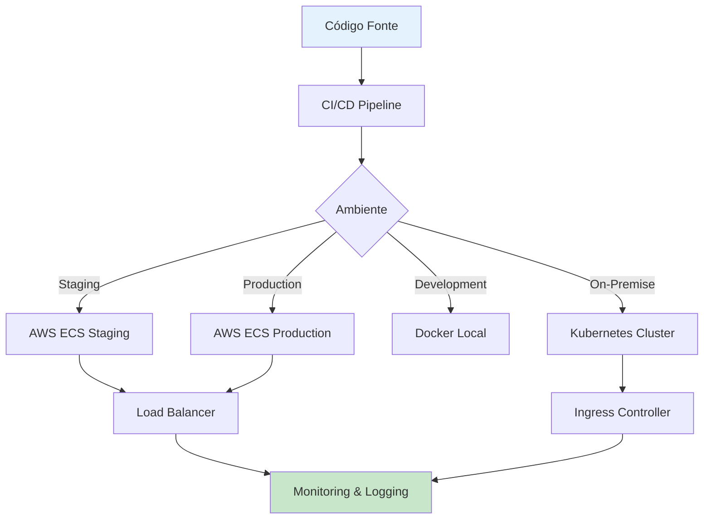

# 🚀 Deployment

Guia completo para deploy da aplicação em diferentes ambientes de produção, incluindo AWS, Google Cloud, Azure e infraestrutura on-premise.

## 🎯 Visão Geral

Esta seção documenta as estratégias de deployment para a aplicação de predição de atrasos de voos, cobrindo desde deployment local até infraestrutura em nuvem com alta disponibilidade.

## ☁️ Estratégias de Deployment



## 🐳 AWS ECS Deployment

### 1. 📋 Task Definition

```json
{
  "family": "flight-delay-api",
  "networkMode": "awsvpc",
  "requiresCompatibilities": ["FARGATE"],
  "cpu": "1024",
  "memory": "2048",
  "executionRoleArn": "arn:aws:iam::ACCOUNT:role/ecsTaskExecutionRole",
  "taskRoleArn": "arn:aws:iam::ACCOUNT:role/flightDelayTaskRole",
  "containerDefinitions": [
    {
      "name": "api",
      "image": "YOUR_ACCOUNT.dkr.ecr.us-east-1.amazonaws.com/flight-delay-api:latest",
      "essential": true,
      "portMappings": [
        {
          "containerPort": 8000,
          "protocol": "tcp"
        }
      ],
      "environment": [
        {
          "name": "ENVIRONMENT",
          "value": "production"
        },
        {
          "name": "LOG_LEVEL",
          "value": "INFO"
        }
      ],
      "secrets": [
        {
          "name": "DATABASE_URL",
          "valueFrom": "arn:aws:secretsmanager:us-east-1:ACCOUNT:secret:flight-delay/database-url"
        },
        {
          "name": "REDIS_URL",
          "valueFrom": "arn:aws:secretsmanager:us-east-1:ACCOUNT:secret:flight-delay/redis-url"
        }
      ],
      "logConfiguration": {
        "logDriver": "awslogs",
        "options": {
          "awslogs-group": "/ecs/flight-delay-api",
          "awslogs-region": "us-east-1",
          "awslogs-stream-prefix": "api"
        }
      },
      "healthCheck": {
        "command": ["CMD-SHELL", "curl -f http://localhost:8000/health || exit 1"],
        "interval": 30,
        "timeout": 5,
        "retries": 3,
        "startPeriod": 60
      }
    }
  ]
}
```

### 2. 🔧 ECS Service Configuration

```yaml
# ecs-service.yml
Resources:
  FlightDelayService:
    Type: AWS::ECS::Service
    Properties:
      ServiceName: flight-delay-api
      Cluster: !Ref ECSCluster
      TaskDefinition: !Ref TaskDefinition
      DesiredCount: 3
      LaunchType: FARGATE
      NetworkConfiguration:
        AwsvpcConfiguration:
          SecurityGroups:
            - !Ref APISecurityGroup
          Subnets:
            - !Ref PrivateSubnet1
            - !Ref PrivateSubnet2
          AssignPublicIp: DISABLED
      LoadBalancers:
        - ContainerName: api
          ContainerPort: 8000
          TargetGroupArn: !Ref APITargetGroup
      ServiceRegistries:
        - RegistryArn: !GetAtt ServiceDiscovery.Arn
      DeploymentConfiguration:
        MaximumPercent: 200
        MinimumHealthyPercent: 50
        DeploymentCircuitBreaker:
          Enable: true
          Rollback: true
      EnableExecuteCommand: true

  # Auto Scaling
  ServiceAutoScalingTarget:
    Type: AWS::ApplicationAutoScaling::ScalableTarget
    Properties:
      MaxCapacity: 10
      MinCapacity: 2
      ResourceId: !Sub "service/${ECSCluster}/${FlightDelayService.Name}"
      RoleARN: !GetAtt AutoScalingRole.Arn
      ScalableDimension: ecs:service:DesiredCount
      ServiceNamespace: ecs

  ServiceAutoScalingPolicy:
    Type: AWS::ApplicationAutoScaling::ScalingPolicy
    Properties:
      PolicyName: FlightDelayAPIScalingPolicy
      PolicyType: TargetTrackingScaling
      ResourceId: !Ref ServiceAutoScalingTarget
      ScalableDimension: ecs:service:DesiredCount
      ServiceNamespace: ecs
      TargetTrackingScalingPolicyConfiguration:
        PredefinedMetricSpecification:
          PredefinedMetricType: ECSServiceAverageCPUUtilization
        TargetValue: 70.0
        ScaleOutCooldown: 300
        ScaleInCooldown: 300
```

### 3. 🏗️ Infrastructure as Code (Terraform)

```hcl
# main.tf
terraform {
  required_version = ">= 1.0"
  required_providers {
    aws = {
      source  = "hashicorp/aws"
      version = "~> 5.0"
    }
  }
  
  backend "s3" {
    bucket = "flight-delay-terraform-state"
    key    = "production/terraform.tfstate"
    region = "us-east-1"
  }
}

provider "aws" {
  region = var.aws_region
  
  default_tags {
    tags = {
      Project     = "FlightDelayPrediction"
      Environment = var.environment
      ManagedBy   = "Terraform"
    }
  }
}

# VPC
module "vpc" {
  source = "terraform-aws-modules/vpc/aws"
  
  name = "flight-delay-vpc"
  cidr = "10.0.0.0/16"
  
  azs             = ["us-east-1a", "us-east-1b", "us-east-1c"]
  private_subnets = ["10.0.1.0/24", "10.0.2.0/24", "10.0.3.0/24"]
  public_subnets  = ["10.0.101.0/24", "10.0.102.0/24", "10.0.103.0/24"]
  
  enable_nat_gateway = true
  enable_vpn_gateway = false
  
  enable_dns_hostnames = true
  enable_dns_support   = true
  
  tags = {
    Name = "flight-delay-vpc"
  }
}

# ECS Cluster
resource "aws_ecs_cluster" "main" {
  name = "flight-delay-cluster"
  
  configuration {
    execute_command_configuration {
      logging = "OVERRIDE"
      
      log_configuration {
        cloud_watch_log_group_name = aws_cloudwatch_log_group.ecs.name
      }
    }
  }
  
  setting {
    name  = "containerInsights"
    value = "enabled"
  }
}

# Application Load Balancer
resource "aws_lb" "main" {
  name               = "flight-delay-alb"
  internal           = false
  load_balancer_type = "application"
  security_groups    = [aws_security_group.alb.id]
  subnets           = module.vpc.public_subnets
  
  enable_deletion_protection = true
  
  access_logs {
    bucket  = aws_s3_bucket.alb_logs.bucket
    prefix  = "flight-delay-alb"
    enabled = true
  }
}

# RDS PostgreSQL (alternativa ao MongoDB)
resource "aws_db_instance" "main" {
  identifier = "flight-delay-db"
  
  engine         = "postgres"
  engine_version = "15.4"
  instance_class = "db.t3.medium"
  
  allocated_storage     = 20
  max_allocated_storage = 100
  storage_encrypted     = true
  
  db_name  = "flight_predictions"
  username = "postgres"
  password = var.db_password
  
  vpc_security_group_ids = [aws_security_group.rds.id]
  db_subnet_group_name   = aws_db_subnet_group.main.name
  
  backup_retention_period = 7
  backup_window          = "03:00-04:00"
  maintenance_window     = "sun:04:00-sun:05:00"
  
  skip_final_snapshot = false
  final_snapshot_identifier = "flight-delay-db-final-snapshot-${formatdate("YYYY-MM-DD-hhmm", timestamp())}"
  
  performance_insights_enabled = true
  monitoring_interval         = 60
  monitoring_role_arn        = aws_iam_role.rds_monitoring.arn
  
  tags = {
    Name = "flight-delay-database"
  }
}

# ElastiCache Redis
resource "aws_elasticache_subnet_group" "main" {
  name       = "flight-delay-cache-subnet"
  subnet_ids = module.vpc.private_subnets
}

resource "aws_elasticache_replication_group" "main" {
  replication_group_id       = "flight-delay-redis"
  description               = "Redis cluster for flight delay prediction"
  
  node_type                 = "cache.t3.micro"
  port                      = 6379
  parameter_group_name      = "default.redis7"
  
  num_cache_clusters        = 2
  automatic_failover_enabled = true
  multi_az_enabled          = true
  
  subnet_group_name = aws_elasticache_subnet_group.main.name
  security_group_ids = [aws_security_group.redis.id]
  
  at_rest_encryption_enabled = true
  transit_encryption_enabled = true
  auth_token                = var.redis_auth_token
  
  log_delivery_configuration {
    destination      = aws_cloudwatch_log_group.redis.name
    destination_type = "cloudwatch-logs"
    log_format      = "text"
    log_type        = "slow-log"
  }
}
```

## 🌐 Google Cloud Platform Deployment

### 1. 📋 Cloud Run Configuration

```yaml
# cloudrun.yml
apiVersion: serving.knative.dev/v1
kind: Service
metadata:
  name: flight-delay-api
  annotations:
    run.googleapis.com/ingress: all
    run.googleapis.com/execution-environment: gen2
spec:
  template:
    metadata:
      annotations:
        autoscaling.knative.dev/maxScale: "100"
        autoscaling.knative.dev/minScale: "2"
        run.googleapis.com/cpu-throttling: "false"
        run.googleapis.com/memory: "2Gi"
        run.googleapis.com/cpu: "1"
    spec:
      containerConcurrency: 80
      timeoutSeconds: 300
      containers:
      - image: gcr.io/PROJECT_ID/flight-delay-api:latest
        ports:
        - containerPort: 8000
        env:
        - name: ENVIRONMENT
          value: "production"
        - name: DATABASE_URL
          valueFrom:
            secretKeyRef:
              name: flight-delay-secrets
              key: database-url
        - name: REDIS_URL
          valueFrom:
            secretKeyRef:
              name: flight-delay-secrets
              key: redis-url
        resources:
          limits:
            cpu: "1"
            memory: "2Gi"
        livenessProbe:
          httpGet:
            path: /health
            port: 8000
          initialDelaySeconds: 30
          periodSeconds: 10
        readinessProbe:
          httpGet:
            path: /health
            port: 8000
          initialDelaySeconds: 5
          periodSeconds: 5
```

### 2. 🔧 Cloud Build Pipeline

```yaml
# cloudbuild.yml
steps:
  # Build da imagem
  - name: 'gcr.io/cloud-builders/docker'
    args:
      - 'build'
      - '-t'
      - 'gcr.io/$PROJECT_ID/flight-delay-api:$COMMIT_SHA'
      - '-t' 
      - 'gcr.io/$PROJECT_ID/flight-delay-api:latest'
      - '.'
    
  # Push da imagem
  - name: 'gcr.io/cloud-builders/docker'
    args:
      - 'push'
      - 'gcr.io/$PROJECT_ID/flight-delay-api:$COMMIT_SHA'
  
  - name: 'gcr.io/cloud-builders/docker'
    args:
      - 'push'
      - 'gcr.io/$PROJECT_ID/flight-delay-api:latest'
  
  # Testes
  - name: 'gcr.io/$PROJECT_ID/flight-delay-api:$COMMIT_SHA'
    entrypoint: 'python'
    args: ['-m', 'pytest', 'tests/', '-v']
    env:
      - 'TESTING=true'
  
  # Deploy para Cloud Run
  - name: 'gcr.io/cloud-builders/gcloud'
    args:
      - 'run'
      - 'deploy'
      - 'flight-delay-api'
      - '--image=gcr.io/$PROJECT_ID/flight-delay-api:$COMMIT_SHA'
      - '--region=us-central1'
      - '--platform=managed'
      - '--allow-unauthenticated'
      - '--max-instances=100'
      - '--min-instances=2'
      - '--cpu=1'
      - '--memory=2Gi'
      - '--concurrency=80'
      - '--timeout=300'

options:
  logging: CLOUD_LOGGING_ONLY
  machineType: 'E2_HIGHCPU_8'

timeout: '1200s'
```

## ⚓ Kubernetes Deployment

### 1. 📋 Deployment Manifest

```yaml
# k8s/deployment.yml
apiVersion: apps/v1
kind: Deployment
metadata:
  name: flight-delay-api
  labels:
    app: flight-delay-api
    version: v1
spec:
  replicas: 3
  strategy:
    type: RollingUpdate
    rollingUpdate:
      maxUnavailable: 1
      maxSurge: 1
  selector:
    matchLabels:
      app: flight-delay-api
  template:
    metadata:
      labels:
        app: flight-delay-api
        version: v1
    spec:
      serviceAccountName: flight-delay-service-account
      securityContext:
        runAsNonRoot: true
        runAsUser: 1000
        fsGroup: 2000
      containers:
      - name: api
        image: flight-delay-api:latest
        imagePullPolicy: Always
        ports:
        - containerPort: 8000
          protocol: TCP
        env:
        - name: ENVIRONMENT
          value: "production"
        - name: DATABASE_URL
          valueFrom:
            secretKeyRef:
              name: flight-delay-secrets
              key: database-url
        - name: REDIS_URL
          valueFrom:
            secretKeyRef:
              name: flight-delay-secrets
              key: redis-url
        resources:
          requests:
            cpu: 100m
            memory: 256Mi
          limits:
            cpu: 500m
            memory: 512Mi
        livenessProbe:
          httpGet:
            path: /health
            port: 8000
          initialDelaySeconds: 30
          periodSeconds: 10
          timeoutSeconds: 5
          failureThreshold: 3
        readinessProbe:
          httpGet:
            path: /health
            port: 8000
          initialDelaySeconds: 5
          periodSeconds: 5
          timeoutSeconds: 3
          failureThreshold: 3
        securityContext:
          allowPrivilegeEscalation: false
          readOnlyRootFilesystem: true
          capabilities:
            drop:
            - ALL
        volumeMounts:
        - name: tmp-volume
          mountPath: /tmp
      volumes:
      - name: tmp-volume
        emptyDir: {}
      nodeSelector:
        kubernetes.io/os: linux
      tolerations:
      - key: "kubernetes.io/arch"
        operator: "Equal"
        value: "amd64"
        effect: "NoSchedule"

---
# Service
apiVersion: v1
kind: Service
metadata:
  name: flight-delay-api-service
  labels:
    app: flight-delay-api
spec:
  type: ClusterIP
  ports:
  - port: 80
    targetPort: 8000
    protocol: TCP
    name: http
  selector:
    app: flight-delay-api

---
# HorizontalPodAutoscaler
apiVersion: autoscaling/v2
kind: HorizontalPodAutoscaler
metadata:
  name: flight-delay-api-hpa
spec:
  scaleTargetRef:
    apiVersion: apps/v1
    kind: Deployment
    name: flight-delay-api
  minReplicas: 2
  maxReplicas: 10
  metrics:
  - type: Resource
    resource:
      name: cpu
      target:
        type: Utilization
        averageUtilization: 70
  - type: Resource
    resource:
      name: memory
      target:
        type: Utilization
        averageUtilization: 80
  behavior:
    scaleDown:
      stabilizationWindowSeconds: 300
      policies:
      - type: Percent
        value: 10
        periodSeconds: 60
    scaleUp:
      stabilizationWindowSeconds: 0
      policies:
      - type: Percent
        value: 100
        periodSeconds: 15
      - type: Pods
        value: 4
        periodSeconds: 15
      selectPolicy: Max
```

### 2. 🌐 Ingress Configuration

```yaml
# k8s/ingress.yml
apiVersion: networking.k8s.io/v1
kind: Ingress
metadata:
  name: flight-delay-ingress
  annotations:
    kubernetes.io/ingress.class: "nginx"
    nginx.ingress.kubernetes.io/rewrite-target: /
    nginx.ingress.kubernetes.io/ssl-redirect: "true"
    nginx.ingress.kubernetes.io/force-ssl-redirect: "true"
    nginx.ingress.kubernetes.io/rate-limit: "10"
    nginx.ingress.kubernetes.io/rate-limit-window: "1m"
    cert-manager.io/cluster-issuer: "letsencrypt-prod"
spec:
  tls:
  - hosts:
    - api.flightdelay.com
    secretName: flight-delay-tls
  rules:
  - host: api.flightdelay.com
    http:
      paths:
      - path: /
        pathType: Prefix
        backend:
          service:
            name: flight-delay-api-service
            port:
              number: 80
```

## 🔄 CI/CD Pipelines

### 1. 🐙 GitHub Actions

```yaml
# .github/workflows/deploy.yml
name: Deploy to Production

on:
  push:
    branches: [main]
  pull_request:
    branches: [main]

env:
  REGISTRY: ghcr.io
  IMAGE_NAME: ${{ github.repository }}

jobs:
  test:
    runs-on: ubuntu-latest
    
    services:
      mongodb:
        image: mongo:7.0
        ports:
          - 27017:27017
      redis:
        image: redis:7-alpine
        ports:
          - 6379:6379
    
    steps:
    - uses: actions/checkout@v4
    
    - name: Set up Python
      uses: actions/setup-python@v4
      with:
        python-version: '3.12'
    
    - name: Install dependencies
      run: |
        pip install poetry
        poetry install
    
    - name: Run tests
      run: |
        poetry run pytest tests/ -v --cov=src --cov-report=xml
      env:
        DATABASE_URL: mongodb://localhost:27017/test_db
        REDIS_URL: redis://localhost:6379/0
        TESTING: true
    
    - name: Upload coverage to Codecov
      uses: codecov/codecov-action@v3
      with:
        file: ./coverage.xml

  build:
    needs: test
    runs-on: ubuntu-latest
    if: github.event_name == 'push' && github.ref == 'refs/heads/main'
    
    outputs:
      image: ${{ steps.image.outputs.image }}
    
    steps:
    - name: Checkout
      uses: actions/checkout@v4
    
    - name: Log in to Container Registry
      uses: docker/login-action@v3
      with:
        registry: ${{ env.REGISTRY }}
        username: ${{ github.actor }}
        password: ${{ secrets.GITHUB_TOKEN }}
    
    - name: Extract metadata
      id: meta
      uses: docker/metadata-action@v5
      with:
        images: ${{ env.REGISTRY }}/${{ env.IMAGE_NAME }}
        tags: |
          type=ref,event=branch
          type=ref,event=pr
          type=sha,prefix={{branch}}-
          type=raw,value=latest,enable={{is_default_branch}}
    
    - name: Build and push
      id: build
      uses: docker/build-push-action@v5
      with:
        context: .
        platforms: linux/amd64,linux/arm64
        push: true
        tags: ${{ steps.meta.outputs.tags }}
        labels: ${{ steps.meta.outputs.labels }}
        cache-from: type=gha
        cache-to: type=gha,mode=max
    
    - name: Output image
      id: image
      run: echo "image=${{ env.REGISTRY }}/${{ env.IMAGE_NAME }}:latest" >> $GITHUB_OUTPUT

  deploy:
    needs: build
    runs-on: ubuntu-latest
    environment: production
    
    steps:
    - name: Checkout
      uses: actions/checkout@v4
    
    - name: Configure AWS credentials
      uses: aws-actions/configure-aws-credentials@v4
      with:
        aws-access-key-id: ${{ secrets.AWS_ACCESS_KEY_ID }}
        aws-secret-access-key: ${{ secrets.AWS_SECRET_ACCESS_KEY }}
        aws-region: us-east-1
    
    - name: Update ECS task definition
      id: task-def
      uses: aws-actions/amazon-ecs-render-task-definition@v1
      with:
        task-definition: .aws/task-definition.json
        container-name: api
        image: ${{ needs.build.outputs.image }}
    
    - name: Deploy to ECS
      uses: aws-actions/amazon-ecs-deploy-task-definition@v1
      with:
        task-definition: ${{ steps.task-def.outputs.task-definition }}
        service: flight-delay-api
        cluster: flight-delay-cluster
        wait-for-service-stability: true
    
    - name: Verify deployment
      run: |
        sleep 60
        curl -f ${{ secrets.PRODUCTION_URL }}/health
```

### 2. 🦊 GitLab CI/CD

```yaml
# .gitlab-ci.yml
stages:
  - test
  - build
  - deploy

variables:
  DOCKER_IMAGE: $CI_REGISTRY_IMAGE
  DOCKER_TAG: $CI_COMMIT_SHA

.docker_template: &docker_template
  image: docker:24.0.5
  services:
    - docker:24.0.5-dind
  before_script:
    - echo $CI_REGISTRY_PASSWORD | docker login -u $CI_REGISTRY_USER --password-stdin $CI_REGISTRY

test:
  stage: test
  image: python:3.12
  services:
    - name: mongo:7.0
      alias: mongodb
    - name: redis:7-alpine
      alias: redis
  variables:
    DATABASE_URL: "mongodb://mongodb:27017/test_db"
    REDIS_URL: "redis://redis:6379/0"
    TESTING: "true"
  before_script:
    - pip install poetry
    - poetry install
  script:
    - poetry run pytest tests/ -v --cov=src --cov-report=term-missing --cov-report=xml
    - poetry run ruff check src/ tests/
    - poetry run black --check src/ tests/
  coverage: '/TOTAL.+ ([0-9]{1,3}%)/'
  artifacts:
    reports:
      coverage_report:
        coverage_format: cobertura
        path: coverage.xml
    paths:
      - coverage.xml
    expire_in: 1 week

build:
  stage: build
  <<: *docker_template
  script:
    - docker build -t $DOCKER_IMAGE:$DOCKER_TAG -t $DOCKER_IMAGE:latest .
    - docker push $DOCKER_IMAGE:$DOCKER_TAG
    - docker push $DOCKER_IMAGE:latest
  only:
    - main

deploy_staging:
  stage: deploy
  <<: *docker_template
  environment:
    name: staging
    url: https://staging-api.flightdelay.com
  script:
    - echo "Deploying to staging..."
    - |
      kubectl set image deployment/flight-delay-api-staging \
        api=$DOCKER_IMAGE:$DOCKER_TAG \
        --namespace=staging
    - kubectl rollout status deployment/flight-delay-api-staging --namespace=staging
  only:
    - main

deploy_production:
  stage: deploy
  <<: *docker_template
  environment:
    name: production
    url: https://api.flightdelay.com
  script:
    - echo "Deploying to production..."
    - |
      kubectl set image deployment/flight-delay-api \
        api=$DOCKER_IMAGE:$DOCKER_TAG \
        --namespace=production
    - kubectl rollout status deployment/flight-delay-api --namespace=production
  when: manual
  only:
    - main
```

## 📊 Monitoramento e Observabilidade

### 1. 🔍 Prometheus & Grafana

```yaml
# monitoring/prometheus-config.yml
apiVersion: v1
kind: ConfigMap
metadata:
  name: prometheus-config
data:
  prometheus.yml: |
    global:
      scrape_interval: 15s
      evaluation_interval: 15s
    
    rule_files:
      - "/etc/prometheus/rules/*.yml"
    
    scrape_configs:
      - job_name: 'flight-delay-api'
        kubernetes_sd_configs:
          - role: pod
        relabel_configs:
          - source_labels: [__meta_kubernetes_pod_annotation_prometheus_io_scrape]
            action: keep
            regex: true
          - source_labels: [__meta_kubernetes_pod_annotation_prometheus_io_path]
            action: replace
            target_label: __metrics_path__
            regex: (.+)
          - source_labels: [__address__, __meta_kubernetes_pod_annotation_prometheus_io_port]
            action: replace
            regex: ([^:]+)(?::\d+)?;(\d+)
            replacement: $1:$2
            target_label: __address__
    
    alerting:
      alertmanagers:
        - kubernetes_sd_configs:
            - role: pod
          relabel_configs:
            - source_labels: [__meta_kubernetes_pod_label_app]
              action: keep
              regex: alertmanager

---
# Alerting Rules
apiVersion: v1
kind: ConfigMap
metadata:
  name: prometheus-rules
data:
  flight-delay.yml: |
    groups:
      - name: flight-delay-api
        rules:
          - alert: APIHighErrorRate
            expr: rate(http_requests_total{status=~"5.."}[5m]) > 0.1
            for: 5m
            labels:
              severity: critical
            annotations:
              summary: "High error rate detected"
              description: "API error rate is {{ $value }} errors per second"
          
          - alert: APIHighLatency
            expr: histogram_quantile(0.95, rate(http_request_duration_seconds_bucket[5m])) > 1.0
            for: 5m
            labels:
              severity: warning
            annotations:
              summary: "High API latency"
              description: "95th percentile latency is {{ $value }} seconds"
          
          - alert: PodCrashLooping
            expr: rate(kube_pod_container_status_restarts_total[15m]) > 0
            for: 5m
            labels:
              severity: critical
            annotations:
              summary: "Pod is crash looping"
              description: "Pod {{ $labels.pod }} is restarting frequently"
```

### 2. 📊 Application Metrics

```python
# src/monitoring/metrics.py
from prometheus_client import Counter, Histogram, Gauge, start_http_server
import time
from functools import wraps

# Métricas customizadas
REQUEST_COUNT = Counter(
    'http_requests_total',
    'Total HTTP requests',
    ['method', 'endpoint', 'status']
)

REQUEST_LATENCY = Histogram(
    'http_request_duration_seconds',
    'HTTP request latency',
    ['method', 'endpoint']
)

ACTIVE_CONNECTIONS = Gauge(
    'http_active_connections',
    'Active HTTP connections'
)

PREDICTION_COUNT = Counter(
    'predictions_total',
    'Total predictions made',
    ['model_type', 'result']
)

MODEL_INFERENCE_TIME = Histogram(
    'model_inference_duration_seconds',
    'Model inference time',
    ['model_type']
)

def monitor_requests(f):
    """Decorator para monitorar requests"""
    @wraps(f)
    def decorated_function(*args, **kwargs):
        start_time = time.time()
        
        try:
            result = f(*args, **kwargs)
            status = '200'
            return result
        except Exception as e:
            status = '500'
            raise
        finally:
            REQUEST_COUNT.labels(
                method='POST', 
                endpoint='/predict', 
                status=status
            ).inc()
            
            REQUEST_LATENCY.labels(
                method='POST', 
                endpoint='/predict'
            ).observe(time.time() - start_time)
    
    return decorated_function

def monitor_predictions(f):
    """Decorator para monitorar predições"""
    @wraps(f)
    def decorated_function(*args, **kwargs):
        start_time = time.time()
        
        result = f(*args, **kwargs)
        
        # Registrar métrica
        PREDICTION_COUNT.labels(
            model_type='xgboost',
            result='delayed' if result['is_delayed'] else 'on_time'
        ).inc()
        
        MODEL_INFERENCE_TIME.labels(
            model_type='xgboost'
        ).observe(time.time() - start_time)
        
        return result
    
    return decorated_function
```

## 🛡️ Security & Compliance

### 1. 🔐 Security Scanning

```yaml
# .github/workflows/security.yml
name: Security Scan

on:
  push:
    branches: [main, develop]
  pull_request:
    branches: [main]
  schedule:
    - cron: '0 2 * * 1'  # Weekly scan

jobs:
  security-scan:
    runs-on: ubuntu-latest
    
    steps:
    - uses: actions/checkout@v4
    
    # Dependency scanning
    - name: Run Trivy vulnerability scanner
      uses: aquasecurity/trivy-action@master
      with:
        scan-type: 'fs'
        scan-ref: '.'
        format: 'sarif'
        output: 'trivy-results.sarif'
    
    - name: Upload Trivy scan results
      uses: github/codeql-action/upload-sarif@v2
      with:
        sarif_file: 'trivy-results.sarif'
    
    # Container scanning
    - name: Build image for scanning
      run: docker build -t security-scan .
    
    - name: Run Trivy image scan
      uses: aquasecurity/trivy-action@master
      with:
        image-ref: 'security-scan'
        format: 'sarif'
        output: 'trivy-image-results.sarif'
    
    # SAST scanning
    - name: Initialize CodeQL
      uses: github/codeql-action/init@v2
      with:
        languages: python
    
    - name: Perform CodeQL Analysis
      uses: github/codeql-action/analyze@v2
    
    # Secrets scanning
    - name: Run GitLeaks
      uses: zricethezav/gitleaks-action@master
```

### 2. 🔒 Network Policies

```yaml
# k8s/network-policy.yml
apiVersion: networking.k8s.io/v1
kind: NetworkPolicy
metadata:
  name: flight-delay-api-netpol
spec:
  podSelector:
    matchLabels:
      app: flight-delay-api
  policyTypes:
  - Ingress
  - Egress
  
  ingress:
  - from:
    - namespaceSelector:
        matchLabels:
          name: ingress-nginx
    - podSelector:
        matchLabels:
          app: prometheus
    ports:
    - protocol: TCP
      port: 8000
  
  egress:
  - to:
    - namespaceSelector:
        matchLabels:
          name: database
    ports:
    - protocol: TCP
      port: 27017
  - to:
    - namespaceSelector:
        matchLabels:
          name: cache
    ports:
    - protocol: TCP
      port: 6379
  - to: []
    ports:
    - protocol: TCP
      port: 53
    - protocol: UDP
      port: 53
  - to: []
    ports:
    - protocol: TCP
      port: 443
```

## 📋 Checklist de Deployment

### ✅ **Pré-Deploy**

- [ ] **Testes passando**
  - [ ] Testes unitários
  - [ ] Testes de integração
  - [ ] Testes de segurança
  - [ ] Testes de performance

- [ ] **Configuração validada**
  - [ ] Variáveis de ambiente
  - [ ] Secrets configurados
  - [ ] Recursos adequados
  - [ ] Health checks funcionando

- [ ] **Infraestrutura preparada**
  - [ ] Banco de dados migrado
  - [ ] Cache configurado
  - [ ] Load balancer configurado
  - [ ] Monitoramento ativo

### ✅ **Deploy**

- [ ] **Deployment executado**
  - [ ] Imagem construída e pushed
  - [ ] Containers atualizados
  - [ ] Rolling update concluído
  - [ ] Health checks passando

- [ ] **Validação pós-deploy**
  - [ ] Endpoints respondendo
  - [ ] Métricas normais
  - [ ] Logs sem erros
  - [ ] Smoke tests passando

### ✅ **Pós-Deploy**

- [ ] **Monitoramento ativo**
  - [ ] Alertas configurados
  - [ ] Dashboards atualizados
  - [ ] SLAs monitorados

- [ ] **Rollback preparado**
  - [ ] Versão anterior disponível
  - [ ] Procedimento de rollback testado
  - [ ] Equipe notificada

## 🔗 Próximos Passos

1. **[🐳 Setup Docker](setup.md)** - Configuração inicial
2. **[🔧 Docker Compose](compose.md)** - Orquestração local
3. **[📊 Monitoramento](../dev/troubleshooting.md)** - Observabilidade

---

## 📞 Referências

- ☁️ **[AWS ECS](https://docs.aws.amazon.com/ecs/)** - Documentação oficial
- ⚓ **[Kubernetes](https://kubernetes.io/docs/)** - Guias de deployment
- 🔍 **[Prometheus](https://prometheus.io/docs/)** - Monitoramento