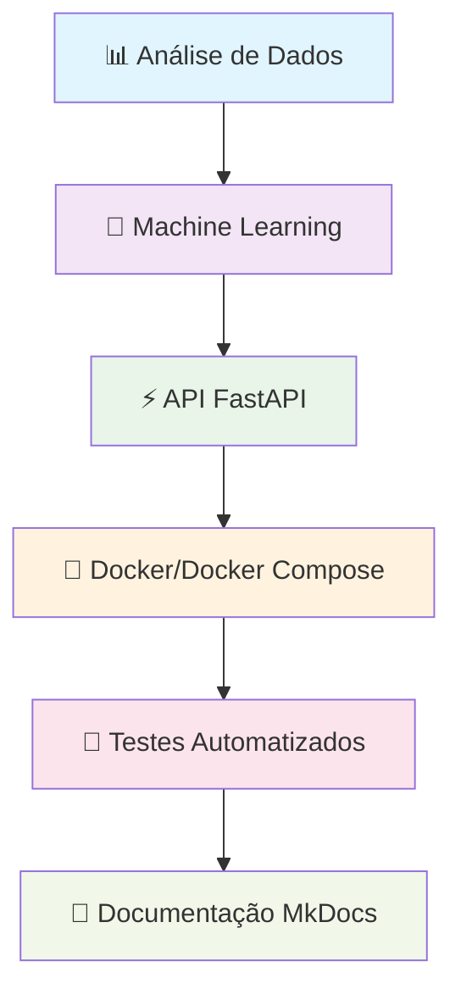

# 🚀 Machine Learning Engineer Challenge

<div align="center">

[](https://www.python.org)
[](https://python-poetry.org)
[](https://fastapi.tiangolo.com)
[](https://www.docker.com)

</div>

## 🎯 Visão Geral

Este repositório contém a solução completa para o **Case Técnico de Machine Learning Engineer**, implementando uma arquitetura profissional para predição de cancelamento de voos usando **FastAPI**, **Machine Learning** e **Docker**.

### 🌟 Destaques do Projeto



### 🎯 Componentes do Sistema

| **Componente**        | **Descrição**             | **Tecnologias**                 |
| --------------------- | ------------------------- | ------------------------------- |
| 📊 **EDA**            | Análise exploratória      | `Pandas`, `Jupyter Notebooks`  |
| 🤖 **ML Pipeline**    | Pipeline de ML            | `Scikit-learn`, `Feature Eng.` |
| ⚡ **API REST**       | Serviço de predição       | `FastAPI`, `Pydantic`          |
| 🐳 **Containerização** | Deploy com containers   | `Docker`, `Docker Compose`     |
| 🧪 **Testes**         | Testes unitários         | `Pytest`, `Coverage`           |
| 📖 **Documentação**   | Docs técnicas            | `MkDocs`, `Material Theme`     |

## 🚀 Começando Rapidamente

### 📋 Pré-requisitos

- 🐍 **Python 3.12.7**
- 📦 **Poetry** (gerenciador de dependências)
- 🐳 **Docker** e **Docker Compose** (opcional)
- 💻 **Git** para versionamento

### ⚡ Instalação Rápida

```bash
# 1. Clone o repositório
git clone https://github.com/ulissesbomjardim/machine_learning_engineer.git
cd machine_learning_engineer

# 2. Configure Python e Poetry
poetry env use 3.12.7
poetry install

# 3. Ative o ambiente virtual
poetry shell

# 4. Execute os testes
task test

# 5. Inicie a API
uvicorn src.routers.main:app --reload
```

!!! success "API Rodando"
    🌐 **API**: [http://localhost:8000](http://localhost:8000)  
    📚 **Swagger**: [http://localhost:8000/docs](http://localhost:8000/docs)  
    📖 **Documentação**: `mkdocs serve`

## 📁 Estrutura do Projeto

```
machine-learning-engineer/
├── 💻 src/
│   ├── routers/          # 🔗 Endpoints da API
│   │   ├── main.py       # 🚀 App principal
│   │   └── model/        # 🤖 Rotas ML
│   └── services/         # ⚙️ Serviços
├── 🧪 tests/            # Testes unitários
├── 📊 data/             # Datasets
├── 🗄️ model/           # Modelos treinados
├── 📓 notebook/         # Jupyter Notebooks
├── 📖 docs/             # Documentação MkDocs
├── 🐳 docker/           # Configurações Docker
└── ⚙️ pyproject.toml    # Dependências Poetry
```

## 🤖 Sobre o Challenge

### 🎯 Objetivo Principal

Desenvolver um **sistema completo de predição de cancelamento de voos** que inclui:

- 📊 **Análise exploratória** dos dados históricos
- 🤖 **Modelo de Machine Learning** para classificação
- ⚡ **API REST** para predições em tempo real
- 🐳 **Deploy containerizado** para produção
- 🧪 **Testes automatizados** para garantir qualidade

### 📋 Funcionalidades Implementadas

| **Endpoint**     | **Método** | **Descrição**              |
| ---------------- | ---------- | -------------------------- |
| `/`              | GET        | Informações da API         |
| `/health`        | GET        | Status do sistema          |
| `/docs`          | GET        | Documentação Swagger       |
| `/model/predict` | POST       | Predição de cancelamento   |
| `/model/load`    | GET/POST   | Carregamento de modelos    |
| `/model/history` | GET        | Histórico de predições     |

### 🧠 Pipeline de Machine Learning


## 📚 Navegação da Documentação

### 🚀 **Quick Start**
- [📥 Instalação](quick-start/installation.md) - Como instalar dependências
- [⚙️ Setup](quick-start/setup.md) - Configuração do ambiente
- [🏃 Executando](quick-start/running.md) - Como rodar o projeto

### 🏗️ **Arquitetura**
- [📋 Visão Geral](architecture/overview.md) - Arquitetura do sistema
- [🧩 Componentes](architecture/components.md) - Detalhes dos módulos
- [🤖 Pipeline ML](architecture/ml-pipeline.md) - Fluxo de Machine Learning

### 🤖 **Machine Learning**
- [📊 Análise de Dados](ml/data-analysis.md) - EDA e insights
- [🔧 Preprocessing](ml/preprocessing.md) - Limpeza e transformação
- [🎯 Treinamento](ml/model-training.md) - Algoritmos e hiperparâmetros
- [📈 Avaliação](ml/evaluation.md) - Métricas e validação

### ⚡ **API Reference**
- [🔗 Endpoints](api/endpoints.md) - Documentação completa da API
- [📋 Modelos](api/models.md) - Schemas Pydantic
- [💡 Exemplos](api/examples.md) - Casos de uso práticos

### 🐳 **Docker**
- [⚙️ Setup](docker/setup.md) - Configuração Docker
- [🔧 Compose](docker/compose.md) - Docker Compose
- [🚀 Deploy](docker/deployment.md) - Deploy em produção

### 🧪 **Testes**
- [🏃 Executando](tests/running-tests.md) - Como rodar testes
- [📊 Coverage](tests/coverage.md) - Cobertura de código
- [🔄 Integração](tests/integration.md) - Testes de integração

### 📓 **Notebooks**
- [📊 EDA](notebooks/eda.md) - Análise exploratória
- [🤖 Modelagem](notebooks/modeling.md) - Desenvolvimento do modelo
- [🧪 Experimentos](notebooks/experiments.md) - Experimentos e otimização

## 🛠️ Comandos Úteis

### 📦 **Poetry**
```bash
poetry install          # Instalar dependências
poetry shell           # Ativar ambiente virtual
poetry add <package>   # Adicionar pacote
```

### 🧪 **Testes**
```bash
task test              # Executar todos os testes
task test-cov         # Testes com coverage
pytest -v             # Testes verbose
```

### ⚡ **API**
```bash
uvicorn src.routers.main:app --reload  # Desenvolvimento
uvicorn src.routers.main:app --host 0.0.0.0 --port 8000  # Produção
```

### 🐳 **Docker**
```bash
docker-compose up --build    # Build e executar
docker-compose up           # Executar containers
docker-compose down         # Parar containers
```

### 📖 **Documentação**
```bash
mkdocs serve           # Servidor local
mkdocs build          # Build estático
mkdocs gh-deploy      # Deploy GitHub Pages
```

## 🤝 Contribuindo

Este projeto segue as melhores práticas de desenvolvimento:

- 🎨 **Formatação**: `black` e `isort`
- 🧪 **Testes**: `pytest` com cobertura
- 📋 **Linting**: `ruff` para qualidade do código
- 📖 **Docs**: `mkdocs` para documentação

Para contribuir:

1. Fork o repositório
2. Crie uma branch para sua feature
3. Execute os testes: `task test`
4. Faça commit das mudanças
5. Abra um Pull Request

## 📞 Suporte

- 📧 **Email**: [ulisses.bomjardim@gmail.com](mailto:ulisses.bomjardim@gmail.com)
- 🐛 **Issues**: [GitHub Issues](https://github.com/ulissesbomjardim/machine_learning_engineer/issues)
- 💡 **Discussões**: [GitHub Discussions](https://github.com/ulissesbomjardim/machine_learning_engineer/discussions)

---

<div align="center">

**🎉 Explore a documentação para descobrir todos os recursos! 🎉**

*📅 Última atualização: 2024-12-21*

</div>
