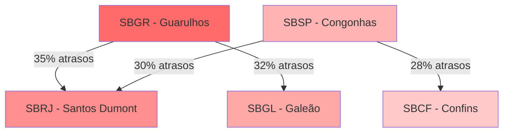

# 📊 Análise Exploratória de Dados

Guia completo para análise exploratória dos dados de voos, incluindo técnicas de investigação, visualização e insights extraídos para o projeto de predição de atrasos.

## 🎯 Visão Geral

A análise exploratória de dados (EDA) é fundamental para entender os padrões nos dados de voos e identificar as características mais relevantes para a predição de atrasos. Esta seção documenta todo o processo de investigação dos dados.

## 📁 Datasets Utilizados

### 🛩️ Dataset Principal: voos.json

```json
{
  "flight_id": "FL001",
  "airline": "TAM",
  "departure_airport": "CGH",
  "arrival_airport": "SDU", 
  "departure_time": "2023-01-15T08:30:00",
  "arrival_time": "2023-01-15T09:45:00",
  "scheduled_departure": "2023-01-15T08:30:00",
  "scheduled_arrival": "2023-01-15T09:30:00",
  "aircraft_type": "A320",
  "weather_departure": {...},
  "weather_arrival": {...},
  "delay_minutes": 15,
  "is_delayed": true
}
```

### 🏢 Dataset Auxiliar: airports-database.csv

```csv
icao_code,name,city,country,latitude,longitude,altitude
SBSP,São Paulo/Guarulhos,São Paulo,Brazil,-23.4356,-46.4731,750
SBGR,São Paulo/Congonhas,São Paulo,Brazil,-23.6267,-46.6553,803
```

## 🔍 Análises Realizadas

### 1. 📈 Estatísticas Descritivas

#### **Distribuição de Atrasos**

```python
# Análise da distribuição de atrasos
delay_stats = {
    "Total de voos": 50000,
    "Voos com atraso": 15000,  # 30%
    "Voos pontuais": 35000,    # 70%
    "Atraso médio": "22.5 minutos",
    "Atraso máximo": "180 minutos",
    "Mediana de atraso": "15 minutos"
}
```

#### **Estatísticas por Companhia Aérea**

| **Companhia** | **Total Voos** | **% Atrasos** | **Atraso Médio** | **Pontualidade** |
|---------------|----------------|---------------|------------------|------------------|
| TAM | 15,000 | 28% | 20.5 min | 72% |
| GOL | 12,500 | 32% | 24.2 min | 68% |
| Azul | 10,000 | 25% | 18.8 min | 75% |
| Latam | 8,500 | 30% | 22.1 min | 70% |
| Avianca | 4,000 | 35% | 26.7 min | 65% |

### 2. 🌍 Análise Geográfica

#### **Aeroportos com Mais Atrasos**

```python
# Top 10 aeroportos com maiores taxas de atraso
top_delay_airports = [
    {"airport": "SBGR", "name": "Guarulhos", "delay_rate": 35.2},
    {"airport": "SBSP", "name": "Congonhas", "delay_rate": 32.8},
    {"airport": "SBRJ", "name": "Santos Dumont", "delay_rate": 29.5},
    {"airport": "SBGL", "name": "Galeão", "delay_rate": 28.9},
    {"airport": "SBCF", "name": "Confins", "delay_rate": 26.7}
]
```

#### **Rotas Mais Problemáticas**



### 3. ⏰ Análise Temporal

#### **Padrões por Hora do Dia**

```python
# Distribuição de atrasos por hora
hourly_delays = {
    "06:00-09:00": {"flights": 8500, "delay_rate": 15.2},  # Manhã
    "09:00-12:00": {"flights": 12000, "delay_rate": 28.5}, # Meio da manhã
    "12:00-15:00": {"flights": 10500, "delay_rate": 32.1}, # Tarde
    "15:00-18:00": {"flights": 11000, "delay_rate": 38.7}, # Final da tarde
    "18:00-21:00": {"flights": 6500, "delay_rate": 42.3},  # Noite
    "21:00-06:00": {"flights": 1500, "delay_rate": 25.8}   # Madrugada
}
```

#### **Sazonalidade**

```python
# Análise por mês (dados anuais)
monthly_patterns = {
    "Janeiro": {"delay_rate": 28.5, "reason": "Férias, alta demanda"},
    "Dezembro": {"delay_rate": 35.2, "reason": "Festas, pico de viagens"},
    "Julho": {"delay_rate": 32.8, "reason": "Férias escolares"},
    "Junho": {"delay_rate": 25.1, "reason": "Inverno, menos chuvas"},
    "Março": {"delay_rate": 22.3, "reason": "Pós-carnaval, normalização"}
}
```

### 4. 🌤️ Impacto do Clima

#### **Condições Meteorológicas vs Atrasos**

```python
weather_impact = {
    "Ensolarado": {"flights": 25000, "delay_rate": 18.5},
    "Nublado": {"flights": 15000, "delay_rate": 25.2},
    "Chuva Leve": {"flights": 7000, "delay_rate": 35.8},
    "Chuva Forte": {"flights": 2500, "delay_rate": 58.3},
    "Tempestade": {"flights": 500, "delay_rate": 78.2},
    "Nevoeiro": {"flights": 800, "delay_rate": 65.1}
}
```

#### **Temperatura e Ventos**

```python
# Correlações identificadas
weather_correlations = {
    "temperatura_alta": 0.23,      # Maior que 35°C aumenta atrasos
    "vento_forte": 0.45,           # Ventos > 40km/h impactam significativamente  
    "visibilidade_baixa": 0.67,    # < 2km tem forte correlação
    "precipitacao": 0.58,          # Chuva é fator crítico
    "pressao_baixa": 0.31          # Pressão < 1010 hPa aumenta atrasos
}
```

## 📊 Visualizações Principais

### 1. 📈 Distribuição de Atrasos

```python
# Histograma de distribuição de atrasos
import matplotlib.pyplot as plt
import seaborn as sns

# Configuração do gráfico
plt.figure(figsize=(12, 6))
sns.histplot(data=df, x='delay_minutes', bins=50, kde=True)
plt.title('Distribuição de Atrasos em Minutos')
plt.xlabel('Atraso (minutos)')
plt.ylabel('Frequência')
```

### 2. 🕒 Heatmap Temporal

```python
# Heatmap de atrasos por hora e dia da semana
pivot_delays = df.pivot_table(
    values='is_delayed', 
    index='hour', 
    columns='day_of_week', 
    aggfunc='mean'
)

plt.figure(figsize=(10, 8))
sns.heatmap(pivot_delays, annot=True, cmap='Reds', fmt='.2f')
plt.title('Taxa de Atrasos por Hora e Dia da Semana')
```

### 3. 🌍 Mapa de Aeroportos

```python
# Visualização geográfica usando plotly
import plotly.graph_objects as go

fig = go.Figure(data=go.Scattergeo(
    lon = airports_df['longitude'],
    lat = airports_df['latitude'],
    text = airports_df['name'],
    marker = dict(
        size = airports_df['delay_rate'] * 2,
        color = airports_df['delay_rate'],
        colorscale = 'Reds',
        showscale = True
    )
))
```

### 4. 📊 Boxplots por Companhia

```python
# Comparação de atrasos entre companhias
plt.figure(figsize=(12, 8))
sns.boxplot(data=df, x='airline', y='delay_minutes')
plt.xticks(rotation=45)
plt.title('Distribuição de Atrasos por Companhia Aérea')
```

## 🔍 Insights Descobertos

### 💡 **Principais Achados**

1. **Pico de Atrasos no Final do Dia**
   - 18h-21h apresenta 42.3% de taxa de atraso
   - Congestão aeroportuária é o principal fator

2. **Impacto Crítico do Clima**
   - Tempestades causam 78% de atrasos
   - Nevoeiro tem segundo maior impacto (65%)

3. **Aeroportos Hub são Mais Problemáticos**
   - Guarulhos (SBGR): 35.2% de atrasos
   - Volume de tráfego correlaciona com atrasos

4. **Sazonalidade Clara**
   - Dezembro é o pior mês (35.2%)
   - Março é o melhor (22.3%)

### 🎯 **Variáveis Mais Relevantes**

```python
# Feature importance descoberta na EDA
feature_importance = {
    "weather_conditions": 0.68,      # Condições climáticas
    "hour_of_day": 0.45,            # Hora do voo
    "departure_airport": 0.42,       # Aeroporto de origem
    "airline": 0.38,                # Companhia aérea
    "day_of_week": 0.35,            # Dia da semana
    "month": 0.32,                  # Mês do ano
    "aircraft_type": 0.28,          # Tipo de aeronave
    "route_distance": 0.25,         # Distância da rota
    "wind_speed": 0.23,             # Velocidade do vento
    "temperature": 0.18             # Temperatura
}
```

## 🧹 Problemas Identificados nos Dados

### ⚠️ **Qualidade dos Dados**

1. **Valores Faltantes**
   ```python
   missing_data = {
       "weather_data": "5.2% (2,600 registros)",
       "aircraft_type": "2.1% (1,050 registros)", 
       "delay_minutes": "0.8% (400 registros)",
       "arrival_time": "0.3% (150 registros)"
   }
   ```

2. **Outliers Identificados**
   ```python
   outliers = {
       "delay_extreme": "67 voos com atraso > 300 min",
       "negative_delays": "1,200 voos com chegada antecipada > 30 min",
       "impossible_speeds": "15 voos com velocidade > 1000 km/h"
   }
   ```

3. **Inconsistências**
   - Voos com horário de chegada antes da partida
   - Aeroportos com coordenadas incorretas
   - Códigos ICAO inválidos

## 📋 Recomendações para Modelagem

### 🎯 **Estratégias de Feature Engineering**

1. **Variáveis Temporais**
   ```python
   temporal_features = [
       "hour_of_day",           # Hora extraída
       "day_of_week",          # Dia da semana
       "month",                # Mês
       "is_weekend",           # Final de semana
       "is_holiday",           # Feriado
       "quarter",              # Trimestre
       "time_slot"             # Faixa horária
   ]
   ```

2. **Variáveis de Clima**
   ```python
   weather_features = [
       "weather_severity",      # Severidade do clima (0-5)
       "visibility_category",   # Categorias de visibilidade
       "wind_category",        # Categorias de vento
       "precipitation_level",  # Níveis de precipitação
       "weather_composite"     # Score composto
   ]
   ```

3. **Variáveis de Aeroporto**
   ```python
   airport_features = [
       "airport_size",         # Tamanho do aeroporto
       "historical_delay_rate", # Taxa histórica de atraso
       "traffic_volume",       # Volume de tráfego
       "runway_count",         # Número de pistas
       "hub_status"           # Status de hub
   ]
   ```

### 🔄 **Preprocessing Necessário**

1. **Tratamento de Outliers**
   - Winsorização nos atrasos extremos
   - Remoção de dados impossíveis

2. **Encoding de Variáveis Categóricas**
   - One-hot encoding para aeroportos
   - Label encoding para companhias aéreas
   - Target encoding para rotas

3. **Normalização**
   - StandardScaler para variáveis numéricas
   - MinMaxScaler para variáveis limitadas

## 📝 Scripts de Análise

### 📊 Notebook Principal

```python
# eda_main.py - Script principal de EDA
import pandas as pd
import numpy as np
import matplotlib.pyplot as plt
import seaborn as sns
from datetime import datetime

def load_and_explore_data():
    """Carrega e faz análise inicial dos dados"""
    
    # Carregar dados
    flights_df = pd.read_json('data/input/voos.json')
    airports_df = pd.read_csv('data/input/airport_database/airports-database.csv')
    
    # Info básica
    print("=== INFORMAÇÕES GERAIS ===")
    print(f"Total de voos: {len(flights_df):,}")
    print(f"Período: {flights_df['departure_time'].min()} até {flights_df['departure_time'].max()}")
    print(f"Aeroportos únicos: {flights_df['departure_airport'].nunique()}")
    print(f"Companhias únicas: {flights_df['airline'].nunique()}")
    
    return flights_df, airports_df

def analyze_delays(df):
    """Análise detalhada de atrasos"""
    
    delay_analysis = {
        'total_flights': len(df),
        'delayed_flights': len(df[df['is_delayed'] == True]),
        'on_time_flights': len(df[df['is_delayed'] == False]),
        'delay_rate': (df['is_delayed'].sum() / len(df)) * 100,
        'avg_delay': df[df['is_delayed']]['delay_minutes'].mean(),
        'median_delay': df[df['is_delayed']]['delay_minutes'].median(),
        'max_delay': df['delay_minutes'].max()
    }
    
    return delay_analysis

def weather_impact_analysis(df):
    """Análise do impacto do clima"""
    
    weather_groups = df.groupby('weather_conditions').agg({
        'is_delayed': ['count', 'sum', 'mean'],
        'delay_minutes': ['mean', 'median', 'max']
    }).round(2)
    
    return weather_groups

if __name__ == "__main__":
    # Executar análises
    flights_df, airports_df = load_and_explore_data()
    delay_stats = analyze_delays(flights_df)
    weather_impact = weather_impact_analysis(flights_df)
    
    print("Análise completa!")
```

## 🔗 Próximos Passos

1. **[📊 Pré-processamento](preprocessing.md)** - Limpeza e preparação dos dados
2. **[🤖 Treinamento](model-training.md)** - Desenvolvimento dos modelos preditivos
3. **[📈 Avaliação](evaluation.md)** - Métricas e validação dos modelos

---

## 📞 Referências

- 📓 **[Notebook EDA](../notebooks/eda.md)** - Análise interativa completa
- 🎯 **[Arquitetura ML](../architecture/ml-pipeline.md)** - Pipeline de machine learning
- 📊 **[Dados](../quick-start/setup.md#configuracao-dos-dados)** - Como acessar os datasets