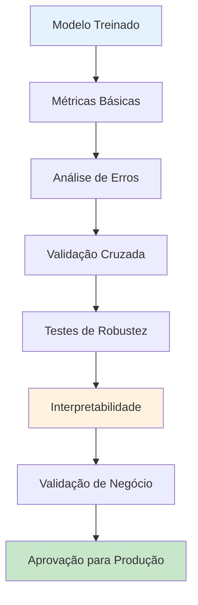

# 📈 Avaliação de Modelos

Guia completo para avaliação e validação de modelos de machine learning, incluindo métricas de performance, análise de erros, interpretabilidade e validação em produção.

## 🎯 Visão Geral

A avaliação de modelos é crucial para garantir que o sistema de predição de atrasos seja confiável, robusto e adequado para uso em produção. Esta seção detalha todas as métricas e técnicas utilizadas.

## 📊 Framework de Avaliação



## 📏 Métricas de Performance

### 1. 🎯 Métricas Principais

#### **Classificação Binária**

```python
from sklearn.metrics import (
    accuracy_score, precision_score, recall_score, f1_score,
    roc_auc_score, average_precision_score, confusion_matrix,
    classification_report, roc_curve, precision_recall_curve
)

def calculate_comprehensive_metrics(y_true, y_pred, y_pred_proba):
    """Calcula todas as métricas de avaliação"""
    
    metrics = {
        # Métricas básicas
        'accuracy': accuracy_score(y_true, y_pred),
        'precision': precision_score(y_true, y_pred),
        'recall': recall_score(y_true, y_pred),
        'f1_score': f1_score(y_true, y_pred),
        'specificity': recall_score(y_true, y_pred, pos_label=0),
        
        # Métricas de ranking
        'roc_auc': roc_auc_score(y_true, y_pred_proba),
        'average_precision': average_precision_score(y_true, y_pred_proba),
        
        # Matriz de confusão
        'confusion_matrix': confusion_matrix(y_true, y_pred),
        
        # Relatório detalhado
        'classification_report': classification_report(y_true, y_pred, output_dict=True)
    }
    
    return metrics
```

#### **Métricas Customizadas para Negócio**

```python
def business_metrics(y_true, y_pred, y_pred_proba, cost_matrix=None):
    """Métricas específicas do negócio de aviação"""
    
    if cost_matrix is None:
        # Custos estimados (em R$)
        cost_matrix = {
            'false_positive': 50,    # Custo de preparação desnecessária
            'false_negative': 200,   # Custo de atraso não previsto
            'true_positive': -20,    # Economia por prevenção
            'true_negative': 0       # Situação normal
        }
    
    # Matriz de confusão
    tn, fp, fn, tp = confusion_matrix(y_true, y_pred).ravel()
    
    # Custo total
    total_cost = (
        fp * cost_matrix['false_positive'] +
        fn * cost_matrix['false_negative'] +
        tp * cost_matrix['true_positive'] +
        tn * cost_matrix['true_negative']
    )
    
    # Métricas de negócio
    business_metrics = {
        'total_cost': total_cost,
        'cost_per_prediction': total_cost / len(y_true),
        'prevention_rate': tp / (tp + fn) if (tp + fn) > 0 else 0,
        'false_alarm_rate': fp / (fp + tn) if (fp + tn) > 0 else 0,
        'economic_value': -total_cost,  # Valor econômico (negativo do custo)
        
        # Métricas operacionais
        'delays_caught': tp,
        'delays_missed': fn,
        'false_alerts': fp,
        'correct_non_delays': tn
    }
    
    return business_metrics
```

### 2. 📊 Visualização de Métricas

```python
import matplotlib.pyplot as plt
import seaborn as sns
from sklearn.metrics import plot_confusion_matrix, plot_roc_curve, plot_precision_recall_curve

class ModelEvaluationVisualizer:
    """Classe para visualização de métricas de avaliação"""
    
    def __init__(self, figsize=(15, 10)):
        self.figsize = figsize
        
    def comprehensive_evaluation_plot(self, model, X_test, y_test, model_name="Model"):
        """Cria visualização completa de avaliação"""
        
        fig, axes = plt.subplots(2, 3, figsize=self.figsize)
        fig.suptitle(f'Avaliação Completa - {model_name}', fontsize=16, fontweight='bold')
        
        # 1. Matriz de Confusão
        plot_confusion_matrix(model, X_test, y_test, ax=axes[0,0], 
                            cmap='Blues', values_format='d')
        axes[0,0].set_title('Matriz de Confusão')
        
        # 2. ROC Curve
        plot_roc_curve(model, X_test, y_test, ax=axes[0,1])
        axes[0,1].set_title('Curva ROC')
        axes[0,1].plot([0, 1], [0, 1], 'k--', alpha=0.6)
        
        # 3. Precision-Recall Curve
        plot_precision_recall_curve(model, X_test, y_test, ax=axes[0,2])
        axes[0,2].set_title('Curva Precisão-Recall')
        
        # 4. Distribuição de Probabilidades
        y_pred_proba = model.predict_proba(X_test)[:, 1]
        
        axes[1,0].hist(y_pred_proba[y_test == 0], bins=30, alpha=0.7, 
                      label='Não Atrasado', color='blue')
        axes[1,0].hist(y_pred_proba[y_test == 1], bins=30, alpha=0.7, 
                      label='Atrasado', color='red')
        axes[1,0].set_xlabel('Probabilidade Predita')
        axes[1,0].set_ylabel('Frequência')
        axes[1,0].set_title('Distribuição de Probabilidades')
        axes[1,0].legend()
        
        # 5. Feature Importance (se disponível)
        if hasattr(model, 'feature_importances_'):
            importances = model.feature_importances_
            feature_names = X_test.columns if hasattr(X_test, 'columns') else [f'Feature_{i}' for i in range(len(importances))]
            
            # Top 15 features
            indices = np.argsort(importances)[-15:]
            
            axes[1,1].barh(range(len(indices)), importances[indices])
            axes[1,1].set_yticks(range(len(indices)))
            axes[1,1].set_yticklabels([feature_names[i] for i in indices])
            axes[1,1].set_xlabel('Importância')
            axes[1,1].set_title('Top 15 Features Mais Importantes')
        
        # 6. Calibração do Modelo
        from sklearn.calibration import calibration_curve
        
        fraction_of_positives, mean_predicted_value = calibration_curve(
            y_test, y_pred_proba, n_bins=10
        )
        
        axes[1,2].plot(mean_predicted_value, fraction_of_positives, "s-", 
                      label=f"{model_name}")
        axes[1,2].plot([0, 1], [0, 1], "k:", label="Perfeitamente Calibrado")
        axes[1,2].set_xlabel('Probabilidade Média Predita')
        axes[1,2].set_ylabel('Fração de Positivos')
        axes[1,2].set_title('Curva de Calibração')
        axes[1,2].legend()
        
        plt.tight_layout()
        plt.show()
        
        return fig
```

## 🔍 Análise de Erros

### 1. 🎯 Análise de Falsos Positivos e Negativos

```python
def error_analysis(X_test, y_test, y_pred, y_pred_proba, feature_names=None):
    """Análise detalhada de erros do modelo"""
    
    # Identificar tipos de erro
    false_positives = (y_test == 0) & (y_pred == 1)
    false_negatives = (y_test == 1) & (y_pred == 0)
    true_positives = (y_test == 1) & (y_pred == 1)
    true_negatives = (y_test == 0) & (y_pred == 0)
    
    error_analysis_results = {
        'false_positives': {
            'count': false_positives.sum(),
            'percentage': false_positives.mean() * 100,
            'avg_probability': y_pred_proba[false_positives].mean(),
            'samples': X_test[false_positives].head(10) if hasattr(X_test, 'head') else None
        },
        
        'false_negatives': {
            'count': false_negatives.sum(),
            'percentage': false_negatives.mean() * 100,
            'avg_probability': y_pred_proba[false_negatives].mean(),
            'samples': X_test[false_negatives].head(10) if hasattr(X_test, 'head') else None
        },
        
        'true_positives': {
            'count': true_positives.sum(),
            'avg_probability': y_pred_proba[true_positives].mean()
        },
        
        'true_negatives': {
            'count': true_negatives.sum(),
            'avg_probability': y_pred_proba[true_negatives].mean()
        }
    }
    
    # Análise por faixas de probabilidade
    prob_bins = np.linspace(0, 1, 11)
    prob_analysis = {}
    
    for i in range(len(prob_bins) - 1):
        bin_mask = (y_pred_proba >= prob_bins[i]) & (y_pred_proba < prob_bins[i+1])
        
        if bin_mask.sum() > 0:
            prob_analysis[f"{prob_bins[i]:.1f}-{prob_bins[i+1]:.1f}"] = {
                'total_predictions': bin_mask.sum(),
                'actual_positive_rate': y_test[bin_mask].mean(),
                'predicted_probability': y_pred_proba[bin_mask].mean()
            }
    
    error_analysis_results['probability_analysis'] = prob_analysis
    
    return error_analysis_results
```

### 2. 📊 Análise de Segmentos

```python
def segment_analysis(X_test, y_test, y_pred, y_pred_proba, segments):
    """Análise de performance por segmentos específicos"""
    
    segment_results = {}
    
    for segment_name, segment_condition in segments.items():
        # Aplicar condição do segmento
        if callable(segment_condition):
            segment_mask = segment_condition(X_test)
        else:
            segment_mask = segment_condition
        
        if segment_mask.sum() == 0:
            continue
            
        # Métricas do segmento
        segment_y_test = y_test[segment_mask]
        segment_y_pred = y_pred[segment_mask]
        segment_y_pred_proba = y_pred_proba[segment_mask]
        
        segment_metrics = calculate_comprehensive_metrics(
            segment_y_test, segment_y_pred, segment_y_pred_proba
        )
        
        segment_results[segment_name] = {
            'size': segment_mask.sum(),
            'percentage': (segment_mask.sum() / len(X_test)) * 100,
            'metrics': segment_metrics,
            'baseline_delay_rate': segment_y_test.mean()
        }
    
    return segment_results
```

## 🔄 Validação Cruzada Avançada

### 1. ⏰ Validação Temporal com Walk-Forward

```python
def walk_forward_validation(model, X, y, initial_train_size=0.6, step_size=0.1):
    """Validação walk-forward para séries temporais"""
    
    n_samples = len(X)
    results = []
    
    # Tamanho inicial do treino
    train_end = int(n_samples * initial_train_size)
    
    while train_end + int(n_samples * step_size) <= n_samples:
        
        # Definir janelas
        test_start = train_end
        test_end = min(train_end + int(n_samples * step_size), n_samples)
        
        # Dividir dados
        X_train_fold = X.iloc[:train_end]
        X_test_fold = X.iloc[test_start:test_end]
        y_train_fold = y.iloc[:train_end]
        y_test_fold = y.iloc[test_start:test_end]
        
        # Treinar modelo
        model_fold = clone(model)
        model_fold.fit(X_train_fold, y_train_fold)
        
        # Predições
        y_pred_proba_fold = model_fold.predict_proba(X_test_fold)[:, 1]
        y_pred_fold = (y_pred_proba_fold > 0.5).astype(int)
        
        # Métricas
        fold_metrics = calculate_comprehensive_metrics(
            y_test_fold, y_pred_fold, y_pred_proba_fold
        )
        
        results.append({
            'fold': len(results) + 1,
            'train_size': len(X_train_fold),
            'test_size': len(X_test_fold),
            'train_end': train_end,
            'test_start': test_start,
            'test_end': test_end,
            'metrics': fold_metrics
        })
        
        # Próxima iteração
        train_end = test_end
        
        print(f"Fold {len(results)}: Train={len(X_train_fold)}, Test={len(X_test_fold)}, AUC={fold_metrics['roc_auc']:.4f}")
    
    # Resumir resultados
    avg_metrics = {}
    for metric in ['accuracy', 'precision', 'recall', 'f1_score', 'roc_auc']:
        values = [r['metrics'][metric] for r in results]
        avg_metrics[f"{metric}_mean"] = np.mean(values)
        avg_metrics[f"{metric}_std"] = np.std(values)
    
    return results, avg_metrics
```

### 2. 🎯 Validação Estratificada por Segmentos

```python
from sklearn.model_selection import StratifiedGroupKFold

def stratified_group_validation(model, X, y, groups, n_splits=5):
    """Validação cruzada estratificada por grupos"""
    
    sgkf = StratifiedGroupKFold(n_splits=n_splits, shuffle=True, random_state=42)
    
    cv_results = []
    
    for fold, (train_idx, test_idx) in enumerate(sgkf.split(X, y, groups)):
        
        print(f"Processando fold {fold + 1}/{n_splits}")
        
        # Dividir dados
        X_train_fold = X.iloc[train_idx]
        X_test_fold = X.iloc[test_idx]
        y_train_fold = y.iloc[train_idx]
        y_test_fold = y.iloc[test_idx]
        
        # Treinar modelo
        model_fold = clone(model)
        model_fold.fit(X_train_fold, y_train_fold)
        
        # Predições
        y_pred_proba_fold = model_fold.predict_proba(X_test_fold)[:, 1]
        y_pred_fold = (y_pred_proba_fold > 0.5).astype(int)
        
        # Métricas
        fold_metrics = calculate_comprehensive_metrics(
            y_test_fold, y_pred_fold, y_pred_proba_fold
        )
        
        cv_results.append({
            'fold': fold + 1,
            'train_groups': np.unique(groups[train_idx]),
            'test_groups': np.unique(groups[test_idx]),
            'metrics': fold_metrics
        })
    
    return cv_results
```

## 🛡️ Testes de Robustez

### 1. 🔄 Teste de Estabilidade

```python
def stability_test(model, X_test, y_test, n_iterations=100):
    """Testa estabilidade das predições do modelo"""
    
    predictions = []
    probabilities = []
    
    for i in range(n_iterations):
        # Adicionar ruído pequeno aos dados (simular variação real)
        X_test_noisy = X_test + np.random.normal(0, 0.01, X_test.shape)
        
        # Predições
        y_pred_proba = model.predict_proba(X_test_noisy)[:, 1]
        y_pred = (y_pred_proba > 0.5).astype(int)
        
        predictions.append(y_pred)
        probabilities.append(y_pred_proba)
    
    # Análise de estabilidade
    predictions_array = np.array(predictions)
    probabilities_array = np.array(probabilities)
    
    stability_metrics = {
        'prediction_variance': np.var(predictions_array, axis=0).mean(),
        'probability_variance': np.var(probabilities_array, axis=0).mean(),
        'prediction_stability': (predictions_array.std(axis=0) < 0.1).mean(),
        'flip_rate': (predictions_array.std(axis=0) > 0).mean()
    }
    
    return stability_metrics
```

### 2. 🎭 Teste de Adversarial

```python
def adversarial_test(model, X_test, y_test, epsilon=0.1):
    """Teste de robustez adversarial (para modelos lineares)"""
    
    if not hasattr(model, 'coef_'):
        print("⚠️ Teste adversarial disponível apenas para modelos lineares")
        return None
    
    # Calcular gradiente (direção de maior mudança)
    gradient = model.coef_[0]
    
    # Normalizar gradiente
    gradient_norm = gradient / np.linalg.norm(gradient)
    
    # Criar exemplos adversariais
    X_adversarial = X_test + epsilon * gradient_norm
    
    # Predições originais vs adversariais
    y_pred_original = model.predict_proba(X_test)[:, 1]
    y_pred_adversarial = model.predict_proba(X_adversarial)[:, 1]
    
    # Métricas de robustez
    robustness_metrics = {
        'max_probability_change': np.max(np.abs(y_pred_adversarial - y_pred_original)),
        'mean_probability_change': np.mean(np.abs(y_pred_adversarial - y_pred_original)),
        'prediction_flip_rate': np.mean((y_pred_adversarial > 0.5) != (y_pred_original > 0.5)),
        'robustness_score': 1 - np.mean(np.abs(y_pred_adversarial - y_pred_original))
    }
    
    return robustness_metrics
```

## 🔍 Interpretabilidade

### 1. 🌟 SHAP Values

```python
import shap

def shap_analysis(model, X_train, X_test, feature_names=None):
    """Análise de interpretabilidade usando SHAP"""
    
    try:
        # Diferentes explicadores para diferentes tipos de modelo
        if hasattr(model, 'tree_'):
            explainer = shap.TreeExplainer(model)
        elif hasattr(model, 'coef_'):
            explainer = shap.LinearExplainer(model, X_train)
        else:
            explainer = shap.KernelExplainer(model.predict_proba, X_train.sample(100))
        
        # Calcular SHAP values
        shap_values = explainer.shap_values(X_test[:100])  # Primeiras 100 amostras
        
        # Se é classificação binária, pegar valores da classe positiva
        if isinstance(shap_values, list):
            shap_values = shap_values[1]
        
        # Análise dos SHAP values
        feature_importance = np.abs(shap_values).mean(axis=0)
        
        shap_results = {
            'shap_values': shap_values,
            'feature_importance': feature_importance,
            'feature_names': feature_names or [f'Feature_{i}' for i in range(shap_values.shape[1])],
            'explainer': explainer
        }
        
        return shap_results
        
    except Exception as e:
        print(f"⚠️ Erro na análise SHAP: {e}")
        return None
```

### 2. 📊 Permutation Importance

```python
from sklearn.inspection import permutation_importance

def permutation_importance_analysis(model, X_test, y_test, n_repeats=10):
    """Análise de importância por permutação"""
    
    # Calcular importância por permutação
    perm_importance = permutation_importance(
        model, X_test, y_test, 
        n_repeats=n_repeats, 
        random_state=42,
        scoring='roc_auc'
    )
    
    # Organizar resultados
    feature_names = X_test.columns if hasattr(X_test, 'columns') else [f'Feature_{i}' for i in range(X_test.shape[1])]
    
    importance_df = pd.DataFrame({
        'feature': feature_names,
        'importance_mean': perm_importance.importances_mean,
        'importance_std': perm_importance.importances_std
    }).sort_values('importance_mean', ascending=False)
    
    return importance_df, perm_importance
```

### 3. 🎯 Feature Interactions

```python
def analyze_feature_interactions(model, X_test, feature_pairs=None):
    """Análise de interações entre features"""
    
    if feature_pairs is None:
        # Selecionar pares de features mais importantes
        if hasattr(model, 'feature_importances_'):
            importances = model.feature_importances_
            top_features_idx = np.argsort(importances)[-10:]  # Top 10
            feature_pairs = [(i, j) for i in top_features_idx for j in top_features_idx if i < j]
        else:
            print("⚠️ Modelo não suporta análise automática de interações")
            return None
    
    interaction_effects = []
    
    for feat1_idx, feat2_idx in feature_pairs:
        
        # Criar grid de valores para as duas features
        feat1_values = np.linspace(X_test.iloc[:, feat1_idx].min(), X_test.iloc[:, feat1_idx].max(), 10)
        feat2_values = np.linspace(X_test.iloc[:, feat2_idx].min(), X_test.iloc[:, feat2_idx].max(), 10)
        
        # Calcular predições no grid
        interaction_grid = np.zeros((len(feat1_values), len(feat2_values)))
        
        for i, val1 in enumerate(feat1_values):
            for j, val2 in enumerate(feat2_values):
                # Criar amostra com valores específicos
                X_sample = X_test.iloc[0:1].copy()
                X_sample.iloc[0, feat1_idx] = val1
                X_sample.iloc[0, feat2_idx] = val2
                
                # Predição
                pred_proba = model.predict_proba(X_sample)[0, 1]
                interaction_grid[i, j] = pred_proba
        
        interaction_effects.append({
            'feature1_idx': feat1_idx,
            'feature2_idx': feat2_idx,
            'feature1_name': X_test.columns[feat1_idx] if hasattr(X_test, 'columns') else f'Feature_{feat1_idx}',
            'feature2_name': X_test.columns[feat2_idx] if hasattr(X_test, 'columns') else f'Feature_{feat2_idx}',
            'interaction_grid': interaction_grid,
            'feature1_values': feat1_values,
            'feature2_values': feat2_values
        })
    
    return interaction_effects
```

## 📊 Validação de Negócio

### 1. 💰 Análise de Valor Econômico

```python
def economic_value_analysis(y_test, y_pred_proba, thresholds=None, cost_matrix=None):
    """Análise de valor econômico para diferentes thresholds"""
    
    if thresholds is None:
        thresholds = np.linspace(0.1, 0.9, 17)
    
    if cost_matrix is None:
        cost_matrix = {
            'false_positive': 50,
            'false_negative': 200,
            'true_positive': -20,
            'true_negative': 0
        }
    
    threshold_analysis = []
    
    for threshold in thresholds:
        y_pred = (y_pred_proba >= threshold).astype(int)
        
        # Métricas básicas
        metrics = calculate_comprehensive_metrics(y_test, y_pred, y_pred_proba)
        
        # Métricas de negócio
        business_metrics_result = business_metrics(y_test, y_pred, y_pred_proba, cost_matrix)
        
        threshold_analysis.append({
            'threshold': threshold,
            'precision': metrics['precision'],
            'recall': metrics['recall'],
            'f1_score': metrics['f1_score'],
            'economic_value': business_metrics_result['economic_value'],
            'cost_per_prediction': business_metrics_result['cost_per_prediction'],
            'prevention_rate': business_metrics_result['prevention_rate']
        })
    
    # Encontrar threshold ótimo
    threshold_df = pd.DataFrame(threshold_analysis)
    optimal_threshold_idx = threshold_df['economic_value'].idxmax()
    optimal_threshold = threshold_df.iloc[optimal_threshold_idx]
    
    print(f"🎯 Threshold ótimo: {optimal_threshold['threshold']:.3f}")
    print(f"💰 Valor econômico: R$ {optimal_threshold['economic_value']:,.2f}")
    print(f"🎯 Taxa de prevenção: {optimal_threshold['prevention_rate']:.1%}")
    
    return threshold_df, optimal_threshold
```

### 2. 🎯 Análise Operacional

```python
def operational_analysis(y_test, y_pred, y_pred_proba, operational_constraints=None):
    """Análise de viabilidade operacional"""
    
    if operational_constraints is None:
        operational_constraints = {
            'max_daily_alerts': 100,          # Máximo de alertas por dia
            'min_precision': 0.70,            # Precisão mínima aceitável
            'min_recall': 0.60,               # Recall mínimo aceitável
            'response_time_limit': 300        # Limite de tempo de resposta (segundos)
        }
    
    # Simular cenário operacional
    n_days = 30  # Análise para 30 dias
    predictions_per_day = len(y_test) / n_days
    alerts_per_day = np.sum(y_pred) / n_days
    
    operational_metrics = {
        'predictions_per_day': predictions_per_day,
        'alerts_per_day': alerts_per_day,
        'alert_rate': alerts_per_day / predictions_per_day,
        'workload_feasible': alerts_per_day <= operational_constraints['max_daily_alerts'],
        'precision_ok': precision_score(y_test, y_pred) >= operational_constraints['min_precision'],
        'recall_ok': recall_score(y_test, y_pred) >= operational_constraints['min_recall']
    }
    
    # Avaliação geral
    operational_metrics['operationally_viable'] = (
        operational_metrics['workload_feasible'] and
        operational_metrics['precision_ok'] and
        operational_metrics['recall_ok']
    )
    
    print("📊 ANÁLISE OPERACIONAL")
    print("=" * 40)
    print(f"Predições por dia: {operational_metrics['predictions_per_day']:.1f}")
    print(f"Alertas por dia: {operational_metrics['alerts_per_day']:.1f}")
    print(f"Taxa de alertas: {operational_metrics['alert_rate']:.1%}")
    print(f"Viável operacionalmente: {'✅' if operational_metrics['operationally_viable'] else '❌'}")
    
    return operational_metrics
```

## 📋 Relatório Completo de Avaliação

### 📄 Classe Geradora de Relatório

```python
class ModelEvaluationReport:
    """Classe para gerar relatório completo de avaliação"""
    
    def __init__(self, model, model_name):
        self.model = model
        self.model_name = model_name
        self.evaluation_results = {}
        
    def full_evaluation(self, X_test, y_test, X_train=None):
        """Avaliação completa do modelo"""
        
        print(f"🔍 Iniciando avaliação completa: {self.model_name}")
        print("=" * 60)
        
        # Predições
        y_pred_proba = self.model.predict_proba(X_test)[:, 1]
        y_pred = (y_pred_proba > 0.5).astype(int)
        
        # 1. Métricas básicas
        print("\n📊 1. MÉTRICAS BÁSICAS")
        basic_metrics = calculate_comprehensive_metrics(y_test, y_pred, y_pred_proba)
        self.evaluation_results['basic_metrics'] = basic_metrics
        
        print(f"Accuracy: {basic_metrics['accuracy']:.4f}")
        print(f"Precision: {basic_metrics['precision']:.4f}")
        print(f"Recall: {basic_metrics['recall']:.4f}")
        print(f"F1-Score: {basic_metrics['f1_score']:.4f}")
        print(f"ROC-AUC: {basic_metrics['roc_auc']:.4f}")
        
        # 2. Métricas de negócio
        print("\n💰 2. MÉTRICAS DE NEGÓCIO")
        business_metrics_result = business_metrics(y_test, y_pred, y_pred_proba)
        self.evaluation_results['business_metrics'] = business_metrics_result
        
        print(f"Valor econômico: R$ {business_metrics_result['economic_value']:,.2f}")
        print(f"Taxa de prevenção: {business_metrics_result['prevention_rate']:.1%}")
        print(f"Taxa de falsos alarmes: {business_metrics_result['false_alarm_rate']:.1%}")
        
        # 3. Análise de erros
        print("\n🔍 3. ANÁLISE DE ERROS")
        error_analysis_result = error_analysis(X_test, y_test, y_pred, y_pred_proba)
        self.evaluation_results['error_analysis'] = error_analysis_result
        
        print(f"Falsos positivos: {error_analysis_result['false_positives']['count']} ({error_analysis_result['false_positives']['percentage']:.1f}%)")
        print(f"Falsos negativos: {error_analysis_result['false_negatives']['count']} ({error_analysis_result['false_negatives']['percentage']:.1f}%)")
        
        # 4. Teste de estabilidade
        print("\n🛡️ 4. TESTE DE ESTABILIDADE")
        stability_result = stability_test(self.model, X_test, y_test)
        self.evaluation_results['stability'] = stability_result
        
        print(f"Estabilidade de predição: {stability_result['prediction_stability']:.1%}")
        print(f"Taxa de mudança: {stability_result['flip_rate']:.1%}")
        
        # 5. Análise operacional
        print("\n📋 5. ANÁLISE OPERACIONAL")
        operational_result = operational_analysis(y_test, y_pred, y_pred_proba)
        self.evaluation_results['operational'] = operational_result
        
        # 6. Interpretabilidade (se X_train fornecido)
        if X_train is not None:
            print("\n🔍 6. ANÁLISE DE INTERPRETABILIDADE")
            
            try:
                shap_result = shap_analysis(self.model, X_train, X_test)
                if shap_result:
                    self.evaluation_results['shap_analysis'] = shap_result
                    print("✅ Análise SHAP concluída")
            except Exception as e:
                print(f"⚠️ Erro na análise SHAP: {e}")
            
            try:
                perm_importance_df, perm_importance = permutation_importance_analysis(
                    self.model, X_test, y_test
                )
                self.evaluation_results['permutation_importance'] = {
                    'dataframe': perm_importance_df,
                    'raw_results': perm_importance
                }
                print("✅ Análise de importância por permutação concluída")
            except Exception as e:
                print(f"⚠️ Erro na análise de permutação: {e}")
        
        print("\n✅ Avaliação completa finalizada!")
        
        return self.evaluation_results
    
    def generate_summary_report(self):
        """Gera resumo executivo da avaliação"""
        
        if not self.evaluation_results:
            print("❌ Execute full_evaluation() primeiro")
            return
        
        print(f"\n📋 RELATÓRIO EXECUTIVO - {self.model_name}")
        print("=" * 60)
        
        # Performance geral
        basic = self.evaluation_results['basic_metrics']
        print(f"🎯 PERFORMANCE GERAL")
        print(f"  ROC-AUC: {basic['roc_auc']:.3f}")
        print(f"  Precision: {basic['precision']:.3f}")
        print(f"  Recall: {basic['recall']:.3f}")
        print(f"  F1-Score: {basic['f1_score']:.3f}")
        
        # Impacto de negócio
        business = self.evaluation_results['business_metrics']
        print(f"\n💰 IMPACTO DE NEGÓCIO")
        print(f"  Valor econômico: R$ {business['economic_value']:,.0f}")
        print(f"  Atrasos prevenidos: {business['delays_caught']}")
        print(f"  Atrasos perdidos: {business['delays_missed']}")
        print(f"  Falsos alertas: {business['false_alerts']}")
        
        # Viabilidade operacional
        operational = self.evaluation_results['operational']
        print(f"\n📊 VIABILIDADE OPERACIONAL")
        print(f"  Alertas por dia: {operational['alerts_per_day']:.1f}")
        print(f"  Taxa de alertas: {operational['alert_rate']:.1%}")
        print(f"  Operacionalmente viável: {'✅' if operational['operationally_viable'] else '❌'}")
        
        # Estabilidade
        stability = self.evaluation_results['stability']
        print(f"\n🛡️ ROBUSTEZ")
        print(f"  Estabilidade: {stability['prediction_stability']:.1%}")
        print(f"  Taxa de mudança: {stability['flip_rate']:.1%}")
        
        # Recomendação final
        print(f"\n🎯 RECOMENDAÇÃO")
        
        # Critérios para aprovação
        approval_criteria = {
            'roc_auc': basic['roc_auc'] >= 0.75,
            'precision': basic['precision'] >= 0.70,
            'recall': basic['recall'] >= 0.60,
            'economic_value': business['economic_value'] > 0,
            'operational_viable': operational['operationally_viable'],
            'stable': stability['prediction_stability'] >= 0.90
        }
        
        approval_score = sum(approval_criteria.values())
        total_criteria = len(approval_criteria)
        
        if approval_score >= 5:
            recommendation = "✅ APROVADO para produção"
        elif approval_score >= 3:
            recommendation = "⚠️ APROVADO COM RESSALVAS"
        else:
            recommendation = "❌ NÃO APROVADO - necessita melhorias"
        
        print(f"  {recommendation}")
        print(f"  Critérios atendidos: {approval_score}/{total_criteria}")
        
        return approval_criteria, recommendation
```

## 🔗 Próximos Passos

1. **[⚡ API](../api/endpoints.md)** - Implementação da API de predição
2. **[🐳 Docker](../docker/setup.md)** - Containerização do modelo
3. **[🧪 Testes](../tests/running-tests.md)** - Testes automatizados

---

## 📞 Referências

- 🤖 **[Treinamento](model-training.md)** - Desenvolvimento dos modelos
- 🏗️ **[Pipeline ML](../architecture/ml-pipeline.md)** - Arquitetura completa
- 📊 **[Análise de Dados](data-analysis.md)** - Insights dos dados