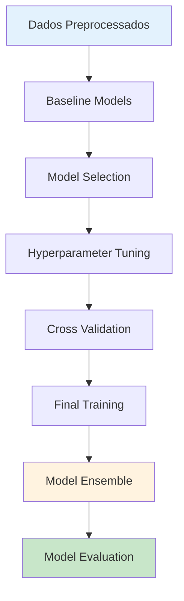

# 🤖 Treinamento de Modelos

Guia completo para treinamento de modelos de machine learning para predição de atrasos de voos, incluindo seleção de algoritmos, otimização de hiperparâmetros e validação cruzada.

## 🎯 Visão Geral

Esta seção documenta todo o processo de treinamento dos modelos preditivos, desde a seleção dos algoritmos até a otimização final, seguindo as melhores práticas de machine learning.

## 🧠 Estratégia de Modelagem



## 🎯 Modelos Candidatos

### 1. 📊 Algoritmos Selecionados

| **Modelo** | **Tipo** | **Vantagens** | **Desvantagens** | **Uso** |
|------------|----------|---------------|------------------|---------|
| **Logistic Regression** | Linear | Interpretável, rápido | Assume linearidade | Baseline |
| **Random Forest** | Ensemble | Robusto, lida com não-linearidade | Pode overfittar | Modelo principal |
| **XGBoost** | Gradient Boosting | Alta performance, feature importance | Complexo de tunar | Alta performance |
| **LightGBM** | Gradient Boosting | Rápido, eficiente em memória | Sensível a overfitting | Alternativa ao XGBoost |
| **Neural Network** | Deep Learning | Captura padrões complexos | Black box, precisa muitos dados | Ensemble |

### 2. 🎯 Configuração dos Modelos

```python
from sklearn.ensemble import RandomForestClassifier
from sklearn.linear_model import LogisticRegression
from xgboost import XGBClassifier
from lightgbm import LGBMClassifier
from sklearn.neural_network import MLPClassifier

def get_base_models():
    """Retorna modelos base com configurações iniciais"""
    
    models = {
        'logistic_regression': LogisticRegression(
            random_state=42,
            max_iter=1000,
            class_weight='balanced'
        ),
        
        'random_forest': RandomForestClassifier(
            n_estimators=100,
            random_state=42,
            class_weight='balanced',
            n_jobs=-1
        ),
        
        'xgboost': XGBClassifier(
            random_state=42,
            eval_metric='logloss',
            use_label_encoder=False
        ),
        
        'lightgbm': LGBMClassifier(
            random_state=42,
            class_weight='balanced',
            verbose=-1
        ),
        
        'neural_network': MLPClassifier(
            random_state=42,
            max_iter=500,
            early_stopping=True,
            validation_fraction=0.1
        )
    }
    
    return models
```

## 🏃‍♂️ Baseline Models

### 1. 📏 Modelos Simples

```python
def train_baseline_models(X_train, X_val, y_train, y_val):
    """Treina modelos baseline para estabelecer linha de base"""
    
    from sklearn.dummy import DummyClassifier
    from sklearn.metrics import classification_report, roc_auc_score
    
    baselines = {}
    
    # 1. Dummy Classifier - Estratified
    dummy_stratified = DummyClassifier(strategy='stratified', random_state=42)
    dummy_stratified.fit(X_train, y_train)
    
    y_pred_dummy = dummy_stratified.predict(X_val)
    y_pred_dummy_proba = dummy_stratified.predict_proba(X_val)[:, 1]
    
    baselines['dummy_stratified'] = {
        'model': dummy_stratified,
        'auc': roc_auc_score(y_val, y_pred_dummy_proba),
        'report': classification_report(y_val, y_pred_dummy, output_dict=True)
    }
    
    # 2. Dummy Classifier - Most Frequent  
    dummy_frequent = DummyClassifier(strategy='most_frequent', random_state=42)
    dummy_frequent.fit(X_train, y_train)
    
    y_pred_freq = dummy_frequent.predict(X_val)
    
    baselines['dummy_frequent'] = {
        'model': dummy_frequent,
        'accuracy': (y_pred_freq == y_val).mean(),
        'report': classification_report(y_val, y_pred_freq, output_dict=True)
    }
    
    # 3. Logistic Regression simples
    lr_simple = LogisticRegression(random_state=42)
    lr_simple.fit(X_train, y_train)
    
    y_pred_lr = lr_simple.predict_proba(X_val)[:, 1]
    
    baselines['logistic_simple'] = {
        'model': lr_simple,
        'auc': roc_auc_score(y_val, y_pred_lr),
        'report': classification_report(y_val, (y_pred_lr > 0.5).astype(int), output_dict=True)
    }
    
    # Resumo dos baselines
    print("🎯 BASELINE RESULTS")
    print("=" * 50)
    for name, results in baselines.items():
        auc = results.get('auc', 0)
        acc = results.get('accuracy', results['report']['accuracy'])
        print(f"{name:20s} - AUC: {auc:.4f}, Accuracy: {acc:.4f}")
    
    return baselines
```

## 🎛️ Otimização de Hiperparâmetros

### 1. 🔍 Grid Search Estratégico

```python
def get_hyperparameter_grids():
    """Define grades de hiperparâmetros para otimização"""
    
    param_grids = {
        'random_forest': {
            'n_estimators': [100, 200, 300],
            'max_depth': [10, 20, None],
            'min_samples_split': [2, 5, 10],
            'min_samples_leaf': [1, 2, 4],
            'max_features': ['sqrt', 'log2', None]
        },
        
        'xgboost': {
            'n_estimators': [100, 200, 300],
            'max_depth': [3, 6, 10],
            'learning_rate': [0.01, 0.1, 0.2],
            'subsample': [0.8, 0.9, 1.0],
            'colsample_bytree': [0.8, 0.9, 1.0]
        },
        
        'lightgbm': {
            'n_estimators': [100, 200, 300],
            'max_depth': [3, 6, 10, -1],
            'learning_rate': [0.01, 0.1, 0.2],
            'num_leaves': [31, 50, 100],
            'feature_fraction': [0.8, 0.9, 1.0]
        },
        
        'logistic_regression': {
            'C': [0.001, 0.01, 0.1, 1, 10, 100],
            'penalty': ['l1', 'l2', 'elasticnet'],
            'solver': ['liblinear', 'saga']
        },
        
        'neural_network': {
            'hidden_layer_sizes': [(50,), (100,), (50, 50), (100, 50)],
            'activation': ['relu', 'tanh'],
            'alpha': [0.0001, 0.001, 0.01],
            'learning_rate_init': [0.001, 0.01]
        }
    }
    
    return param_grids
```

### 2. 🎯 Busca Bayesiana (Optuna)

```python
import optuna
from optuna.integration import OptunaSearchCV

def bayesian_optimization(model_name, model, X_train, y_train, n_trials=100):
    """Otimização bayesiana usando Optuna"""
    
    def objective(trial):
        
        if model_name == 'xgboost':
            params = {
                'n_estimators': trial.suggest_int('n_estimators', 50, 500),
                'max_depth': trial.suggest_int('max_depth', 3, 15),
                'learning_rate': trial.suggest_float('learning_rate', 0.01, 0.3),
                'subsample': trial.suggest_float('subsample', 0.6, 1.0),
                'colsample_bytree': trial.suggest_float('colsample_bytree', 0.6, 1.0),
                'reg_alpha': trial.suggest_float('reg_alpha', 0, 10),
                'reg_lambda': trial.suggest_float('reg_lambda', 1, 10)
            }
            
        elif model_name == 'lightgbm':
            params = {
                'n_estimators': trial.suggest_int('n_estimators', 50, 500),
                'max_depth': trial.suggest_int('max_depth', 3, 15),
                'learning_rate': trial.suggest_float('learning_rate', 0.01, 0.3),
                'num_leaves': trial.suggest_int('num_leaves', 10, 200),
                'feature_fraction': trial.suggest_float('feature_fraction', 0.6, 1.0),
                'bagging_fraction': trial.suggest_float('bagging_fraction', 0.6, 1.0),
                'reg_alpha': trial.suggest_float('reg_alpha', 0, 10),
                'reg_lambda': trial.suggest_float('reg_lambda', 1, 10)
            }
            
        elif model_name == 'random_forest':
            params = {
                'n_estimators': trial.suggest_int('n_estimators', 50, 300),
                'max_depth': trial.suggest_int('max_depth', 5, 30),
                'min_samples_split': trial.suggest_int('min_samples_split', 2, 20),
                'min_samples_leaf': trial.suggest_int('min_samples_leaf', 1, 10),
                'max_features': trial.suggest_categorical('max_features', ['sqrt', 'log2', None])
            }
        
        # Configurar modelo com parâmetros
        model_with_params = model.__class__(**params, random_state=42)
        
        # Cross-validation
        from sklearn.model_selection import cross_val_score
        cv_scores = cross_val_score(
            model_with_params, X_train, y_train, 
            cv=5, scoring='roc_auc', n_jobs=-1
        )
        
        return cv_scores.mean()
    
    # Executar otimização
    study = optuna.create_study(direction='maximize')
    study.optimize(objective, n_trials=n_trials)
    
    print(f"🎯 Melhores parâmetros para {model_name}:")
    print(study.best_params)
    print(f"Melhor AUC: {study.best_value:.4f}")
    
    return study.best_params, study.best_value
```

## 🔄 Validação Cruzada

### 1. ⏰ Time Series Split

```python
from sklearn.model_selection import TimeSeriesSplit

def time_series_cross_validation(models, X_train, y_train, n_splits=5):
    """Validação cruzada respeitando ordem temporal"""
    
    tscv = TimeSeriesSplit(n_splits=n_splits)
    results = {}
    
    for model_name, model in models.items():
        print(f"\n🔄 Validando {model_name}...")
        
        cv_scores = {
            'auc': [],
            'precision': [],
            'recall': [],
            'f1': []
        }
        
        for fold, (train_idx, val_idx) in enumerate(tscv.split(X_train)):
            print(f"  Fold {fold + 1}/{n_splits}")
            
            # Dividir dados
            X_fold_train = X_train.iloc[train_idx]
            X_fold_val = X_train.iloc[val_idx]
            y_fold_train = y_train.iloc[train_idx]
            y_fold_val = y_train.iloc[val_idx]
            
            # Treinar modelo
            model_copy = clone(model)
            model_copy.fit(X_fold_train, y_fold_train)
            
            # Predições
            y_pred_proba = model_copy.predict_proba(X_fold_val)[:, 1]
            y_pred = (y_pred_proba > 0.5).astype(int)
            
            # Métricas
            from sklearn.metrics import roc_auc_score, precision_score, recall_score, f1_score
            
            cv_scores['auc'].append(roc_auc_score(y_fold_val, y_pred_proba))
            cv_scores['precision'].append(precision_score(y_fold_val, y_pred))
            cv_scores['recall'].append(recall_score(y_fold_val, y_pred))
            cv_scores['f1'].append(f1_score(y_fold_val, y_pred))
        
        # Resumir resultados
        results[model_name] = {
            'auc_mean': np.mean(cv_scores['auc']),
            'auc_std': np.std(cv_scores['auc']),
            'precision_mean': np.mean(cv_scores['precision']),
            'precision_std': np.std(cv_scores['precision']),
            'recall_mean': np.mean(cv_scores['recall']),
            'recall_std': np.std(cv_scores['recall']),
            'f1_mean': np.mean(cv_scores['f1']),
            'f1_std': np.std(cv_scores['f1'])
        }
        
        print(f"  AUC: {results[model_name]['auc_mean']:.4f} ± {results[model_name]['auc_std']:.4f}")
    
    return results
```

### 2. 📊 Stratified K-Fold

```python
from sklearn.model_selection import StratifiedKFold

def stratified_cross_validation(models, X_train, y_train, n_splits=5):
    """Validação cruzada estratificada"""
    
    skf = StratifiedKFold(n_splits=n_splits, shuffle=True, random_state=42)
    results = {}
    
    for model_name, model in models.items():
        print(f"\n🔄 Validação estratificada - {model_name}")
        
        cv_scores = cross_val_score(
            model, X_train, y_train,
            cv=skf, scoring='roc_auc', n_jobs=-1
        )
        
        results[model_name] = {
            'scores': cv_scores,
            'mean': cv_scores.mean(),
            'std': cv_scores.std(),
            'min': cv_scores.min(),
            'max': cv_scores.max()
        }
        
        print(f"  AUC: {results[model_name]['mean']:.4f} ± {results[model_name]['std']:.4f}")
        print(f"  Range: [{results[model_name]['min']:.4f}, {results[model_name]['max']:.4f}]")
    
    return results
```

## 🎯 Seleção de Features

### 1. 📊 Importância das Features

```python
def feature_importance_analysis(models_trained, X_train, feature_names):
    """Análise de importância das features"""
    
    feature_importance_results = {}
    
    for model_name, model in models_trained.items():
        
        if hasattr(model, 'feature_importances_'):
            # Tree-based models
            importances = model.feature_importances_
            
        elif hasattr(model, 'coef_'):
            # Linear models
            importances = np.abs(model.coef_[0])
            
        else:
            print(f"⚠️ {model_name} não suporta feature importance")
            continue
        
        # Criar DataFrame de importâncias
        importance_df = pd.DataFrame({
            'feature': feature_names,
            'importance': importances
        }).sort_values('importance', ascending=False)
        
        feature_importance_results[model_name] = importance_df
        
        # Top 10 features mais importantes
        print(f"\n🎯 Top 10 features - {model_name}:")
        print(importance_df.head(10).to_string(index=False))
    
    return feature_importance_results
```

### 2. 🔍 Seleção Automática

```python
from sklearn.feature_selection import SelectFromModel, RFE

def automated_feature_selection(model, X_train, y_train, method='importance'):
    """Seleção automática de features"""
    
    if method == 'importance':
        # Seleção baseada em importância
        selector = SelectFromModel(model, threshold='mean')
        
    elif method == 'rfe':
        # Recursive Feature Elimination
        selector = RFE(model, n_features_to_select=50)
    
    # Ajustar seletor
    X_selected = selector.fit_transform(X_train, y_train)
    
    # Features selecionadas
    selected_features = X_train.columns[selector.get_support()]
    
    print(f"🎯 {method.upper()}: {len(selected_features)} features selecionadas de {X_train.shape[1]}")
    print(f"Features selecionadas: {list(selected_features)}")
    
    return selector, selected_features, X_selected
```

## 🏆 Treinamento Final

### 1. 🎯 Modelo Otimizado

```python
class OptimizedModelTrainer:
    """Classe para treinamento de modelos otimizados"""
    
    def __init__(self, model_configs=None):
        self.model_configs = model_configs or {}
        self.trained_models = {}
        self.feature_selectors = {}
        
    def train_optimized_models(self, X_train, y_train, X_val, y_val):
        """Treina modelos com melhores hiperparâmetros"""
        
        # Configurações otimizadas (exemplo)
        optimized_configs = {
            'xgboost': {
                'n_estimators': 300,
                'max_depth': 8,
                'learning_rate': 0.1,
                'subsample': 0.9,
                'colsample_bytree': 0.9,
                'reg_alpha': 1,
                'reg_lambda': 2,
                'random_state': 42
            },
            
            'lightgbm': {
                'n_estimators': 250,
                'max_depth': 10,
                'learning_rate': 0.15,
                'num_leaves': 100,
                'feature_fraction': 0.9,
                'bagging_fraction': 0.8,
                'random_state': 42,
                'verbose': -1
            },
            
            'random_forest': {
                'n_estimators': 200,
                'max_depth': 15,
                'min_samples_split': 5,
                'min_samples_leaf': 2,
                'max_features': 'sqrt',
                'random_state': 42,
                'n_jobs': -1
            }
        }
        
        for model_name, config in optimized_configs.items():
            print(f"\n🚀 Treinando {model_name} otimizado...")
            
            # Instanciar modelo
            if model_name == 'xgboost':
                model = XGBClassifier(**config)
            elif model_name == 'lightgbm':
                model = LGBMClassifier(**config)
            elif model_name == 'random_forest':
                model = RandomForestClassifier(**config)
            
            # Treinar
            model.fit(X_train, y_train)
            
            # Avaliar
            y_pred_proba = model.predict_proba(X_val)[:, 1]
            auc_score = roc_auc_score(y_val, y_pred_proba)
            
            self.trained_models[model_name] = {
                'model': model,
                'config': config,
                'auc_score': auc_score
            }
            
            print(f"✅ {model_name}: AUC = {auc_score:.4f}")
        
        return self.trained_models
    
    def save_models(self, filepath_prefix='model/'):
        """Salvar modelos treinados"""
        import joblib
        
        for model_name, model_data in self.trained_models.items():
            filepath = f"{filepath_prefix}{model_name}_optimized.pkl"
            joblib.dump(model_data, filepath)
            print(f"💾 {model_name} salvo em: {filepath}")
```

## 🎭 Ensemble Methods

### 1. 🗳️ Voting Classifier

```python
from sklearn.ensemble import VotingClassifier

def create_ensemble_model(trained_models, method='soft'):
    """Cria modelo ensemble com voting"""
    
    # Preparar lista de modelos para ensemble
    estimators = []
    
    for model_name, model_data in trained_models.items():
        model = model_data['model']
        estimators.append((model_name, model))
    
    # Criar ensemble
    ensemble = VotingClassifier(
        estimators=estimators,
        voting=method  # 'soft' para probabilidades, 'hard' para votos
    )
    
    return ensemble
```

### 2. 🎯 Stacking Classifier

```python
from sklearn.ensemble import StackingClassifier
from sklearn.linear_model import LogisticRegression

def create_stacking_ensemble(trained_models, meta_learner=None):
    """Cria ensemble com stacking"""
    
    # Meta-learner padrão
    if meta_learner is None:
        meta_learner = LogisticRegression(random_state=42)
    
    # Preparar estimators
    estimators = []
    for model_name, model_data in trained_models.items():
        model = model_data['model']
        estimators.append((model_name, model))
    
    # Criar stacking ensemble
    stacking_ensemble = StackingClassifier(
        estimators=estimators,
        final_estimator=meta_learner,
        cv=5,  # Cross-validation para meta-features
        n_jobs=-1
    )
    
    return stacking_ensemble
```

### 3. 🎪 Blending Manual

```python
def manual_blending(models, X_val, y_val, weights=None):
    """Blending manual com pesos customizados"""
    
    if weights is None:
        # Pesos baseados na performance individual
        weights = {}
        for name, model_data in models.items():
            weights[name] = model_data['auc_score']
        
        # Normalizar pesos
        total_weight = sum(weights.values())
        weights = {k: v/total_weight for k, v in weights.items()}
    
    # Coletar predições
    predictions = {}
    for name, model_data in models.items():
        model = model_data['model']
        pred_proba = model.predict_proba(X_val)[:, 1]
        predictions[name] = pred_proba
    
    # Combinar predições com pesos
    blended_predictions = np.zeros(len(y_val))
    
    for name, pred in predictions.items():
        weight = weights[name]
        blended_predictions += weight * pred
        print(f"🎯 {name}: peso = {weight:.3f}")
    
    # Avaliar ensemble
    ensemble_auc = roc_auc_score(y_val, blended_predictions)
    print(f"\n🏆 Ensemble AUC: {ensemble_auc:.4f}")
    
    return blended_predictions, weights, ensemble_auc
```

## 📊 Métricas de Treinamento

### 1. 📈 Curvas de Aprendizado

```python
from sklearn.model_selection import learning_curve

def plot_learning_curves(model, X_train, y_train):
    """Plota curvas de aprendizado"""
    
    train_sizes, train_scores, val_scores = learning_curve(
        model, X_train, y_train,
        train_sizes=np.linspace(0.1, 1.0, 10),
        cv=5, scoring='roc_auc', n_jobs=-1
    )
    
    # Calcular médias e desvios
    train_mean = np.mean(train_scores, axis=1)
    train_std = np.std(train_scores, axis=1)
    val_mean = np.mean(val_scores, axis=1)
    val_std = np.std(val_scores, axis=1)
    
    # Plot
    plt.figure(figsize=(10, 6))
    
    plt.plot(train_sizes, train_mean, 'o-', color='blue', label='Treino')
    plt.fill_between(train_sizes, train_mean - train_std, train_mean + train_std, alpha=0.1, color='blue')
    
    plt.plot(train_sizes, val_mean, 'o-', color='red', label='Validação')
    plt.fill_between(train_sizes, val_mean - val_std, val_mean + val_std, alpha=0.1, color='red')
    
    plt.xlabel('Tamanho do Conjunto de Treino')
    plt.ylabel('AUC Score')
    plt.title('Curvas de Aprendizado')
    plt.legend()
    plt.grid(True)
    plt.show()
    
    return train_sizes, train_scores, val_scores
```

### 2. 📊 Validation Curves

```python
from sklearn.model_selection import validation_curve

def plot_validation_curve(model, X_train, y_train, param_name, param_range):
    """Plota curva de validação para um hiperparâmetro"""
    
    train_scores, val_scores = validation_curve(
        model, X_train, y_train,
        param_name=param_name,
        param_range=param_range,
        cv=5, scoring='roc_auc', n_jobs=-1
    )
    
    train_mean = np.mean(train_scores, axis=1)
    train_std = np.std(train_scores, axis=1)
    val_mean = np.mean(val_scores, axis=1)
    val_std = np.std(val_scores, axis=1)
    
    plt.figure(figsize=(10, 6))
    
    plt.semilogx(param_range, train_mean, 'o-', color='blue', label='Treino')
    plt.fill_between(param_range, train_mean - train_std, train_mean + train_std, alpha=0.1, color='blue')
    
    plt.semilogx(param_range, val_mean, 'o-', color='red', label='Validação')
    plt.fill_between(param_range, val_mean - val_std, val_mean + val_std, alpha=0.1, color='red')
    
    plt.xlabel(param_name)
    plt.ylabel('AUC Score')
    plt.title(f'Curva de Validação - {param_name}')
    plt.legend()
    plt.grid(True)
    plt.show()
    
    return train_scores, val_scores
```

## 💾 Persistência de Modelos

### 1. 📦 Salvamento Completo

```python
import joblib
import json
from datetime import datetime

class ModelPersistence:
    """Classe para salvar e carregar modelos treinados"""
    
    @staticmethod
    def save_complete_model(model, model_name, metadata=None, filepath_prefix='model/'):
        """Salva modelo completo com metadados"""
        
        timestamp = datetime.now().strftime("%Y%m%d_%H%M%S")
        
        # Estrutura de dados para salvar
        model_package = {
            'model': model,
            'model_name': model_name,
            'timestamp': timestamp,
            'metadata': metadata or {}
        }
        
        # Caminhos de arquivo
        model_filepath = f"{filepath_prefix}{model_name}_{timestamp}.pkl"
        metadata_filepath = f"{filepath_prefix}{model_name}_{timestamp}_metadata.json"
        
        # Salvar modelo
        joblib.dump(model_package, model_filepath)
        
        # Salvar metadados separadamente
        metadata_to_save = {
            'model_name': model_name,
            'timestamp': timestamp,
            'model_filepath': model_filepath,
            **model_package['metadata']
        }
        
        with open(metadata_filepath, 'w') as f:
            json.dump(metadata_to_save, f, indent=2, default=str)
        
        print(f"💾 Modelo salvo: {model_filepath}")
        print(f"📄 Metadados salvos: {metadata_filepath}")
        
        return model_filepath, metadata_filepath
    
    @staticmethod
    def load_model(filepath):
        """Carrega modelo salvo"""
        
        model_package = joblib.load(filepath)
        
        print(f"📂 Modelo carregado: {model_package['model_name']}")
        print(f"🕒 Timestamp: {model_package['timestamp']}")
        
        return model_package['model'], model_package['metadata']
    
    @staticmethod
    def save_ensemble(ensemble_models, ensemble_weights, filepath_prefix='model/'):
        """Salva ensemble de modelos"""
        
        timestamp = datetime.now().strftime("%Y%m%d_%H%M%S")
        
        ensemble_package = {
            'models': ensemble_models,
            'weights': ensemble_weights,
            'timestamp': timestamp,
            'model_type': 'ensemble'
        }
        
        filepath = f"{filepath_prefix}ensemble_{timestamp}.pkl"
        joblib.dump(ensemble_package, filepath)
        
        print(f"💾 Ensemble salvo: {filepath}")
        
        return filepath
```

## 📋 Pipeline de Treinamento Completo

### 🚀 Classe Principal

```python
class FlightDelayModelTrainer:
    """Pipeline completo de treinamento de modelos"""
    
    def __init__(self, config=None):
        self.config = config or {}
        self.models = {}
        self.best_model = None
        self.ensemble = None
        
    def full_training_pipeline(self, X_train, X_val, y_train, y_val):
        """Pipeline completo de treinamento"""
        
        print("🚀 Iniciando pipeline de treinamento completo...")
        
        # 1. Baselines
        print("\n📏 FASE 1: Modelos Baseline")
        baselines = train_baseline_models(X_train, X_val, y_train, y_val)
        
        # 2. Modelos base
        print("\n🧠 FASE 2: Modelos Base")
        base_models = get_base_models()
        
        # Treinar modelos base
        for name, model in base_models.items():
            print(f"Treinando {name}...")
            model.fit(X_train, y_train)
            
            y_pred_proba = model.predict_proba(X_val)[:, 1]
            auc = roc_auc_score(y_val, y_pred_proba)
            
            self.models[name] = {
                'model': model,
                'auc': auc,
                'type': 'base'
            }
            
            print(f"  {name}: AUC = {auc:.4f}")
        
        # 3. Otimização de hiperparâmetros
        print("\n🎛️ FASE 3: Otimização de Hiperparâmetros")
        
        # Selecionar top 3 modelos para otimização
        top_models = sorted(self.models.items(), key=lambda x: x[1]['auc'], reverse=True)[:3]
        
        for model_name, model_data in top_models:
            print(f"\nOtimizando {model_name}...")
            
            best_params, best_score = bayesian_optimization(
                model_name, model_data['model'], X_train, y_train, n_trials=50
            )
            
            # Treinar com melhores parâmetros
            if model_name == 'xgboost':
                optimized_model = XGBClassifier(**best_params, random_state=42)
            elif model_name == 'lightgbm':
                optimized_model = LGBMClassifier(**best_params, random_state=42)
            elif model_name == 'random_forest':
                optimized_model = RandomForestClassifier(**best_params, random_state=42)
            
            optimized_model.fit(X_train, y_train)
            y_pred_proba = optimized_model.predict_proba(X_val)[:, 1]
            optimized_auc = roc_auc_score(y_val, y_pred_proba)
            
            self.models[f"{model_name}_optimized"] = {
                'model': optimized_model,
                'auc': optimized_auc,
                'params': best_params,
                'type': 'optimized'
            }
            
            print(f"  {model_name} otimizado: AUC = {optimized_auc:.4f}")
        
        # 4. Seleção do melhor modelo
        print("\n🏆 FASE 4: Seleção do Melhor Modelo")
        
        best_model_name = max(self.models.keys(), key=lambda k: self.models[k]['auc'])
        self.best_model = self.models[best_model_name]
        
        print(f"🥇 Melhor modelo: {best_model_name}")
        print(f"🎯 AUC: {self.best_model['auc']:.4f}")
        
        # 5. Ensemble
        print("\n🎪 FASE 5: Criação de Ensemble")
        
        # Selecionar top 3 modelos otimizados para ensemble
        optimized_models = {k: v for k, v in self.models.items() if v['type'] == 'optimized'}
        
        if len(optimized_models) >= 2:
            ensemble_predictions, ensemble_weights, ensemble_auc = manual_blending(
                optimized_models, X_val, y_val
            )
            
            self.ensemble = {
                'models': optimized_models,
                'weights': ensemble_weights,
                'auc': ensemble_auc,
                'predictions': ensemble_predictions
            }
            
            print(f"🎭 Ensemble AUC: {ensemble_auc:.4f}")
        
        # 6. Salvar modelos
        print("\n💾 FASE 6: Salvando Modelos")
        
        # Salvar melhor modelo individual
        model_filepath, metadata_filepath = ModelPersistence.save_complete_model(
            self.best_model['model'],
            best_model_name,
            metadata={
                'auc_score': self.best_model['auc'],
                'model_type': 'individual',
                'training_samples': len(X_train),
                'features': X_train.shape[1]
            }
        )
        
        # Salvar ensemble se disponível
        if self.ensemble:
            ensemble_filepath = ModelPersistence.save_ensemble(
                self.ensemble['models'],
                self.ensemble['weights']
            )
        
        print("✅ Pipeline de treinamento concluído!")
        
        return {
            'best_model': self.best_model,
            'ensemble': self.ensemble,
            'all_models': self.models
        }
```

## 📊 Resumo de Resultados

### 🏆 Comparação Final

```python
def create_results_summary(trained_models):
    """Cria resumo dos resultados de treinamento"""
    
    results_df = pd.DataFrame([
        {
            'Model': name,
            'AUC': data['auc'],
            'Type': data['type'],
            'Parameters': len(data.get('params', {})) if 'params' in data else 0
        }
        for name, data in trained_models.items()
    ]).sort_values('AUC', ascending=False)
    
    print("\n📊 RESUMO FINAL DOS RESULTADOS")
    print("=" * 60)
    print(results_df.to_string(index=False))
    
    # Melhoria percentual
    baseline_auc = min(results_df['AUC'])
    best_auc = max(results_df['AUC'])
    improvement = ((best_auc - baseline_auc) / baseline_auc) * 100
    
    print(f"\n🚀 Melhoria sobre baseline: {improvement:.2f}%")
    
    return results_df
```

## 🔗 Próximos Passos

1. **[📈 Avaliação](evaluation.md)** - Métricas detalhadas e validação dos modelos
2. **[⚡ API](../api/endpoints.md)** - Implementação da API de predição
3. **[🐳 Docker](../docker/setup.md)** - Containerização dos modelos

---

## 📞 Referências

- 📊 **[Pré-processamento](preprocessing.md)** - Preparação dos dados
- 🏗️ **[Pipeline ML](../architecture/ml-pipeline.md)** - Arquitetura completa
- 🧪 **[Testes](../tests/running-tests.md)** - Testes dos modelos