# 🧹 Pré-processamento de Dados

Guia completo de pré-processamento e preparação dos dados para o modelo de predição de atrasos de voos, incluindo limpeza, transformações e feature engineering.

## 🎯 Visão Geral

O pré-processamento é uma etapa crítica que transforma dados brutos em features prontas para treinamento do modelo. Esta seção documenta todas as transformações aplicadas aos dados de voos.

## 🔄 Pipeline de Pré-processamento

```mermaid
graph TD
    A[Dados Brutos] --> B[Validação Inicial]
    B --> C[Limpeza de Dados]
    C --> D[Feature Engineering]
    D --> E[Encoding Categórico]
    E --> F[Normalização]
    F --> G[Divisão Train/Test]
    G --> H[Dados Prontos]
    
    style A fill:#ff6b6b
    style H fill:#51cf66
    style D fill:#339af0
```



## 🧹 Limpeza de Dados

### 1. 📊 Validação Inicial

```python
def validate_raw_data(df):
    """Validação inicial dos dados brutos"""
    
    validation_checks = {
        'missing_values': df.isnull().sum(),
        'duplicate_rows': df.duplicated().sum(),
        'data_types': df.dtypes,
        'date_range': {
            'min_date': df['departure_time'].min(),
            'max_date': df['departure_time'].max()
        },
        'negative_delays': (df['delay_minutes'] < -30).sum(),
        'extreme_delays': (df['delay_minutes'] > 300).sum()
    }
    
    return validation_checks
```

### 2. ⚠️ Tratamento de Valores Ausentes

#### **Estratégias por Tipo de Variável**

| **Variável** | **% Missing** | **Estratégia** | **Justificativa** |
|--------------|---------------|----------------|-------------------|
| `weather_data` | 5.2% | Interpolação temporal | Dados climáticos seguem padrões temporais |
| `aircraft_type` | 2.1% | Moda por companhia | Companhias têm frotas específicas |
| `delay_minutes` | 0.8% | Remoção | Variável target, crítica para modelo |
| `arrival_time` | 0.3% | Cálculo baseado em duração | Pode ser derivada de outros campos |

```python
def handle_missing_values(df):
    """Tratamento de valores ausentes"""
    
    # 1. Weather data - interpolação temporal
    df['temperature'] = df.groupby('departure_airport')['temperature'].transform(
        lambda x: x.interpolate(method='time')
    )
    
    # 2. Aircraft type - moda por companhia
    aircraft_mode = df.groupby('airline')['aircraft_type'].transform(
        lambda x: x.fillna(x.mode().iloc[0] if not x.mode().empty else 'Unknown')
    )
    df['aircraft_type'].fillna(aircraft_mode, inplace=True)
    
    # 3. Remover registros sem delay_minutes
    df = df.dropna(subset=['delay_minutes'])
    
    # 4. Calcular arrival_time se ausente
    mask = df['arrival_time'].isnull()
    df.loc[mask, 'arrival_time'] = (
        pd.to_datetime(df.loc[mask, 'departure_time']) + 
        pd.to_timedelta(df.loc[mask, 'flight_duration'], unit='minutes')
    )
    
    return df
```

### 3. 🎯 Detecção e Tratamento de Outliers

#### **Métodos de Detecção**

```python
def detect_outliers(df):
    """Detecção de outliers usando múltiplos métodos"""
    
    # 1. IQR Method para delay_minutes
    Q1 = df['delay_minutes'].quantile(0.25)
    Q3 = df['delay_minutes'].quantile(0.75)
    IQR = Q3 - Q1
    
    outliers_iqr = df[
        (df['delay_minutes'] < Q1 - 1.5 * IQR) | 
        (df['delay_minutes'] > Q3 + 1.5 * IQR)
    ]
    
    # 2. Z-Score para variáveis numéricas
    from scipy import stats
    z_scores = np.abs(stats.zscore(df.select_dtypes(include=[np.number])))
    outliers_zscore = df[(z_scores > 3).any(axis=1)]
    
    # 3. Outliers de domínio (regras de negócio)
    business_outliers = df[
        (df['delay_minutes'] < -60) |  # Chegada muito antecipada
        (df['delay_minutes'] > 480) |  # Atraso > 8 horas
        (df['flight_duration'] < 30) |  # Voo muito curto
        (df['flight_duration'] > 800)   # Voo muito longo
    ]
    
    return {
        'iqr_outliers': len(outliers_iqr),
        'zscore_outliers': len(outliers_zscore),
        'business_outliers': len(business_outliers)
    }
```

#### **Estratégias de Tratamento**

```python
def treat_outliers(df):
    """Tratamento de outliers"""
    
    # 1. Winsorização para delays extremos
    delay_99 = df['delay_minutes'].quantile(0.99)
    delay_1 = df['delay_minutes'].quantile(0.01)
    
    df['delay_minutes'] = np.clip(
        df['delay_minutes'], 
        delay_1, 
        delay_99
    )
    
    # 2. Remoção de impossibilidades físicas
    df = df[
        (df['flight_duration'] >= 30) &  # Mínimo 30 min
        (df['flight_duration'] <= 800) & # Máximo 13h20
        (df['delay_minutes'] >= -60) &   # Máximo 1h adiantado
        (df['delay_minutes'] <= 480)     # Máximo 8h atrasado
    ]
    
    # 3. Correção de dados inconsistentes
    # Voos que "chegaram" antes de partir
    mask_invalid = df['arrival_time'] <= df['departure_time']
    df = df[~mask_invalid]
    
    return df
```

## 🔧 Feature Engineering

### 1. ⏰ Variáveis Temporais

```python
def create_temporal_features(df):
    """Criação de features temporais"""
    
    # Converter para datetime
    df['departure_time'] = pd.to_datetime(df['departure_time'])
    df['arrival_time'] = pd.to_datetime(df['arrival_time'])
    
    # Features básicas
    df['hour'] = df['departure_time'].dt.hour
    df['day_of_week'] = df['departure_time'].dt.dayofweek
    df['month'] = df['departure_time'].dt.month
    df['quarter'] = df['departure_time'].dt.quarter
    df['day_of_year'] = df['departure_time'].dt.dayofyear
    
    # Features derivadas
    df['is_weekend'] = df['day_of_week'].isin([5, 6]).astype(int)
    df['is_business_hours'] = ((df['hour'] >= 8) & (df['hour'] <= 18)).astype(int)
    df['is_early_morning'] = (df['hour'] < 6).astype(int)
    df['is_late_night'] = (df['hour'] > 22).astype(int)
    
    # Slots de tempo
    def get_time_slot(hour):
        if 6 <= hour < 12:
            return 'morning'
        elif 12 <= hour < 18:
            return 'afternoon'
        elif 18 <= hour < 22:
            return 'evening'
        else:
            return 'night'
    
    df['time_slot'] = df['hour'].apply(get_time_slot)
    
    # Feriados brasileiros
    from datetime import date
    import holidays
    
    br_holidays = holidays.Brazil()
    df['is_holiday'] = df['departure_time'].dt.date.apply(
        lambda x: x in br_holidays
    ).astype(int)
    
    return df
```

### 2. 🌍 Variáveis Geográficas

```python
def create_geographical_features(df, airports_df):
    """Criação de features geográficas"""
    
    # Merge com dados de aeroportos
    df = df.merge(
        airports_df[['icao_code', 'latitude', 'longitude', 'altitude']],
        left_on='departure_airport', 
        right_on='icao_code', 
        suffixes=('', '_dep')
    )
    
    df = df.merge(
        airports_df[['icao_code', 'latitude', 'longitude', 'altitude']],
        left_on='arrival_airport',
        right_on='icao_code',
        suffixes=('_dep', '_arr')
    )
    
    # Calcular distância usando fórmula haversine
    def haversine_distance(lat1, lon1, lat2, lon2):
        """Calcula distância entre dois pontos em km"""
        from math import radians, cos, sin, asin, sqrt
        
        lat1, lon1, lat2, lon2 = map(radians, [lat1, lon1, lat2, lon2])
        dlat = lat2 - lat1
        dlon = lon2 - lon1
        a = sin(dlat/2)**2 + cos(lat1) * cos(lat2) * sin(dlon/2)**2
        c = 2 * asin(sqrt(a))
        r = 6371  # Raio da Terra em km
        return c * r
    
    df['route_distance'] = haversine_distance(
        df['latitude_dep'], df['longitude_dep'],
        df['latitude_arr'], df['longitude_arr']
    )
    
    # Diferença de altitude
    df['altitude_diff'] = df['altitude_arr'] - df['altitude_dep']
    
    # Categorias de rotas
    def categorize_route_distance(distance):
        if distance < 500:
            return 'short'      # Curta
        elif distance < 1500:
            return 'medium'     # Média
        else:
            return 'long'       # Longa
    
    df['route_category'] = df['route_distance'].apply(categorize_route_distance)
    
    # Features de aeroporto
    # Hub status (aeroportos com mais de X voos/dia)
    flight_counts = df['departure_airport'].value_counts()
    hub_airports = flight_counts[flight_counts > 50].index
    df['is_hub_departure'] = df['departure_airport'].isin(hub_airports).astype(int)
    
    return df
```

### 3. 🌤️ Variáveis Meteorológicas

```python
def create_weather_features(df):
    """Criação de features meteorológicas"""
    
    # Categoria de clima baseada em condições
    weather_severity_map = {
        'clear': 1,
        'partly_cloudy': 2, 
        'cloudy': 3,
        'light_rain': 4,
        'rain': 5,
        'heavy_rain': 6,
        'thunderstorm': 7,
        'fog': 6,
        'snow': 5
    }
    
    df['weather_severity'] = df['weather_conditions'].map(
        weather_severity_map
    ).fillna(3)
    
    # Categorias de vento
    def categorize_wind(speed):
        if speed < 15:
            return 'calm'
        elif speed < 30:
            return 'moderate'
        elif speed < 50:
            return 'strong'
        else:
            return 'extreme'
    
    df['wind_category'] = df['wind_speed'].apply(categorize_wind)
    
    # Índice de visibilidade
    def categorize_visibility(visibility):
        if visibility > 10:
            return 'excellent'
        elif visibility > 5:
            return 'good'
        elif visibility > 2:
            return 'poor'
        else:
            return 'very_poor'
    
    df['visibility_category'] = df['visibility'].apply(categorize_visibility)
    
    # Score composto de clima adverso
    df['adverse_weather_score'] = (
        df['weather_severity'] * 0.4 +
        df['wind_speed'] / 10 * 0.3 +
        (10 - df['visibility']) / 10 * 0.3
    )
    
    # Features de temperatura
    df['temperature_category'] = pd.cut(
        df['temperature'],
        bins=[-np.inf, 10, 20, 30, np.inf],
        labels=['cold', 'mild', 'warm', 'hot']
    )
    
    return df
```

### 4. ✈️ Variáveis de Voo

```python
def create_flight_features(df):
    """Criação de features específicas de voo"""
    
    # Histórico de atrasos por companhia
    airline_delay_rate = df.groupby('airline')['is_delayed'].mean()
    df['airline_historical_delay'] = df['airline'].map(airline_delay_rate)
    
    # Histórico de atrasos por aeroporto
    airport_delay_rate = df.groupby('departure_airport')['is_delayed'].mean()
    df['airport_historical_delay'] = df['departure_airport'].map(airport_delay_rate)
    
    # Histórico por rota
    df['route'] = df['departure_airport'] + '_' + df['arrival_airport']
    route_delay_rate = df.groupby('route')['is_delayed'].mean()
    df['route_historical_delay'] = df['route'].map(route_delay_rate)
    
    # Features de aeronave
    aircraft_delay_rate = df.groupby('aircraft_type')['is_delayed'].mean()
    df['aircraft_historical_delay'] = df['aircraft_type'].map(aircraft_delay_rate)
    
    # Volume de tráfego (voos por hora/aeroporto)
    df['datetime_hour'] = df['departure_time'].dt.floor('H')
    traffic_volume = df.groupby(['departure_airport', 'datetime_hour']).size()
    df['traffic_volume'] = df.set_index(['departure_airport', 'datetime_hour']).index.map(traffic_volume)
    
    # Duração vs distância (velocidade média)
    df['avg_speed'] = df['route_distance'] / (df['flight_duration'] / 60)  # km/h
    
    # Desvio da duração esperada
    expected_duration = df.groupby('route')['flight_duration'].mean()
    df['expected_duration'] = df['route'].map(expected_duration)
    df['duration_deviation'] = df['flight_duration'] - df['expected_duration']
    
    return df
```

## 🎭 Encoding de Variáveis Categóricas

### 1. 📊 Estratégias por Tipo

```python
def encode_categorical_variables(df):
    """Encoding de variáveis categóricas"""
    
    from sklearn.preprocessing import LabelEncoder, OneHotEncoder
    from category_encoders import TargetEncoder
    
    # 1. One-Hot Encoding para variáveis com poucas categorias
    one_hot_features = [
        'time_slot', 'route_category', 'wind_category', 
        'visibility_category', 'temperature_category'
    ]
    
    df_encoded = pd.get_dummies(
        df, 
        columns=one_hot_features, 
        prefix=one_hot_features,
        drop_first=True
    )
    
    # 2. Label Encoding para variáveis ordinais
    label_encoders = {}
    ordinal_features = ['weather_severity']
    
    for feature in ordinal_features:
        le = LabelEncoder()
        df_encoded[f'{feature}_encoded'] = le.fit_transform(df[feature])
        label_encoders[feature] = le
    
    # 3. Target Encoding para variáveis com alta cardinalidade
    target_encoder = TargetEncoder()
    high_cardinality_features = [
        'departure_airport', 'arrival_airport', 'airline', 
        'aircraft_type', 'route'
    ]
    
    for feature in high_cardinality_features:
        df_encoded[f'{feature}_target_encoded'] = target_encoder.fit_transform(
            df[feature], df['is_delayed']
        )
    
    return df_encoded, label_encoders, target_encoder
```

### 2. 🔄 Tratamento de Categorias Raras

```python
def handle_rare_categories(df, min_frequency=50):
    """Agrupa categorias raras em 'Other'"""
    
    categorical_columns = df.select_dtypes(include=['object']).columns
    
    for col in categorical_columns:
        # Contar frequências
        value_counts = df[col].value_counts()
        
        # Identificar categorias raras
        rare_categories = value_counts[value_counts < min_frequency].index
        
        # Substituir por 'Other'
        df[col] = df[col].replace(rare_categories, 'Other')
        
        print(f"{col}: {len(rare_categories)} categorias raras agrupadas")
    
    return df
```

## 📏 Normalização e Escalonamento

### 1. ⚖️ Escolha do Método

```python
def normalize_features(df, method='standard'):
    """Normalização de features numéricas"""
    
    from sklearn.preprocessing import StandardScaler, MinMaxScaler, RobustScaler
    
    # Separar features numéricas
    numeric_features = df.select_dtypes(include=[np.number]).columns.tolist()
    
    # Remover target e IDs
    exclude_features = ['is_delayed', 'delay_minutes', 'flight_id']
    numeric_features = [f for f in numeric_features if f not in exclude_features]
    
    # Escolher scaler
    if method == 'standard':
        scaler = StandardScaler()
    elif method == 'minmax':
        scaler = MinMaxScaler()
    elif method == 'robust':
        scaler = RobustScaler()
    
    # Aplicar normalização
    df_scaled = df.copy()
    df_scaled[numeric_features] = scaler.fit_transform(df[numeric_features])
    
    return df_scaled, scaler
```

### 2. 📊 Validação da Normalização

```python
def validate_normalization(df_original, df_scaled, numeric_features):
    """Validar se a normalização foi aplicada corretamente"""
    
    validation_results = {}
    
    for feature in numeric_features:
        validation_results[feature] = {
            'original_mean': df_original[feature].mean(),
            'original_std': df_original[feature].std(),
            'scaled_mean': df_scaled[feature].mean(),
            'scaled_std': df_scaled[feature].std(),
            'is_normalized': abs(df_scaled[feature].mean()) < 0.01 and abs(df_scaled[feature].std() - 1) < 0.01
        }
    
    return validation_results
```

## 🎯 Divisão dos Dados

### 1. 📊 Estratificação Temporal

```python
def temporal_split(df, test_size=0.2, val_size=0.1):
    """Divisão temporal dos dados"""
    
    # Ordenar por data
    df_sorted = df.sort_values('departure_time')
    
    # Calcular índices de corte
    n = len(df_sorted)
    train_end = int(n * (1 - test_size - val_size))
    val_end = int(n * (1 - test_size))
    
    # Dividir
    train_df = df_sorted.iloc[:train_end]
    val_df = df_sorted.iloc[train_end:val_end]
    test_df = df_sorted.iloc[val_end:]
    
    print(f"Treino: {len(train_df):,} samples ({train_df['departure_time'].min()} até {train_df['departure_time'].max()})")
    print(f"Validação: {len(val_df):,} samples ({val_df['departure_time'].min()} até {val_df['departure_time'].max()})")
    print(f"Teste: {len(test_df):,} samples ({test_df['departure_time'].min()} até {test_df['departure_time'].max()})")
    
    return train_df, val_df, test_df
```

### 2. ⚖️ Balanceamento das Classes

```python
def balance_dataset(X_train, y_train, method='smote'):
    """Balanceamento do dataset de treino"""
    
    from imblearn.over_sampling import SMOTE, RandomOverSampler
    from imblearn.under_sampling import RandomUnderSampler
    from imblearn.combine import SMOTETomek
    
    print(f"Distribuição original: {y_train.value_counts().to_dict()}")
    
    if method == 'smote':
        sampler = SMOTE(random_state=42)
    elif method == 'random_over':
        sampler = RandomOverSampler(random_state=42)
    elif method == 'random_under':
        sampler = RandomUnderSampler(random_state=42)
    elif method == 'smote_tomek':
        sampler = SMOTETomek(random_state=42)
    
    X_resampled, y_resampled = sampler.fit_resample(X_train, y_train)
    
    print(f"Distribuição balanceada: {pd.Series(y_resampled).value_counts().to_dict()}")
    
    return X_resampled, y_resampled
```

## 🔄 Pipeline Completo

### 📋 Classe Principal

```python
class FlightDelayPreprocessor:
    """Pipeline completo de pré-processamento"""
    
    def __init__(self, config=None):
        self.config = config or {}
        self.encoders = {}
        self.scaler = None
        self.feature_names = None
        
    def fit_transform(self, df, target_col='is_delayed'):
        """Ajustar e transformar dados de treino"""
        
        print("🚀 Iniciando pré-processamento...")
        
        # 1. Validação inicial
        validation_results = validate_raw_data(df)
        print(f"✅ Validação inicial: {validation_results['duplicate_rows']} duplicatas encontradas")
        
        # 2. Limpeza
        df_clean = handle_missing_values(df.copy())
        df_clean = treat_outliers(df_clean)
        print(f"✅ Limpeza completa: {len(df_clean):,} registros restantes")
        
        # 3. Feature Engineering
        df_features = create_temporal_features(df_clean)
        df_features = create_geographical_features(df_features, self.airports_df)
        df_features = create_weather_features(df_features)
        df_features = create_flight_features(df_features)
        print("✅ Feature engineering completo")
        
        # 4. Tratamento de categorias raras
        df_features = handle_rare_categories(df_features)
        
        # 5. Encoding
        df_encoded, label_encoders, target_encoder = encode_categorical_variables(df_features)
        self.encoders['label'] = label_encoders
        self.encoders['target'] = target_encoder
        print("✅ Encoding categórico completo")
        
        # 6. Separar features e target
        X = df_encoded.drop(columns=[target_col, 'delay_minutes'], errors='ignore')
        y = df_encoded[target_col]
        
        # 7. Normalização
        X_scaled, scaler = normalize_features(X)
        self.scaler = scaler
        self.feature_names = X_scaled.columns.tolist()
        print("✅ Normalização completa")
        
        print(f"🎉 Pré-processamento finalizado: {X_scaled.shape[1]} features criadas")
        
        return X_scaled, y
    
    def transform(self, df):
        """Transformar novos dados usando parâmetros ajustados"""
        
        if self.scaler is None:
            raise ValueError("Pipeline não foi ajustado. Execute fit_transform primeiro.")
        
        # Aplicar mesmas transformações
        df_clean = handle_missing_values(df.copy())
        df_clean = treat_outliers(df_clean)
        
        df_features = create_temporal_features(df_clean)
        df_features = create_geographical_features(df_features, self.airports_df)
        df_features = create_weather_features(df_features)
        df_features = create_flight_features(df_features)
        
        df_features = handle_rare_categories(df_features)
        
        # Aplicar encoders já ajustados
        df_encoded = apply_fitted_encoders(df_features, self.encoders)
        
        # Separar features
        X = df_encoded[self.feature_names]
        
        # Aplicar scaler já ajustado
        X_scaled = pd.DataFrame(
            self.scaler.transform(X),
            columns=self.feature_names,
            index=X.index
        )
        
        return X_scaled
    
    def save_pipeline(self, filepath):
        """Salvar pipeline ajustado"""
        import joblib
        
        pipeline_data = {
            'encoders': self.encoders,
            'scaler': self.scaler,
            'feature_names': self.feature_names,
            'config': self.config
        }
        
        joblib.dump(pipeline_data, filepath)
        print(f"💾 Pipeline salvo em: {filepath}")
    
    def load_pipeline(self, filepath):
        """Carregar pipeline salvo"""
        import joblib
        
        pipeline_data = joblib.load(filepath)
        
        self.encoders = pipeline_data['encoders']
        self.scaler = pipeline_data['scaler']
        self.feature_names = pipeline_data['feature_names']
        self.config = pipeline_data['config']
        
        print(f"📂 Pipeline carregado de: {filepath}")
```

### 🚀 Uso do Pipeline

```python
# Exemplo de uso
if __name__ == "__main__":
    
    # Carregar dados
    df = pd.read_json('data/input/voos.json')
    airports_df = pd.read_csv('data/input/airport_database/airports-database.csv')
    
    # Inicializar preprocessor
    preprocessor = FlightDelayPreprocessor()
    preprocessor.airports_df = airports_df
    
    # Dividir dados temporalmente
    train_df, val_df, test_df = temporal_split(df)
    
    # Ajustar pipeline no treino
    X_train, y_train = preprocessor.fit_transform(train_df)
    
    # Transformar validação e teste
    X_val = preprocessor.transform(val_df)
    X_test = preprocessor.transform(test_df)
    y_val = val_df['is_delayed']
    y_test = test_df['is_delayed']
    
    # Salvar pipeline
    preprocessor.save_pipeline('model/preprocessor.pkl')
    
    print(f"✅ Dados prontos para treinamento:")
    print(f"Treino: {X_train.shape}")
    print(f"Validação: {X_val.shape}")
    print(f"Teste: {X_test.shape}")
```

## 📊 Validação da Qualidade

### 🔍 Métricas de Qualidade

```python
def validate_preprocessing_quality(X_train, y_train):
    """Validar qualidade do pré-processamento"""
    
    quality_metrics = {
        'shape': X_train.shape,
        'missing_values': X_train.isnull().sum().sum(),
        'infinite_values': np.isinf(X_train.select_dtypes(include=[np.number])).sum().sum(),
        'class_distribution': y_train.value_counts(normalize=True).to_dict(),
        'feature_variance': X_train.var().describe(),
        'correlation_with_target': X_train.corrwith(y_train).abs().describe()
    }
    
    return quality_metrics
```

## 📋 Checklist de Pré-processamento

### ✅ **Validações Essenciais**

- [ ] **Dados carregados corretamente**
  - [ ] Tipos de dados corretos
  - [ ] Datas no formato adequado
  - [ ] Encoding de texto (UTF-8)

- [ ] **Limpeza aplicada**
  - [ ] Valores ausentes tratados
  - [ ] Outliers identificados e tratados
  - [ ] Duplicatas removidas
  - [ ] Inconsistências corrigidas

- [ ] **Features criadas**
  - [ ] Variáveis temporais extraídas
  - [ ] Features geográficas calculadas
  - [ ] Features meteorológicas processadas
  - [ ] Features históricas criadas

- [ ] **Encoding realizado**
  - [ ] Variáveis categóricas codificadas
  - [ ] Categorias raras agrupadas
  - [ ] Target encoding aplicado adequadamente

- [ ] **Normalização executada**
  - [ ] Features numéricas padronizadas
  - [ ] Distribuições verificadas
  - [ ] Scaler salvo para uso posterior

- [ ] **Divisão temporal**
  - [ ] Dados divididos cronologicamente
  - [ ] Sem vazamento de dados futuros
  - [ ] Classes balanceadas adequadamente

## 🔗 Próximos Passos

1. **[🤖 Treinamento](model-training.md)** - Desenvolvimento dos modelos preditivos
2. **[📈 Avaliação](evaluation.md)** - Métricas e validação dos modelos  
3. **[⚡ API](../api/endpoints.md)** - Implementação da API de predição

---

## 📞 Referências

- 📊 **[Análise Exploratória](data-analysis.md)** - Insights dos dados
- 🏗️ **[Pipeline ML](../architecture/ml-pipeline.md)** - Arquitetura completa
- 🧪 **[Testes](../tests/running-tests.md)** - Testes do pré-processamento