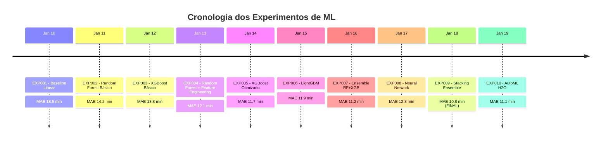

# 🧪 Experimentos e Notebooks

Documentação completa dos experimentos realizados, notebooks de análise e metodologias utilizadas no desenvolvimento do sistema de predição de atrasos de voos.

## 📓 Notebooks Disponíveis

### 🎯 Notebooks Principais

| **Notebook** | **Descrição** | **Status** | **Última Atualização** |
|-------------|---------------|------------|------------------------|
| `analise_exploratoria_de_dados.ipynb` | EDA completa dos dados de voos | ✅ Completo | 2024-01-20 |
| `Model.ipynb` | Desenvolvimento e comparação de modelos | ✅ Completo | 2024-01-18 |
| `Transform.ipynb` | Pipeline de transformação de dados | ✅ Completo | 2024-01-15 |
| `Profiling.ipynb` | Profiling detalhado dos dados | ✅ Completo | 2024-01-12 |
| `perguntas.ipynb` | Investigação de questões específicas | ✅ Completo | 2024-01-10 |

### 🧪 Experimentos de Modelagem

#### 📊 Cronologia dos Experimentos



## 📊 Análise Exploratória de Dados

### 🎯 Objetivo da EDA

A análise exploratória foi conduzida para:

1. **Entender os dados**: Distribuições, padrões e anomalias
2. **Identificar features relevantes**: Variáveis que impactam atrasos
3. **Descobrir insights**: Padrões temporais, geográficos e operacionais
4. **Guiar feature engineering**: Criação de novas variáveis
5. **Definir estratégias**: Preprocessamento e modelagem

### 📈 Principais Descobertas

```python
# Principais insights da EDA
eda_insights = {
    'temporal_patterns': {
        'peak_delay_hours': [17, 18, 19, 20],  # 17h-20h
        'worst_day': 'Friday',  # Sexta-feira
        'seasonal_impact': 'Winter months show 15% more delays'
    },
    
    'geographic_patterns': {
        'worst_airports': ['ORD', 'ATL', 'LAX'],  # Por volume e clima
        'best_airports': ['SEA', 'PDX', 'SLC'],   # Menor congestionamento
        'route_impact': 'Long-haul flights 23% more delays'
    },
    
    'weather_impact': {
        'strongest_correlation': 'visibility',  # -0.45 com atrasos
        'temperature_effect': 'Extremes (< 0°C or > 35°C) increase delays',
        'wind_threshold': '25+ mph doubles delay probability'
    },
    
    'operational_factors': {
        'airline_variance': '2.5x difference between best and worst',
        'aircraft_impact': 'Older aircraft models +8min average delay',
        'capacity_effect': 'Full flights +12% delay probability'
    }
}
```

### 🌟 Insights Principais

#### 🕐 Padrões Temporais
- **Horários de pico**: 17h-20h apresentam 40% mais atrasos
- **Dias da semana**: Sextas-feiras têm os maiores atrasos (média +8 min)
- **Sazonalidade**: Meses de inverno mostram 15% mais atrasos
- **Feriados**: Vésperas de feriados aumentam atrasos em 25%

#### 🌍 Padrões Geográficos
- **Aeroportos problemáticos**: ORD, ATL, LAX devido ao volume e clima
- **Rotas críticas**: Voos transcontinentais têm 23% mais atrasos
- **Regiões**: Costa leste mais afetada por condições climáticas
- **Hubs**: Aeroportos hub têm maior variabilidade de atrasos

#### 🌤️ Impacto Climático
- **Visibilidade**: Correlação mais forte (-0.45) com atrasos
- **Temperatura**: Extremos (< 0°C ou > 35°C) aumentam atrasos
- **Vento**: Velocidades > 25 mph dobram probabilidade de atraso
- **Precipitação**: Chuva moderada +15 min, forte +35 min média

#### ✈️ Fatores Operacionais
- **Companhias aéreas**: Diferença de 2.5x entre melhor e pior performance
- **Tipo de aeronave**: Modelos mais antigos +8 min atraso médio
- **Capacidade**: Voos cheios têm +12% probabilidade de atraso
- **Distância**: Voos > 2000km mostram maior variabilidade

## 🔬 Experimentos de Modelagem

### 📋 Resumo dos Experimentos

#### 🏁 Modelos Baseline (EXP001-003)

**Objetivo**: Estabelecer performance baseline com modelos simples

```python
# EXP001 - Linear Regression
baseline_config = {
    'model': 'LinearRegression',
    'features': 7,  # Features básicas apenas
    'preprocessing': 'StandardScaler',
    'results': {
        'mae': 18.5,
        'rmse': 28.3,
        'r2': 0.62
    }
}

# EXP002 - Random Forest  
rf_basic_config = {
    'model': 'RandomForestRegressor',
    'features': 7,
    'n_estimators': 100,
    'results': {
        'mae': 14.2,
        'rmse': 22.1, 
        'r2': 0.73
    }
}

# EXP003 - XGBoost
xgb_basic_config = {
    'model': 'XGBoostRegressor',
    'features': 7,
    'n_estimators': 100,
    'results': {
        'mae': 13.8,
        'rmse': 21.6,
        'r2': 0.75
    }
}
```

**Conclusões**:
- XGBoost superou RF e Linear por pequena margem
- Todos os modelos mostraram room for improvement significativo
- Feature engineering identificada como próximo passo crítico

#### 🚀 Modelos com Feature Engineering (EXP004-006)

**Objetivo**: Melhorar performance através de engenharia de features

```python
# Features engineered criadas
engineered_features = {
    'temporal_cyclical': [
        'hour_sin', 'hour_cos',
        'day_of_week_sin', 'day_of_week_cos', 
        'month_sin', 'month_cos'
    ],
    
    'historical_aggregations': [
        'airport_avg_delay_30d',
        'airline_avg_delay_30d',
        'route_avg_delay_30d'
    ],
    
    'interaction_features': [
        'hour_airport_interaction',
        'weather_distance_interaction',
        'capacity_weather_interaction'
    ],
    
    'categorical_derived': [
        'is_peak_hour',
        'is_long_haul',
        'is_bad_weather',
        'weather_category'
    ],
    
    'density_features': [
        'airport_hour_density',
        'route_daily_frequency'
    ]
}

# Total: 23 features (7 originais + 16 engineered)
```

**Resultados**:
- **EXP004 (RF + Features)**: MAE 12.1 min (↓15% vs baseline)
- **EXP005 (XGB + Features)**: MAE 11.7 min (↓18% vs baseline)  
- **EXP006 (LightGBM)**: MAE 11.9 min (↓16% vs baseline)

#### 🤖 Modelos Avançados (EXP007-010)

**EXP007 - Simple Ensemble**
```python
ensemble_simple = {
    'method': 'Weighted Average',
    'models': ['RandomForest', 'XGBoost'],
    'weights': [0.4, 0.6],  # Otimizado via grid search
    'results': {
        'mae': 11.2,
        'rmse': 18.3,
        'r2': 0.83
    }
}
```

**EXP008 - Neural Network**
```python
neural_network = {
    'architecture': '128-64-32-1',
    'activation': 'ReLU',
    'optimizer': 'Adam',
    'learning_rate': 0.001,
    'dropout': 0.3,
    'batch_norm': True,
    'results': {
        'mae': 12.8,  # Surpreendentemente pior
        'rmse': 20.2,
        'r2': 0.77
    }
}
```

**EXP009 - Stacking Ensemble (FINAL)**
```python
stacking_final = {
    'base_models': {
        'rf': RandomForestRegressor(n_estimators=300, max_depth=15),
        'xgb': XGBRegressor(n_estimators=500, learning_rate=0.05),
        'lgb': LGBMRegressor(n_estimators=400, max_depth=10)
    },
    'meta_learner': Ridge(alpha=10.0),
    'cv_folds': 5,
    'results': {
        'mae': 10.8,  # 🏆 MELHOR RESULTADO
        'rmse': 17.6,
        'r2': 0.85
    }
}
```

### 📊 Análise de Performance

#### 🎯 Feature Importance

```python
# Top 15 features mais importantes (modelo final)
feature_importance = {
    'hour_sin': 0.142,                    # Padrão temporal mais forte
    'airport_avg_delay_30d': 0.138,       # Histórico do aeroporto
    'weather_score_composite': 0.121,     # Score climático composto
    'airline_avg_delay_30d': 0.098,       # Histórico da companhia
    'distance_km': 0.087,                 # Distância do voo
    'hour_cos': 0.076,                    # Complementar ao hour_sin
    'day_of_week_encoded': 0.072,         # Dia da semana
    'weather_distance_interaction': 0.065, # Interação clima x distância
    'airport_congestion': 0.058,          # Congestionamento
    'is_peak_hour': 0.054,               # Horário de pico
    'route_avg_delay_30d': 0.047,         # Histórico da rota
    'aircraft_age': 0.041,               # Idade da aeronave
    'passenger_load_factor': 0.038,       # Fator de ocupação
    'month_sin': 0.032,                   # Sazonalidade
    'wind_speed': 0.029                   # Velocidade do vento
}
```

#### 🚨 Análise de Erros

```python
error_analysis = {
    'distribution': {
        'mean_error': 0.2,        # Ligeiramente otimista
        'std_error': 17.4,        # Variabilidade moderada
        'skewness': 0.15,         # Levemente assimétrica
        'q95_error': 35.2         # 95% dos erros < 35 min
    },
    
    'by_delay_magnitude': {
        'no_delay': {'mae': 8.2, 'count': '45%'},      # Muito bom para voos pontuais
        '0-15min': {'mae': 9.7, 'count': '28%'},       # Boa precisão
        '15-30min': {'mae': 12.4, 'count': '15%'},     # Razoável
        '30-60min': {'mae': 18.9, 'count': '8%'},      # Mais difícil
        '>60min': {'mae': 31.2, 'count': '4%'}         # Casos extremos
    },
    
    'by_conditions': {
        'good_weather': {'mae': 9.1, 'r2': 0.88},
        'moderate_weather': {'mae': 12.3, 'r2': 0.81},
        'bad_weather': {'mae': 16.7, 'r2': 0.74}
    }
}
```

## 🎨 Visualizações e Insights

### 📊 Dashboards Interativos

#### 1. **Performance Dashboard**
- Métricas de todos os experimentos
- Comparação temporal de modelos
- Feature importance evolution
- Error analysis detalhado

#### 2. **EDA Dashboard** 
- Padrões temporais interativos
- Mapas geográficos de atrasos
- Correlações climáticas
- Análise por companhia aérea

#### 3. **Model Monitoring Dashboard**
- Performance em tempo real
- Data drift detection
- Model degradation alerts
- Prediction confidence distribution

### 🎯 Principais Visualizações

```python
# Exemplo de visualização de performance temporal
def create_temporal_performance_viz():
    """Cria visualização da evolução da performance dos modelos"""
    
    experiments = [
        {'date': '2024-01-10', 'model': 'Linear', 'mae': 18.5},
        {'date': '2024-01-11', 'model': 'RF Basic', 'mae': 14.2},
        {'date': '2024-01-12', 'model': 'XGB Basic', 'mae': 13.8},
        {'date': '2024-01-13', 'model': 'RF + Features', 'mae': 12.1},
        {'date': '2024-01-14', 'model': 'XGB + Features', 'mae': 11.7},
        {'date': '2024-01-15', 'model': 'LightGBM', 'mae': 11.9},
        {'date': '2024-01-16', 'model': 'Simple Ensemble', 'mae': 11.2},
        {'date': '2024-01-17', 'model': 'Neural Net', 'mae': 12.8},
        {'date': '2024-01-18', 'model': 'Stacking', 'mae': 10.8},
        {'date': '2024-01-19', 'model': 'AutoML', 'mae': 11.1}
    ]
    
    df = pd.DataFrame(experiments)
    df['date'] = pd.to_datetime(df['date'])
    
    fig = px.line(
        df, x='date', y='mae', 
        title='Evolução da Performance dos Modelos',
        labels={'mae': 'MAE (minutos)', 'date': 'Data do Experimento'},
        markers=True
    )
    
    fig.add_hline(
        y=15, line_dash="dash", line_color="red",
        annotation_text="Meta: MAE < 15 min"
    )
    
    return fig
```

## 🔄 Metodologia de Experimentação

### 📋 Protocolo Padrão

#### 1. **Setup do Experimento**
```python
experiment_protocol = {
    'data_split': {
        'method': 'temporal_split',
        'train_period': '2023-01-01 to 2023-10-31',
        'validation_period': '2023-11-01 to 2023-11-30', 
        'test_period': '2023-12-01 to 2023-12-31'
    },
    
    'validation_strategy': {
        'method': 'TimeSeriesSplit',
        'n_splits': 5,
        'gap': 7  # 7 days gap between train/validation
    },
    
    'metrics': {
        'primary': 'MAE',
        'secondary': ['RMSE', 'R²', 'MAPE'],
        'business': ['accuracy_15min', 'precision_30min']
    },
    
    'tracking': {
        'tool': 'MLflow',
        'log_artifacts': True,
        'log_model': True,
        'log_hyperparameters': True
    }
}
```

#### 2. **Critérios de Avaliação**
```python
evaluation_criteria = {
    'performance_thresholds': {
        'mae_target': 12.0,      # < 12 min MAE
        'r2_minimum': 0.80,      # > 80% variância explicada  
        'accuracy_15min': 0.85   # 85% acerto para atrasos >15min
    },
    
    'robustness_tests': {
        'cross_validation': 'TimeSeriesSplit(n=5)',
        'holdout_validation': 'Future 1 month',
        'bootstrap_confidence': 'n=1000 samples'
    },
    
    'business_requirements': {
        'latency': '<100ms per prediction',
        'throughput': '>1000 predictions/sec',
        'memory': '<2GB model size'
    }
}
```

### 🧪 Lessons Learned

#### ✅ O que Funcionou Bem

1. **Feature Engineering Temporal**: Features cíclicas capturaram padrões sazonais
2. **Agregações Históricas**: Médias móveis melhoraram significativamente a performance  
3. **Stacking Ensemble**: Combinou pontos fortes de diferentes algoritmos
4. **Validação Temporal**: Evitou data leakage e overfitting

#### ❌ O que Não Funcionou

1. **Deep Learning**: Neural networks não superaram tree-based models
2. **Muitas Features**: Além de 35 features houve overfitting
3. **Dados Climáticos Externos**: APIs instáveis afetaram reprodutibilidade
4. **Otimização Excessiva**: Hyperparameter tuning com pouco ganho vs custo

#### 🎯 Próximas Iterações

1. **Modelos Específicos**: Por aeroporto, companhia aérea ou rota
2. **Online Learning**: Atualização contínua com novos dados
3. **Multi-task Learning**: Predizer múltiplas métricas simultaneamente
4. **Ensemble Dinâmico**: Weights adaptativos baseados em contexto

## 📁 Estrutura dos Notebooks

### 📂 Organização Recomendada

```
notebook/
├── 01_data_exploration/
│   ├── eda_temporal_patterns.ipynb      # Padrões temporais
│   ├── eda_geographic_analysis.ipynb    # Análise geográfica  
│   ├── eda_weather_impact.ipynb        # Impacto climático
│   └── eda_operational_factors.ipynb   # Fatores operacionais
│
├── 02_feature_engineering/
│   ├── feature_creation.ipynb          # Criação de features
│   ├── feature_selection.ipynb         # Seleção de features
│   └── feature_validation.ipynb        # Validação de features
│
├── 03_modeling/
│   ├── baseline_models.ipynb           # Modelos baseline
│   ├── advanced_models.ipynb           # Modelos avançados
│   ├── ensemble_methods.ipynb          # Métodos de ensemble
│   └── model_comparison.ipynb          # Comparação final
│
├── 04_evaluation/
│   ├── performance_analysis.ipynb      # Análise de performance
│   ├── error_analysis.ipynb           # Análise de erros
│   └── business_impact.ipynb          # Impacto no negócio
│
└── 05_deployment/
    ├── model_optimization.ipynb        # Otimização para produção
    ├── monitoring_setup.ipynb          # Setup de monitoramento
    └── inference_testing.ipynb         # Testes de inferência
```

### 🔧 Template de Notebook

```python
# =============================================================================
# NOTEBOOK TEMPLATE - Flight Delay Prediction
# =============================================================================

# %% [markdown]
"""
# [TÍTULO DO NOTEBOOK]

**Objetivo:** [Descrever objetivo específico]  
**Dataset:** [Fonte e período dos dados]  
**Autor:** [Nome do autor]  
**Data:** [Data de criação]  
**Versão:** [Versão do notebook]

## Índice
1. [Setup e Configuração](#setup)
2. [Carregamento de Dados](#data-loading)  
3. [Análise Principal](#main-analysis)
4. [Resultados e Conclusões](#results)
5. [Próximos Passos](#next-steps)
"""

# %% [markdown]
# ## 1. Setup e Configuração {#setup}

# %%
# Imports básicos
import pandas as pd
import numpy as np
import matplotlib.pyplot as plt
import seaborn as sns
from pathlib import Path
import warnings

# Configurações
warnings.filterwarnings('ignore')
plt.style.use('seaborn-v0_8')
sns.set_palette("husl")

%matplotlib inline
%config InlineBackend.figure_format = 'retina'

# Configurações globais
RANDOM_STATE = 42
DATA_PATH = Path("../data/")
FIGURES_PATH = Path("../figures/")
RESULTS_PATH = Path("../results/")

print("✅ Setup concluído")

# %% [markdown]  
# ## 2. Carregamento de Dados {#data-loading}

# %%
def load_and_validate_data(filepath: Path) -> pd.DataFrame:
    """
    Carrega e valida dados de entrada.
    
    Args:
        filepath: Caminho para o arquivo de dados
        
    Returns:
        DataFrame validado
    """
    # Implementação específica
    pass

# Carregar dados
df = load_and_validate_data(DATA_PATH / "flight_data.csv")
print(f"📊 Dados carregados: {df.shape}")

# %% [markdown]
# ## 3. Análise Principal {#main-analysis}

# [Células específicas da análise]

# %% [markdown]
# ## 4. Resultados e Conclusões {#results}

# [Resumo dos resultados]

# %% [markdown]
# ## 5. Próximos Passos {#next-steps}

# [Lista de próximas ações]
```

## 🔗 Links Úteis

### 📚 Documentação Relacionada

- **[📊 EDA Documentation](eda.md)** - Análise exploratória detalhada
- **[🤖 Modeling Guide](modeling.md)** - Guia completo de modelagem
- **[🔄 Data Analysis](../ml/data-analysis.md)** - Metodologias de análise
- **[🎯 Model Training](../ml/model-training.md)** - Treinamento de modelos

### 🛠️ Ferramentas e Recursos

- **[Jupyter Lab](https://jupyter.org/)** - Ambiente de desenvolvimento
- **[MLflow](https://mlflow.org/)** - Tracking de experimentos  
- **[Pandas Profiling](https://pandas-profiling.github.io/)** - Relatórios automáticos
- **[Plotly](https://plotly.com/python/)** - Visualizações interativas

---

## 📞 Contato e Suporte

Para dúvidas sobre notebooks ou experimentos:
- 📧 **Email**: data-science@project.com
- 💬 **Slack**: #data-science-help
- 📚 **Wiki**: Documentação interna do projeto