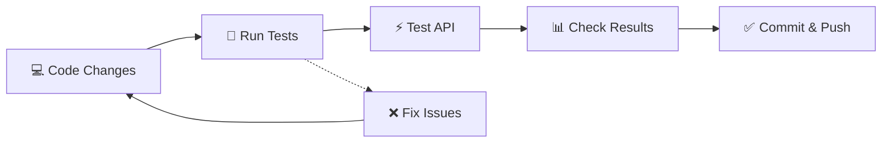

# 🏃 Executando o Projeto

Este guia mostra como executar todos os componentes do projeto Machine Learning Engineer Challenge.

## 🚀 Formas de Executar

### ⚡ Execução Rápida (Recomendado)

```bash
# 1. Ativar ambiente Poetry
poetry shell

# 2. Executar testes para validar setup
task test

# 3. Iniciar API de desenvolvimento
uvicorn src.routers.main:app --reload

# 4. Acessar API
# http://localhost:8000
# http://localhost:8000/docs (Swagger)
```

### 🐳 Execução com Docker

```bash
# Build e execução
docker-compose up --build

# Ou apenas execução (se já buildado)
docker-compose up

# Em background
docker-compose up -d

# Parar containers
docker-compose down
```

## 📊 Componentes do Sistema

### 1. 🧪 Executar Testes

**Testes Completos:**
```bash
# Com Poetry shell ativo
task test

# Ou sem ativar shell
poetry run task test

# Com coverage detalhado
task test-cov

# Testes específicos
pytest tests/test_routers.py -v
pytest tests/test_ml_pipeline.py::TestModelTraining -v
```

**Saída Esperada:**
```
================================= test session starts =================================
collected 100 items

tests/test_routers.py ........................... [ 25%]
tests/test_services.py .......................... [ 50%]
tests/test_ml_pipeline.py ....................... [ 75%]
tests/test_integration.py ....................... [100%]

======================== 83 passed, 17 skipped in 15.23s ========================
```

### 2. ⚡ Executar API FastAPI

**Desenvolvimento (com reload):**
```bash
# Opção 1: Comando direto
uvicorn src.routers.main:app --reload

# Opção 2: Com Poetry
poetry run uvicorn src.routers.main:app --reload

# Opção 3: Task personalizada
task api

# Opção 4: Com configurações específicas
uvicorn src.routers.main:app --host 0.0.0.0 --port 8000 --reload
```

**Produção:**
```bash
# Sem reload, otimizado para produção
uvicorn src.routers.main:app --host 0.0.0.0 --port 8000 --workers 4
```

**Saída Esperada:**
```
INFO:     Uvicorn running on http://127.0.0.1:8000 (Press CTRL+C to quit)
INFO:     Started reloader process [1234] using WatchFiles
INFO:     Started server process [5678]
INFO:     Waiting for application startup.
INFO:     Application startup complete.
```

### 3. 📖 Executar Documentação

```bash
# Servir documentação MkDocs
mkdocs serve

# Ou com Poetry
poetry run mkdocs serve

# Ou via task
task docs

# Em porta específica
mkdocs serve --dev-addr 0.0.0.0:8080
```

**Acessar em:** `http://localhost:8000`

### 4. 📓 Executar Notebooks

**Jupyter Lab:**
```bash
# Ativar ambiente Poetry primeiro
poetry shell

# Iniciar Jupyter Lab
jupyter lab

# Ou em porta específica
jupyter lab --port=8888
```

**VS Code:**
- Abrir arquivo `.ipynb` no VS Code
- Selecionar kernel Poetry environment
- Executar células normalmente

## 🔗 Endpoints da API

### 🏠 Endpoints Principais

| **Endpoint** | **Método** | **Descrição** | **Exemplo** |
|--------------|------------|---------------|-------------|
| `/` | GET | Info da API | `curl http://localhost:8000/` |
| `/health` | GET | Health check | `curl http://localhost:8000/health` |
| `/docs` | GET | Swagger UI | Abrir no browser |
| `/redoc` | GET | ReDoc | Abrir no browser |

### 🤖 Endpoints de Machine Learning

| **Endpoint** | **Método** | **Descrição** |
|--------------|------------|---------------|
| `/model/predict` | POST | Predição única ou em lote |
| `/model/load/default` | GET | Carregar modelo padrão |
| `/model/load/` | POST | Upload de modelo |
| `/model/history/` | GET | Histórico de predições |

### 💡 Exemplos de Uso da API

**Health Check:**
```bash
curl -X GET "http://localhost:8000/health"
```

**Predição Simples:**
```bash
curl -X POST "http://localhost:8000/model/predict" \
     -H "Content-Type: application/json" \
     -d '{
       "features": {
         "airline": "American Airlines",
         "flight_number": "AA123",
         "departure_airport": "JFK",
         "arrival_airport": "LAX",
         "scheduled_departure": "2024-01-15T10:00:00",
         "scheduled_arrival": "2024-01-15T14:00:00"
       }
     }'
```

**Carregar Modelo Padrão:**
```bash
curl -X GET "http://localhost:8000/model/load/default"
```

**Visualizar Histórico:**
```bash
curl -X GET "http://localhost:8000/model/history/?limit=10"
```

## 🔄 Fluxo de Desenvolvimento

### 🎯 Ciclo Típico de Desenvolvimento



**Comandos do ciclo:**
```bash
# 1. Fazer alterações no código
# 2. Executar testes
task test

# 3. Testar API localmente
uvicorn src.routers.main:app --reload

# 4. Verificar formatação
task format

# 5. Commit e push
git add .
git commit -m "feat: add new feature"
git push origin main
```

### 🎨 Formatação e Qualidade

```bash
# Formatação automática
task format

# Ou executar individualmente
poetry run black src/ tests/
poetry run isort src/ tests/
poetry run ruff check src/ tests/
```

## 🐳 Docker em Detalhes

### 📋 Docker Compose Services

```yaml
# docker-compose.yml
services:
  api:
    build: .
    ports:
      - "8000:8000"
    volumes:
      - ./model:/app/model
    environment:
      - ENVIRONMENT=development
```

### 🔧 Comandos Docker Úteis

```bash
# Build apenas
docker-compose build

# Logs dos containers
docker-compose logs -f

# Executar comando no container
docker-compose exec api bash

# Verificar status
docker-compose ps

# Remover tudo
docker-compose down --volumes --remove-orphans
```

## 📊 Monitoramento e Logs

### 🔍 Verificação de Status

**API Status:**
```bash
# Verificar se API está respondendo
curl http://localhost:8000/health

# Verificar endpoints disponíveis
curl http://localhost:8000/
```

**Logs da API:**
```bash
# Logs do uvicorn aparecem no terminal
# Para Docker:
docker-compose logs -f api
```

### 📈 Métricas e Performance

**Coverage de Testes:**
```bash
# Executar com coverage
task test-cov

# Gerar relatório HTML
poetry run pytest --cov=src --cov-report=html

# Abrir relatório
open htmlcov/index.html  # macOS
start htmlcov/index.html  # Windows
```

## 🔧 Configuração Avançada

### ⚙️ Variáveis de Ambiente

```bash
# .env (criar se necessário)
ENVIRONMENT=development
LOG_LEVEL=INFO
DATABASE_URL=mongodb://localhost:27017
MODEL_PATH=./model/modelo_arvore_decisao.pkl
```

### 🎛️ Configuração de Produção

```bash
# Para produção com múltiplos workers
uvicorn src.routers.main:app \
  --host 0.0.0.0 \
  --port 8000 \
  --workers 4 \
  --log-level info \
  --access-log
```

## 🚨 Troubleshooting

### ❌ API não inicia

```bash
# Verificar porta ocupada
netstat -an | grep :8000  # Linux/macOS
netstat -an | findstr :8000  # Windows

# Usar porta diferente
uvicorn src.routers.main:app --port 8001 --reload
```

### ❌ Imports não funcionam

```bash
# Verificar PYTHONPATH
echo $PYTHONPATH

# Executar do diretório raiz do projeto
cd machine_learning_engineer
poetry run uvicorn src.routers.main:app --reload
```

### ❌ Modelo não carrega

```bash
# Verificar se arquivo existe
ls -la model/

# Verificar logs da API para detalhes do erro
# Logs aparecem no terminal onde uvicorn está executando
```

### ❌ Docker não funciona

```bash
# Verificar Docker
docker --version
docker-compose --version

# Rebuild sem cache
docker-compose build --no-cache

# Verificar logs
docker-compose logs api
```

## 📚 Próximos Passos

Após executar o projeto:

1. 🔗 [Explorar API](../api/endpoints.md)
2. 📓 [Analisar Notebooks](../notebooks/eda.md)
3. 🧪 [Executar Testes](../tests/running-tests.md)
4. 🏗️ [Entender Arquitetura](../architecture/overview.md)

## 📞 Suporte

Problemas ao executar?

- 🔧 [Troubleshooting Detalhado](../dev/troubleshooting.md)
- 🐛 [Issues](https://github.com/ulissesbomjardim/machine_learning_engineer/issues)
- 📧 [Email](mailto:ulisses.bomjardim@gmail.com)